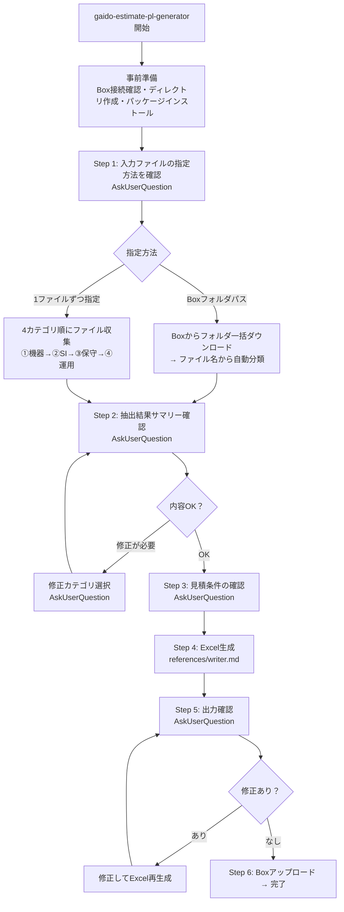

# 見積・PL生成スキル

## 概要

複数社の原価見積ファイルを読み取り、CTC標準フォーマットの見積書兼PLシートをExcelで生成する。
welcome-messageの「営業支援」→「見積・PLシートを作成する」で呼び出す独立スキル。

## 行動指針

- **選択式中心**: 自由記述は最小限にし、AskUserQuestionの選択式で素早く回答できるようにする
- **各ステップで確認**: データ抽出後は必ずサマリーをユーザーに見せて確認を取る
- **日本語**: ユーザーに見える出力はすべて日本語にする
- **戻り操作**: ユーザーが「戻りたい」「やり直したい」と言った場合は、直前のステップのAskUserQuestionを再度提示する

## フロー



## 事前準備

1. `ai_generated/estimates/` ディレクトリの存在を確認し、なければ作成
2. Box接続の確認（`.box/credentials.json` の存在確認）
   - Box接続可能 → `box_available = true`
   - Box未設定 → `box_available = false`（Step 1でBox関連の選択肢を除外する）
3. Pythonパッケージのインストール:

```bash
mkdir -p ai_generated/estimates ai_generated/input
pip install --break-system-packages openpyxl xlrd 2>/dev/null || true
```

## リファレンス構成

各リファレンスは該当ステップに入ったタイミングで読み込むこと（すべてを事前に読む必要はない）。

| リファレンス | パス（相対） | 役割 |
|------------|-------------|------|
| hardware | `references/hardware.md` | 機器費用ファイルの読み取り・データ抽出の手順 |
| si | `references/si.md` | SI（役務原価）ファイルの読み取り・データ抽出の手順 |
| maintenance | `references/maintenance.md` | 製品保守費用ファイルの読み取り・データ抽出の手順 |
| operation | `references/operation.md` | 運用費用ファイルの読み取り・データ抽出の手順 |
| writer | `references/writer.md` | 抽出済みデータをテンプレートに書き込みExcel出力する手順 |

パスはこのSKILL.mdファイルと同じディレクトリからの相対パスである。

## Step 1: 入力ファイルの指定

### box_available = true の場合

AskUserQuestionで入力方法を確認する。

```
メェナビ「見積・PLシートを作成するなのです！原価ファイルの指定方法を教えてほしいなのです」
  ○ Boxのフォルダを指定する（フォルダ内のファイルをまとめて読み取ります）
  ○ ファイルを1つずつ指定する（カテゴリごとに順番に進めます）
```

### box_available = false の場合

Boxが使えない旨を伝え、ローカルファイル指定のみで進める。

```
メェナビ「見積・PLシートを作成するなのです！Box連携が未設定なので、ローカルのファイルパスで進めるなのです。
カテゴリごとに順番にファイルを指定してほしいなのです」
```

→ 「ファイルを1つずつ指定する」フローに進む。

### 「Boxのフォルダを指定する」の場合

AskUserQuestionでBoxのフォルダパスを聞く:

```
メェナビ「Boxのフォルダパスを教えてほしいなのです（例: GAiDo/案件名/見積）
わからない場合はBoxのURLをそのまま貼ってもOKなのです」
→ 自由記述
```

フォルダをダウンロードし、ファイル名・内容から4カテゴリに自動分類する:

```bash
python3 tools/box_client.py download-folder-by-path "{フォルダパス}" \
  --output-dir ai_generated/input
```

**Boxダウンロード失敗時のフォールバック**: エラー内容をユーザーに伝え、「ファイルを1つずつ指定する」モードに切り替えて続行する。

分類結果をユーザーにサマリーとして表示してから、AskUserQuestionで確認する:

まず以下のサマリーを表示:
```
メェナビ「以下のように分類したなのです」

  ①機器費用: vendor_quote_juniper.xlsx, vendor_quote_a10.xlsx
  ②SI費用: si_estimate.pdf
  ③製品保守: maintenance_detail.xlsx
  ④運用費用: sms_cost.xlsx
```

次にAskUserQuestionで確認:
```
  ○ OK
  ○ 分類を修正する
  ○ 足りないファイルがある
```

- 「分類を修正する」→ AskUserQuestionでどのファイルをどのカテゴリに変更するかを聞く:
  ```
  メェナビ「どのファイルの分類を変更するなのです？」
    ○ {ファイル名A}（現在: ①機器費用）→ カテゴリを変更
    ○ {ファイル名B}（現在: ②SI費用）→ カテゴリを変更
    ...
  ```
  選択後、変更先カテゴリをAskUserQuestionで選択させる。
- 「足りないファイルがある」→ 追加ファイルのBoxパスまたはローカルパスを聞き、分類確認を再実施する。

分類確認OKの後、各カテゴリのリファレンスに従ってデータ抽出を実行し、Step 2へ進む。

### 「ファイルを1つずつ指定する」の場合

4カテゴリを順番に収集する。各カテゴリで以下のサイクルを回す:

```
ファイル名/パスを聞く → Boxからダウンロード（またはローカル読み取り） → リファレンスに従いデータ抽出 → 結果サマリーを報告 → AskUserQuestionで確認 → 次のカテゴリへ
```

#### 収集順序

| 順番 | カテゴリ | 読むリファレンス | 完了後の案内 |
|------|---------|----------------|------------|
| ① | 機器費用 | `references/hardware.md` | 「次に **②SI（役務原価）** のファイルを教えてほしいなのです（工数表、SI費用一覧など。Boxのファイル名やフォルダパスでOKです。なければ「なし」と入力してください）」 |
| ② | SI費用 | `references/si.md` | 「次に **③製品保守** のファイルを教えてほしいなのです（保守見積明細、HW保守一覧など）」 |
| ③ | 製品保守 | `references/maintenance.md` | 「次に **④運用費用** のファイルを教えてほしいなのです（SMS費用、運用保守見積など）」 |
| ④ | 運用費用 | `references/operation.md` | Step 2へ進む |

各カテゴリの抽出完了後、サマリーを表示してからAskUserQuestionで確認:

まずサマリーを表示:
```
メェナビ「{カテゴリ名}を読み取ったなのです」

  {抽出結果のサマリー（品目数、原価合計等）}
```

次にAskUserQuestionで確認:
```
  ○ OK
  ○ 読み取り内容に問題がある
```

**柔軟性のルール:**
- 「なし」「スキップ」「ない」→ そのカテゴリを飛ばして次へ
- 「もう1つあります」→ 同じカテゴリで追加ファイルを受け付ける
- 順番が前後しても受け付ける（ファイル内容から判断）
- ユーザーがローカルファイルパスを指定した場合（既にBoxからダウンロード済み等）→ そのパスのファイルを直接読む

## Step 2: 抽出結果サマリーの確認

全カテゴリの抽出が完了したら、サマリーを表示してからAskUserQuestionで確認する。

まず以下のサマリーを表示:
```
メェナビ「すべてのファイルを読み取ったなのです！」

■ 機器費用（3 Quote、計48品目、原価合計: 約20,700,223円）
■ SI費用（工数4人月、原価合計: 4,800,000円）
■ 製品保守（2台、原価合計: 3,801,120円）
■ 運用費用（初期: 600,000円、月額: 814,125円）
■ 原価総計: 約29,901,343円
```

次にAskUserQuestionで確認:
```
  ○ OK
  ○ 修正が必要
  ○ ファイルを追加したい
```

- 「修正が必要」→ AskUserQuestionで修正するカテゴリを選択:
  ```
  メェナビ「どのカテゴリを修正するなのです？」
    ○ ①機器費用
    ○ ②SI費用
    ○ ③製品保守
    ○ ④運用費用
  ```
  選択したカテゴリのリファレンスを再読み込みして再処理し、Step 2に戻る。
- 「ファイルを追加したい」→ 追加ファイルのBoxパスまたはローカルパスを聞き、処理後Step 2に戻る。

## Step 3: 見積条件の確認

AskUserQuestionで見積条件を段階的に確認する。

### Step 3-1: 宛先情報

```
メェナビ「見積書の宛先情報を教えてほしいなのです」

  顧客名（○○株式会社 御中）:
  案件名:
→ 自由記述
```

### Step 3-2: 見積パターン

```
メェナビ「見積のバリエーションはいくつ作るなのです？」
  ○ 1パターン
  ○ 2パターン
  ○ 3パターン以上（いくつか教えてください）
```

2パターン以上の場合、各パターンの違い（発注時期、保守レベル、構成の違い等）をAskUserQuestionで確認。

### Step 3-3: 売価の決め方

```
メェナビ「提供単価（売価）はどう決めるなのです？」
  ○ おまかせ（粗利率30%で自動算出）
  ○ 粗利率を指定する
  ○ 具体的な売価を指定する
```

- 「粗利率を指定する」→ 粗利率を聞く
- 「具体的な売価を指定する」→ カテゴリごとの売価を聞く

### Step 3-4: 詳細設定

```
メェナビ「詳細設定なのです」
  ○ PL列（原価・粗利などの社内管理用列）を表示する（社内レビュー用）
  ○ PL列を非表示にする（顧客提出用）
```

```
メェナビ「御見積条件に記載する特記事項はあるなのです？」
  ○ デフォルトのまま（消費税、有効期限等の標準条件）
  ○ 追加したい条件がある
```

## Step 4: Excel生成

`references/writer.md` を読み、その手順に従ってExcelファイルを生成する。
writerにはStep 1-2で抽出した全カテゴリのデータとStep 3で確認した条件を渡す。

ファイル名: `ai_generated/estimates/estimate_{YYYYMMDD}_{案件名}.xlsx`

## Step 5: 出力確認

生成したExcelのサマリーを表示してから、AskUserQuestionで確認する。

まず以下のサマリーを表示:
```
メェナビ「見積・PLシートを生成したなのです！」

  ファイル: ai_generated/estimates/estimate_20260414_ノーリツ様向けA10リプレース.xlsx
  - 見積サマリーシート: パターン①、パターン②
  - パターン①: ご提供価格 ¥42,500,000（粗利率 29.8%）
  - パターン②: ご提供価格 ¥41,200,000（粗利率 27.5%）
```

次にAskUserQuestionで確認:
```
  ○ OK
  ○ 売価を調整したい
  ○ その他の修正がある
```

- 「売価を調整したい」→ AskUserQuestionで調整方法を選択:
  ```
  メェナビ「売価の調整方法を教えてほしいなのです」
    ○ 粗利率をまとめて変更する
    ○ カテゴリごとに個別変更する
    ○ 合計売価を指定する
  ```
  調整後Excelを再生成し、Step 5に戻る。
- 「その他の修正がある」→ 修正内容を自由記述で受け付け、Excelを再生成してStep 5に戻る。

## Step 6: 保存（Boxマスター）

**box_available = true の場合:**

Boxにアップロードする。アップロード後、出力されたBox URLをユーザーに表示すること。

```bash
python3 tools/box_client.py upload ai_generated/estimates/{ファイル名} \
  --folder-path "GAiDo/{案件名}/estimates"
```

**Boxアップロードが失敗した場合**: エラー内容をユーザーに伝え、Boxへの再アップロードを促すこと。

**box_available = false の場合:**

ローカルファイルパスのみ案内する。

完了メッセージ:

```
メェナビ「見積・PLシートの作成が完了したなのです！」

  ローカル: ai_generated/estimates/{ファイル名}

  Box未連携のためローカルに保存しました。Box連携を有効にすると、この成果物が自動でBoxに保存されます（GAiDoアプリの Step 4 で設定できます）。
```

## ファイル読み取りルール

入力ファイルの形式に応じて、`.claude/rules/constraints.md` のルールに従う:

- **Excel (.xlsx/.xls)**: openpyxl（.xlsx）またはxlrd（.xls）でPythonから直接読む。構造を俯瞰する場合はlibreofficeでPDFに変換しRead toolで読んでもよい
- **PDF**: `pdfinfo` でページ数確認後、Read toolの `pages` パラメータで20ページずつ読む
- **PowerPoint (.pptx/.ppt)**: libreofficeでPDFに変換し、Read toolの `pages` パラメータで読む

## データの受け渡し

各リファレンスが抽出したデータは、以下の形式でPython変数として保持し、writerリファレンスに渡す。各リファレンスに出力形式が定義されている。

```python
extracted_data = {
    "hardware": [...],    # hardwareリファレンスの出力
    "si": [...],          # siリファレンスの出力
    "maintenance": [...], # maintenanceリファレンスの出力
    "operation": {...},   # operationリファレンスの出力
}

estimate_config = {
    "customer_name": "...",
    "project_name": "...",
    "patterns": [...],
    "conditions": [...],
    "hide_pl_columns": True/False,
}
```

## 注意事項

- AskUserQuestionの `questions` パラメータは必ず配列型で渡すこと（JSON文字列は不可）
- 1つのAskUserQuestion呼び出しでは、関連する質問のみをまとめること
- このスキルはwelcome-messageの「営業支援」→「見積・PLシートを作成する」から呼び出される独立スキル
