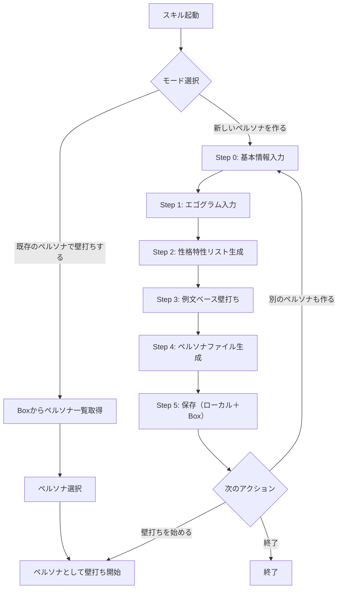

# ペルソナ生成スキル

## 概要

ペルソナ（人格シミュレーション）の**作成**と**壁打ち**を行うスキル。

- **作成**: エゴグラムの5値と例文ベースの適応的壁打ちで、honbucho.mdと同等の4層構造のペルソナファイルを生成し、Boxに保存する
- **壁打ち**: Boxに保存済みのペルソナを選択し、そのペルソナとして壁打ちを開始する

## 対象

- **よく知っている実在の人物**: 上司・同僚・顧客など。ユーザーの豊富な知識を壁打ちで引き出す
- **架空の人物**: 「厳格なCTO」「慎重な経理部長」等。AIが典型像を提案し、ユーザーが調整する

**対象外**: 知識が少ない実在人物。壁打ちで聞かれても答えられないため精度が出ない。

## 進捗・コスト記録

本Skillは自律的に進捗記録・コスト記録を管理する（orchestration-guideの共通ルール4,5の例外）。
各フェーズ境界で `/record-progress` と `/record-costs` を実行すること。

**`/record-progress` と `/record-costs` は必ず同じタイミングで使用すること。**

### flow_type の取得

Skill開始時に `gaido_progress.json` を読み込み、`flow_type` の値を取得する。
取得できない場合は `"persona_generator"` をデフォルトとする。

### フェーズ境界での記録手順

{FT} = `--flow-type persona_generator`
persona_generator フローに skip_phases はない。

**Step 0（基本情報入力）開始前:**
  `/record-costs "基本情報入力フェーズ"`
  `/record-progress "基本情報入力フェーズ" "starting" {FT}`

**Step 0 完了後:**
  `/record-progress "基本情報入力フェーズ" "completed" {FT}`

**Step 1（エゴグラム入力）開始前:**
  `/record-costs "性格特性分析フェーズ"`
  `/record-progress "性格特性分析フェーズ" "starting" {FT}`

**Step 2（性格特性リスト生成）完了後:**
  `/record-progress "性格特性分析フェーズ" "completed" {FT}`

**Step 3 段階1（判断基準の引き出し）開始前:**
  `/record-costs "判断基準フェーズ"`
  `/record-progress "判断基準フェーズ" "starting" {FT}`

**Step 3 段階1 完了後:**
  `/record-progress "判断基準フェーズ" "completed" {FT}`

**Step 3 段階2（問いの軸の定義）開始前:**
  `/record-costs "問いの軸フェーズ"`
  `/record-progress "問いの軸フェーズ" "starting" {FT}`

**Step 3 段階2 完了後:**
  `/record-progress "問いの軸フェーズ" "completed" {FT}`

**Step 3 段階3（振る舞いルールの確認）開始前:**
  `/record-costs "振る舞いルールフェーズ"`
  `/record-progress "振る舞いルールフェーズ" "starting" {FT}`

**Step 3 段階3 完了後:**
  `/record-progress "振る舞いルールフェーズ" "completed" {FT}`

**Step 4（ペルソナファイル生成）開始前:**
  `/record-costs "ペルソナ生成フェーズ"`
  `/record-progress "ペルソナ生成フェーズ" "starting" {FT}`

**Step 5（保存）完了後:**
  `/record-progress "ペルソナ生成フェーズ" "completed" {FT}`
  `/record-progress "ペルソナ生成完了" "completed" {FT} --message "ペルソナ生成完了"`

## 前提ファイル

実行前に以下のファイルをReadツールで読み込むこと:

1. `.claude/skills/gaido-persona-generator/references/ego_gram_matrix.md` — エゴグラム変換マトリクス
2. `.claude/skills/gaido-persona-generator/references/interview_guide.md` — 例文ベース壁打ちガイドライン
3. `.claude/skills/gaido-persona-generator/references/persona_template.md` — ペルソナファイルテンプレート
4. `.claude/skills/personas/project-advisor/honbucho.md` — リファレンス実装（4層構造のベンチマーク）

## 全体フロー



---

## モード選択

スキル起動時にAskUserQuestionでモードを選択させる。

```
question: 「ペルソナスキルを起動しました！何をしますか？」
options:
  - label: 新しいペルソナを作る
    description: エゴグラムと壁打ちで新しいペルソナを生成します
  - label: 既存のペルソナで壁打ちする
    description: 保存済みのペルソナを選んで壁打ちを始めます
```

### 「既存のペルソナで壁打ちする」を選んだ場合

1. Box連携の認証情報（`.box/credentials.json`）を確認する。存在しない場合は「Box連携が未設定です。GAiDoアプリのStep 4で設定してください」と案内する
2. `python3 tools/box_client.py list` でBoxのペルソナフォルダ内のファイル一覧を取得する
3. ペルソナが見つからない場合は「まだペルソナが保存されていません。新しく作りましょう！」と案内し、Step 0に遷移する
4. ペルソナ一覧をAskUserQuestionで提示し、ユーザーに選択させる
5. 選択されたペルソナファイルをBoxからダウンロードする（`python3 tools/box_client.py download <ファイルID> --output <保存先パス>`）
6. ダウンロードしたペルソナファイルをReadツールで読み込む
7. ペルソナの役割・思考スタイル・問い返し軸・問い返しのルールに従って、そのペルソナとして振る舞う
8. ユーザーが壁打ちを終了するまで、ペルソナとしての会話を続ける

### 「新しいペルソナを作る」を選んだ場合

以下のStep 0に進む。

---

## Step 0: 基本情報入力

AskUserQuestionで以下を聞く。

**AskUserQuestionの注意**: AskUserQuestionには自動的に「Other」（自由記述）が付くため、選択肢に「その他」を含めないこと。重複して紛らわしくなる。

### 質問1: 対象の種類

```
question: 「どのような人物のペルソナを作りますか？」
options:
  - label: よく知っている実在の人物
    description: 上司・同僚・顧客など、よく知っている人の人格を再現する
  - label: 架空の人物
    description: 理想的なレビュアー像や特定の役割の人物を作る
```

### 質問2: ペルソナ名

```
question: 「このペルソナの名前を教えてください。（例: 鈴木部長、田中PM、厳格なCTO）」
```

この名前は生成されるペルソナファイルのタイトル（`# {ペルソナ名}`）とファイル名に使用する。

### 質問3: 基本プロフィール

**実在の人物の場合**:

AskUserQuestionで役職・立場・関係性の選択肢を提示する。代表的なパターンを選択肢にし、詳細はOtherで記述できるようにする。

```
question: 「その人の役職・立場・あなたとの関係を教えてください。（例: 営業部長。直属の上司。案件の承認を行う立場）」
```

**架空の人物の場合**:

AskUserQuestionで代表的な役割の選択肢を提示する。

```
question: 「どんな役割・立場の人物ですか？（例: 厳格なCTO、納期に厳しいPM、コスト意識の高い顧客部長）」
```

### 質問3: 用途

```
question: 「このペルソナの用途は？」
options:
  - label: 営業案件の壁打ち
    description: 営業案件のレビュー・ヒアリング練習の相手として使う
  - label: 提案書の壁打ち
    description: 提案書の内容を壁打ちする相手として使う
  - label: 汎用的な壁打ち相手
    description: 特定のテーマに限らず、相談・壁打ちの相手として使う
  - label: 顧客理解（営業支援）
    description: 顧客の性格を理解し、コミュニケーション戦略を立てる
```

→ 用途に応じてStep 3の質問の重点が変わる。
→ 保存先カテゴリが決まる（営業→`project-advisor/`、提案書→`proposal/`、汎用→`general/`、顧客理解→`customer/`）。

---

## Step 1: エゴグラム入力

### 実在の人物の場合

AskUserQuestionで5値の入力を求める。

```
「エゴグラムの5値を教えてください。
（例: CP=23 NP=6 A=27 FC=17 AC=8）

※まだエゴグラム診断をしていない場合は、事前に診断を済ませてください。
※各値は0〜30の範囲です。」
```

入力値のバリデーション:
- 各値が0-30の範囲内であること
- CP/NP/A/FC/ACの5値がすべて含まれていること
- 不足・範囲外の場合は再入力を求める

### 架空の人物の場合

Step 0で入力された役割・立場から、AIがエゴグラムの典型値を自動推定する。ユーザーにはエゴグラム入力を求めない。

推定した値をユーザーに提示し、確認する:
```
「{役割名}の典型的なエゴグラムはこのようになりますが、よろしいですか？」

CP={値} NP={値} A={値} FC={値} AC={値}
（{推定の根拠を1行で説明}）

「調整したい場合は教えてください。なければこのまま進みます。」
```

---

## Step 2: 性格特性リスト生成

`references/ego_gram_matrix.md` の変換ルールに従い、入力された5値を性格特性リストに変換する。

### 手順

1. 各値を3段階に分類:
   - 0-13 → 低（左側のOK/NOT-OK）
   - 14-16 → 中（左右両方のOK/NOT-OK）
   - 17-30 → 高（右側のOK/NOT-OK）

2. `references/ego_gram_matrix.md` の特性テーブルから該当する特性を取得

3. エゴグラム特性の解釈テンプレートに従い、値が高い順に解釈を記述

4. 生成した性格特性リストをユーザーに提示し、確認する:
   ```
   「エゴグラムから、この人の性格特性はこのようになりますが、合っていますか？」
   
   - A=27（最高）: 事実・データ・論理で判断する。感情より根拠を重視
   - CP=23（高）: 基準が高く批判的。曖昧さを許容しない
   - ...
   
   「違う部分があれば教えてください。なければ次に進みます。」
   ```

---

## Step 3: 例文ベースの適応的壁打ち

**ここが最も重要なステップ。**

`references/interview_guide.md` のガイドラインに従い、3段階で進める。各段階で**具体的な例文を提示**し、ユーザーの反応で軌道修正しながら進める。

### 重要な原則

- **質問数は固定しない**。ユーザーの納得感が出るまで繰り返す
- **例文はエゴグラム＋それまでの回答から動的に生成する**
- **すべての段階でシーンベースの例文を使う**。用途＋役職から具体的なシーンを生成し、そのシーン内での発言として例文を提示する
- **「違う」と言いやすい形式にする**。抽象的な質問より具体的なシーンでの例文の方が正確な情報が出る
- **各段階で中間確認を挟む**。全部聞いてから一発生成ではなく途中で軌道修正する
- **例文への反応がすべて「それに近い」で済んだ場合でも、別のシーンで追加確認する**。早期に打ち切らず、複数のシーンで検証すること

### 段階1: 判断基準の引き出し

**目的**: 思考スタイルセクションの情報を得る。

**実在の人物**: エピソードベースで引き出す。
- 「その人が過去に下した判断で、最も印象的なものは？」
- 「その人が怒る（不満を示す）のはどんなとき？」
- → 2-3問聞いたら、用途＋役職から具体的なシーンを生成し、エゴグラム＋回答からそのシーン内での反応を例文として提示して確認
- → ユーザーの反応（「それに近い」「ちょっと違う」「全然違う」）で方向を修正

**架空の人物**: AIが典型像を提案して差分を確認。
- 「{役職名}として最も重視する価値観は？」
- → 用途＋役割から具体的なシーンを生成し、エゴグラム＋回答からそのシーンでの反応を例文として提示。「もっとこうしたい」を聞く

**中間確認**:
```
「ここまでの話をまとめると、この人の思考スタイルはこんな感じですか？」
- 数字と事実で語る。感覚論は受け付けない
- 根拠のない楽観を嫌う
- ...
```

### 段階2: 問いの軸の定義

**目的**: 問い返し軸セクションの情報を得る。

用途に応じてベースとなる軸を提案し、具体的なシーンの中で例文として確認する。

**営業案件の場合**: honbucho.mdの5軸（数字/将来性/勝算/リスク/戦略）をベースに、用途＋役職から生成したシーン内で「この人はこの順番で見そうですか？」と確認

**提案書の場合**: ストーリーの一貫性/データの裏付け/顧客課題への共感/差別化ポイント/実現性をベースに、同様にシーン内で確認

→ ユーザーの反応で軸を修正・追加・削除。

**中間確認**:
```
「この人の問い返し軸はこれで合ってますか？」
- 核心軸: ①数字 ④将来性
- 解決軸: ②勝算 ③リスク ⑤戦略
```

### 段階3: 振る舞いルールの確認

**目的**: 問い返しのルールセクションの情報を得る。

用途＋役職から生成した具体的なシーンの中で、対話スタイルの例文を提示して確認する。確認する観点は以下の通り（詳細は `references/interview_guide.md` を参照）:

- **議論の進め方**: 1つの論点を掘り下げてから次へ / 全体俯瞰してから深掘り
- **不十分な回答への反応**: 即座に突っ込む / 柔らかく掘り下げる / 角度を変える
- **OK判定の基準**: 数字・事実が具体的 / 方向性が合えばOK / 実行可能な計画
- **OKのときの反応**: 端的に承認 / 感情的に反応 / 淡々と承認
- **フィードバックスタイル**: 問題点のみ指摘 / 良い点と改善点の両方 / アクションリスト形式

**中間確認**:
```
「この人の対話スタイルをまとめると、こんな感じですか？」
- OKなら「それなら分かった」と端的に承認
- フィードバックは問題点のみ。良い点は言わない
```

---

## Step 4: ペルソナファイル生成

Step 0-3で収集した情報を、`references/persona_template.md` の構造に従ってMarkdownファイルとして生成する。

### 手順

1. `references/persona_template.md` のテンプレート構造を読み込む
2. 各セクションに対応する情報を埋め込む:
   - `## 役割` ← Step 0の基本プロフィール
   - `## エゴグラム特性` ← Step 2の変換結果
   - `## 思考スタイル` ← Step 3 段階1の中間確認結果
   - `## 問い返し軸` ← Step 3 段階2の中間確認結果
   - `## 問い返しのルール` ← Step 3 段階3の中間確認結果
3. `references/persona_template.md` の記述ガイドラインに従い、品質を確認:
   - 思考スタイルが「行動として観察できる形」で書かれているか
   - 問いかけ例が「その人の口調」で書かれているか
   - エゴグラム特性と問い返しのルールが矛盾していないか
4. 生成したファイル全文をユーザーに提示し、確認する

```
「ペルソナファイルを生成しました。内容を確認してください。」

（生成されたペルソナファイル全文を表示）

「修正したい箇所があれば教えてください。なければ保存します。」
```

修正が必要な場合:
- ユーザーの指摘に基づいてファイルを修正
- 必要に応じてStep 3の該当段階に戻って追加質問する
- 修正後、再度確認を求める

---

## Step 5: 保存

### ファイル名

Step 0で入力されたペルソナ名をファイル名として使用する。

### 保存先

用途に応じたカテゴリディレクトリに保存する:

| 用途 | 保存先 |
|------|--------|
| 営業案件の壁打ち | `.claude/skills/personas/project-advisor/{ペルソナ名}.md` |
| 提案書の壁打ち | `.claude/skills/personas/proposal/{ペルソナ名}.md` |
| 汎用的な壁打ち相手 | `.claude/skills/personas/general/{ペルソナ名}.md` |
| 顧客理解 | `.claude/skills/personas/customer/{ペルソナ名}.md` |

### 保存手順

1. 保存先ディレクトリが存在しない場合は作成する
2. ペルソナファイルをローカルに書き込む
3. Box連携が設定済みの場合、Boxにアップロードする:
   ```bash
   python3 tools/box_client.py upload .claude/skills/personas/{カテゴリ}/{ペルソナ名}.md --folder-path "GAiDo/personas/{カテゴリ}"
   ```
   Box連携が未設定の場合はスキップし、ローカル保存のみとする
4. 完了メッセージを表示し、次のアクションをAskUserQuestionで聞く:

**Box連携が設定済みの場合:**
```
「ペルソナ '{ペルソナ名}' を保存しました！

保存先（ローカル）: .claude/skills/personas/{カテゴリ}/{ペルソナ名}.md
保存先（Box）: GAiDo/personas/{カテゴリ}/{ペルソナ名}.md
```

**Box連携が未設定の場合:**
```
「ペルソナ '{ペルソナ名}' を保存しました！

Box未連携のためローカルに保存しました。Box連携を有効にすると、この成果物が自動でBoxに保存されます（GAiDoアプリの Step 4 で設定できます）。

保存先: .claude/skills/personas/{カテゴリ}/{ペルソナ名}.md
```

```
question: 「次にどうしますか？」
options:
  - label: このペルソナで壁打ちを始める
    description: 生成したペルソナとして会話します。適当なお題で試してみてください
  - label: 別のペルソナも作る
    description: Step 0に戻って別の人物のペルソナを生成します
  - label: 終了
    description: ペルソナ生成を終了します
```

### 「このペルソナで壁打ちを始める」を選んだ場合

1. 生成したペルソナファイルをReadツールで読み込む
2. ペルソナの役割・思考スタイル・問い返し軸・問い返しのルールに従って、そのペルソナとして振る舞う
3. ユーザーからのお題・相談に対して、ペルソナの視点でフィードバック・質問を行う
4. ユーザーが壁打ちを終了するまで、ペルソナとしての会話を続ける

### 「別のペルソナも作る」を選んだ場合

Step 0に戻り、新しいペルソナの生成を開始する。

### 「終了」を選んだ場合

スキルを終了する。
