# Proposal Init

## 概要

提案書作成の入口となるスキル。ワークスペースの初期化とストーリー（スライド構成）の壁打ちを対話で行う。

**既存Skillとの関係:**
- `/gaido-dev-utils-issue-workshop`: 開発Issue（PBI+Spike）の壁打ち
- `/gaido-proposal-init`: 提案書スライド構成の壁打ち
- `/project-advisor`: 案件評価 → Go系判定後に本スキルを自動実行

## 進捗・コスト記録

本Skillは自律的に進捗記録・コスト記録を管理する（orchestration-guideの共通ルール4,5の例外）。
各フェーズ境界で `/record-progress` と `/record-costs` を実行すること。

**`/record-progress` と `/record-costs` は必ず同じタイミングで使用すること。**

### flow_type の取得

Skill開始時に `gaido_progress.json` を読み込み、`flow_type` の値を取得する。
取得できない場合は `"proposal"` をデフォルトとする。

### フェーズ境界での記録手順

{FT} = `--flow-type proposal`
proposal フローに skip_phases はない。

**Step 0-1（レポート検出＋案件名確認）開始前:**
  `gaido_progress.json` を読み、`phase` が `提案準備フェーズ` かつ `status` が `starting` の場合はskip（`/project-advisor` のGo判定から遷移してきた場合、既に記録済みのため）。
  それ以外の場合:
  `/record-costs "提案準備フェーズ"`
  `/record-progress "提案準備フェーズ" "starting" {FT}`

**Step 2（ワークスペース作成）完了後:**
  `/record-progress "提案準備フェーズ" "completed" {FT}`

**Step 3（入力資料読み込み）開始前:**
  `/record-costs "資料読み込みフェーズ"`
  `/record-progress "資料読み込みフェーズ" "starting" {FT}`

**Step 3 完了後:**
  `/record-progress "資料読み込みフェーズ" "completed" {FT}`

**Step 4（構成案提示）開始前:**
  `/record-costs "構成壁打ちフェーズ"`
  `/record-progress "構成壁打ちフェーズ" "starting" {FT}`

**Step 8（要件検証）完了後:**
  `/record-progress "構成壁打ちフェーズ" "completed" {FT}`

**Step 9（HTMLモック生成）開始前:**
  `/record-costs "デザインフェーズ"`
  `/record-progress "デザインフェーズ" "starting" {FT}`

**Step 9（1枚目スライドAskUserQuestion前）:**
  `/record-progress "デザインフェーズ" "waiting_approval" {FT} --message "1枚目スライドのデザインを確認してください"`

**Step 9 完了後（残りHTMLモック生成完了後）:**
  `/record-progress "デザインフェーズ" "completed" {FT}`

**Step 10（図表作成）開始前:**
  `/record-costs "図表・スライド生成フェーズ"`
  `/record-progress "図表・スライド生成フェーズ" "starting" {FT}`

**Step 10（全スライドAskUserQuestion前）:**
  `/record-progress "図表・スライド生成フェーズ" "waiting_approval" {FT} --message "全スライドのデザインを確認してください"`

**Step 11 PPTX生成完了後:**
  `/record-progress "図表・スライド生成フェーズ" "completed" {FT}`

**Step 11 ユーザー最終確認前:**
  `/record-costs "提案書確認フェーズ"`
  `/record-progress "提案書確認フェーズ" "starting" {FT}`
  `/record-progress "提案書確認フェーズ" "waiting_approval" {FT} --message "PPTXを確認してください"`

**Step 12（Box連携）完了後:**
  `/record-progress "提案書確認フェーズ" "completed" {FT}`
  `/record-progress "提案書完了" "completed" {FT} --message "提案書作成完了"`

## 使用場面

- RFP（提案依頼書）に対する提案書を作成したい
- 提案書のスライド構成を対話で練り上げたい
- 既存の資料をもとに提案書の骨格を作りたい
- `/project-advisor` のGo系判定後、案件情報を引き継いで提案書を作成したい

## フロー

```mermaid
flowchart TD
    A["/gaido-proposal-init 開始"] --> A2{"ai_generated/advisor/ に<br>確定レポートあり?"}
    A2 -->|"YES"| A3["レポートから案件情報を抽出"]
    A3 --> A4["案件名の確認（レポートから提案）"]
    A4 --> C["ワークスペース作成"]
    A2 -->|"NO"| B["案件名の確認"]
    B --> C
    C --> D{"入力資料あり?"}
    D -->|"YES"| E["資料読み込み・要点抽出"]
    D -->|"NO"| F["背景・目的のヒアリング"]
    E --> WHY["Why CTC素材収集<br>/gaido-proposal-why-ctc"]
    F --> WHY
    WHY --> E2{"質疑一覧を生成する?"}
    E2 -->|"YES"| E3["/gaido-proposal-rfp-qa-generator 実行<br>顧客回答反映まで完了"]
    E3 --> G["スライド骨格リスト提示<br>（タイトル・種別・RFP参照元）"]
    E2 -->|"NO"| G
    G --> GB{"骨格OK?"}
    GB -->|"NO"| GC["骨格修正<br>（追加/削除/順序変更）"]
    GC --> GB
    GB -->|"YES"| GU["story.mdに骨格を書き出し<br>Boxにアップロード"]
    GU --> G2["デザイン方針の決定<br>DesignGuidelines.md参照"]
    G2 --> HL["スライドNの内容叩き台提示<br>（メッセージ・内容概要・図表案）"]
    HL --> I{"このスライドOK?"}
    I -->|"NO"| HR["内容修正・再提示"]
    HR --> I
    I -->|"YES"| HS{"全スライド完了?"}
    HS -->|"NO"| HN["次のスライドへ"]
    HN --> HL
    HS -->|"YES"| J["story.md 書き出し<br>デザイン方針含む"]
    J --> JU["Boxにstory.mdをアップロード"]
    JU --> V["要件網羅性の検証<br>RFP項目×スライド突合"]
    V --> V2{"漏れあり?"}
    V2 -->|"YES"| V3["漏れをstory.mdに反映"]
    V3 --> VU["story.mdをBoxに再アップロード"]
    VU --> FD["1枚目HTMLモック生成<br>/frontend-design"]
    V2 -->|"NO"| FD
    FD --> FD_SS["PlaywrightでPNG変換"]
    FD_SS --> FD_UPLOAD["BoxにPNGアップロード"]
    FD_UPLOAD --> FD2["BoxURLをユーザーに提示<br>デザイン方向性確認"]
    FD2 --> FD3{"方向性OK?"}
    FD3 -->|"NO"| FD4["デザイン修正・再生成<br>再アップロード"]
    FD4 --> FD2
    FD3 -->|"YES"| FD5["残りのHTMLモックを生成<br>PNG一括スクリーンショット"]
    FD5 --> FD5_UPLOAD["BoxにPNG全件アップロード<br>（Step 10確認用）"]
    FD5_UPLOAD --> DG_CHECK{"diagram種別あり?"}
    DG_CHECK -->|"YES"| DG["図表作成<br>drawio_builder.py + HTML再現<br>+ element.screenshot()"]
    DG --> DG_UPLOAD["Boxにdiagram PNGアップロード"]
    DG_UPLOAD --> FD6["全スライドをBoxURLでユーザーに提示<br>全体デザイン確認"]
    DG_CHECK -->|"NO"| FD6
    FD6 --> FD7{"全体OK?"}
    FD7 -->|"NO"| FD8["修正・再生成・再アップロード"]
    FD8 --> FD6
    FD7 -->|"YES"| SG["/gaido-proposal-slide-generator 自動実行<br>PPTX生成"]
    SG --> SG_UPLOAD["BoxにPPTXアップロード"]
    SG_UPLOAD --> SG2["URLをユーザーに提示<br>確認依頼"]
    SG2 --> SG3{"修正あり?"}
    SG3 -->|"YES"| SG4["該当スライド修正・再生成・再アップロード"]
    SG4 --> SG2
    SG3 -->|"NO"| S12_READ["Step 12開始前: .claude/skills/gaido-proposal-init/references/step12.md を Read すること（必須）"]
    S12_READ --> S12_1["12-1: claude_in_pptx_prompt.md生成・Boxアップロード"]
    S12_1 --> S12_2["12-2: story.md + assets/ Boxアップロード"]
    S12_2 --> S12_3["12-3: BoxフォルダURL取得"]
    S12_3 --> S12_4["12-4: 完了報告（次のステップ省略禁止）"]
    S12_4 --> K["完了"]
```



## ワークスペース構成

以下のディレクトリ構造を `ai_generated/proposals/{案件名}/` に作成する。

```
ai_generated/proposals/{案件名}/
├── story.md              # スライド構成（壁打ち成果物）
├── design/
│   └── (HTMLデザインファイル)
├── assets/
│   └── (draw.io図、画像等)
└── output/
    └── (最終成果物 .pptx)
```

## 実行手順

### Step 0: 案件アドバイザーレポートの検出

`ai_generated/advisor/` ディレクトリに `report_*.md`（確定レポート）が存在するか確認する。

**レポートが存在する場合:**

1. 最新の `report_*.md` をReadツールで読み込む
2. 以下の情報を抽出する:
   - 案件名
   - 顧客名
   - 案件概要（判定結果セクションの記載から）
   - 判定結果（最終アクション）
   - スコアサマリ（確度・戦略・提案難易度の各ランク）
3. 抽出した情報をユーザーに提示し、「この案件の提案書を作成しますか？」と確認する
4. YESの場合: 案件名をディレクトリ名用に変換して提案し、Step 1へ（案件名はレポートから提案、ユーザーに確認）
5. NOの場合: 通常フロー（Step 1へ、レポート情報は使わない）

**レポートが存在しない場合:** Step 1へ進む（通常フロー）

### Step 1: 案件名の確認

ユーザーに案件名を確認する。ディレクトリ名に使うため、短い英語またはローマ字表記にする。

例: `sdn3_virtualization`, `cloud_migration_2025`

**AskUserQuestion** で確認すること。

Step 0でレポートから案件名を提案している場合は、その案件名をデフォルト値として提示する。

### Step 2: ワークスペース作成

以下のディレクトリとテンプレートファイルを作成する。

```bash
mkdir -p ai_generated/proposals/{案件名}/design
mkdir -p ai_generated/proposals/{案件名}/assets
mkdir -p ai_generated/proposals/{案件名}/output
```

**Readツールで `.claude/skills/gaido-proposal-init/references/StoryTemplate.md` を読み込み**、テンプレートの内容を `story.md` の初期内容として配置する。

### Step 3: 入力資料の読み込み（ある場合）

#### 既存入力ファイルの保護

`ai_generated/input/` にファイルが既に存在する場合（手動で配置済みの場合）、誤編集・誤削除を防ぐためread-onlyにする。

```bash
if [ -d ai_generated/input/ ] && [ "$(ls -A ai_generated/input/)" ]; then
  chmod -R a-w ai_generated/input/
fi
```

#### Box資料の読み込み（オプション）

1. AskUserQuestionで「Boxから資料（RFP等）を読み込みますか？」と確認する
   - 選択肢: 「はい（BoxフォルダIDを入力）」「いいえ」
2. 「はい」の場合:
   - AskUserQuestionでBoxフォルダIDの入力を求める
   - 以下のコマンドでフォルダ内のファイルを再帰的にダウンロードする
     ```bash
     python3 tools/box_client.py download-folder {フォルダID}
     # ダウンロード完了後、元ファイルへの誤編集・誤削除を防ぐためread-onlyにする
     chmod -R a-w ai_generated/input/
     ```
   - ダウンロードされたファイルは `ai_generated/input/` に保存される（read-only保護済み）
   - **エラー時の対処**: ダウンロードコマンドがエラーになった場合、エラーメッセージの内容に応じて以下のように対応する:
     - 「接続認証の有効期限が切れています」→ ユーザーに「Boxとの接続認証が期限切れです。GAiDoアプリのStep 4でBox連携を再設定してください」と伝え、Box読み込みをスキップする
     - 「IDが存在しません」(404) → ユーザーに「入力したBoxフォルダIDが見つかりません。Box画面でフォルダを開いたときのURLに含まれるIDを確認してください」と伝え、再入力を求める
     - 「アクセス権限がありません」(403) → ユーザーに「指定したBoxフォルダへのアクセス権限がありません。Box上でそのフォルダの共有設定を確認してください」と伝える
     - 「接続できません」→ ユーザーに「Boxのサーバーに接続できません。インターネット接続を確認してください」と伝え、Box読み込みをスキップする
     - その他のエラー → エラーメッセージをそのままユーザーに伝え、Box読み込みをスキップする

#### Excel設計書の自動読み込み

`ai_generated/input/` に `.xlsx` ファイルが存在する場合、Skillツールで `/gaido-proposal-read-excel` を自動実行する。

```bash
find ai_generated/input/ -name "*.xlsx" | sort
```

`.xlsx` が1件以上存在する場合:
- ユーザーへの確認なしに `/gaido-proposal-read-excel` を実行する
- `/gaido-proposal-read-excel` が `ai_generated/input/design_summary.md` を生成する
- 生成されたサマリは以降の資料読み込み・要点抽出で追加コンテキストとして扱う

#### 資料の読み込みと要点抽出

RFP等の入力資料がある場合（Boxからダウンロードした資料、または `ai_generated/input/` に既にある資料）：

1. PDFやドキュメントを読み込む
2. 以下の13カテゴリで要点を抽出して整理する：

   | カテゴリ | 抽出内容 |
   |---------|---------|
   | 1. 案件の背景・目的 | 発注背景、現状課題、導入目的、期待効果 |
   | 2. 要求仕様の概要 | システム全体の要求概要、機能範囲 |
   | 3. 回答依頼事項 | 提案書に含めるべきセクションを番号付きで全列挙 |
   | 4. 技術要件の詳細 | 開発言語・FW、クラウド・インフラ、連携システム、データ仕様、API要件 |
   | 5. 既存環境の情報 | 現行システム構成、技術スタック、インフラ環境、データ量・件数 |
   | 6. 移行要件 | データ移行方針、並行稼働要否、移行スケジュール、移行リスク |
   | 7. セキュリティ要件 | 認証・認可、暗号化、コンプライアンス、監査ログ |
   | 8. 運用・保守要件 | 監視体制、SLA・稼働率、障害対応、保守期間・サポート範囲 |
   | 9. 非機能要件 | 性能・レスポンス、可用性、拡張性、信頼性 |
   | 10. スケジュール制約 | 最終締切・稼働予定日、主要マイルストーン、制約条件 |
   | 11. 納品成果物要件 | ドキュメント一覧、形式・品質基準、検収条件 |
   | 12. 予算・費用条件 | 予算規模、費用区分（初期/ランニング）、支払い条件 |
   | 13. 体制・役割要件 | 求められるスキルセット、常駐要否、役割定義、人員規模 |

   **抽出ルール:**
   - 各カテゴリにはRFPの該当セクション番号を必ず明記する
   - 具体的な数値・固有名詞・要件は原文に忠実に抽出する（各カテゴリ3箇条以上を目標）
   - RFPに記載がないカテゴリは「記載なし」と明記してスキップする（カテゴリ自体は省略しない）

3. 抽出結果を `ai_generated/proposals/{案件名}/rfp_summary.md` に以下の形式で保存する：

   ```markdown
   # RFP要点サマリ
   
   ## 1. 案件の背景・目的（RFP {セクション番号}）
   - {抽出内容}
   
   ## 2. 要求仕様の概要（RFP {セクション番号}）
   - {抽出内容}
   
   （以下、13カテゴリすべて同様に記載）
   ```

4. 抽出した要点をユーザーに提示して確認する

Step 0で確定レポートを読み込んでいる場合、レポートの案件情報も入力資料として扱う。レポートから抽出した案件概要・判定結果・スコアサマリを、提案書の背景・目的セクションの素材として活用する。

### Step 3.5: Why CTC 素材収集（SharePoint参照）

入力資料の読み込みが完了したら、Skillツールで `/gaido-proposal-why-ctc` を実行する。

```
/gaido-proposal-why-ctc {案件名}
```

`/gaido-proposal-why-ctc` は以下を行う:
- rfp_summary.md から提案文脈キーワードを抽出してユーザーに提示
- ユーザー確認後にSharePointを検索（`.ms365/credentials.json` の `access_token` が必要）
- 検索結果を `ai_generated/proposals/{案件名}/why_ctc_materials.md` に保存

SharePoint認証（`.ms365/credentials.json`）が用意されていない場合は自動スキップし、
フォールバック版の `why_ctc_materials.md` を生成して続行する。
Step 3.6 以降への影響はない。

### Step 3.6: 質疑一覧生成（オプション）

RFP読み込み完了後、提案書のスライド構成を検討する前に、顧客への質疑一覧を生成するかどうかを確認する。

AskUserQuestionで以下を確認する:

```
AskUserQuestion(
  questions=[
    {
      "question": "RFPの読み込みが完了しました。提案書作成の前に顧客への質疑一覧を生成しますか？",
      "header": "質疑一覧の生成",
      "multiSelect": false,
      "options": [
        {"label": "質疑一覧を生成する", "description": "4観点（要件曖昧さ/技術的前提/評価基準/体制・日程）から質疑を自動生成し、Excel/Markdownで出力します"},
        {"label": "スキップして提案書作成へ進む", "description": "質疑なしで直接スライド構成の検討に進みます"}
      ]
    }
  ]
)
```

**「質疑一覧を生成する」を選択した場合:**

Skillツールで `/gaido-proposal-rfp-qa-generator` を実行する。
`/gaido-proposal-rfp-qa-generator` は案件名・入力資料を引き継いで動作する。

**`/gaido-proposal-rfp-qa-generator` の「完了」の定義:**
以下の2段階を経て完了とする。

| 段階 | 内容 | 完了の判断 |
|------|------|----------|
| 1. 質疑一覧出力 | 4観点の質疑をExcel/Markdownで生成し、ユーザーに提示 | ユーザーが顧客に質疑を送付したことを確認 |
| 2. 回答の取り込み | ユーザーが顧客回答をシステムに入力し、`/gaido-proposal-rfp-qa-generator` が回答内容を `ai_generated/proposals/{案件名}/qa/` に保存 | ユーザーが「回答を取り込んだ」と明示したとき |

段階1のみで「顧客回答待ち」の状態で止まることがある。この場合は proposal-init を一時中断してよい。
ユーザーが「回答が来た」と伝えたタイミングで段階2を再開し、完了後に Step 4 へ進む。

顧客の回答で判明した新たな要件・制約は、スライド構成案の検討に反映すること。

**「スキップ」を選択した場合:**

そのまま Step 4 に進む。

### Step 4: スライド骨格リストの提示と確認

**まず `ai_generated/proposals/{案件名}/rfp_summary.md` をReadツールで読み込んでから**、スライドの骨格リストを生成する。入力資料がない場合（ヒアリングのみの場合）はスキップする。

`ai_generated/proposals/{案件名}/why_ctc_materials.md` が存在する場合は、スライド骨格リストに「CTCの優位性」スライドを含めること。（SharePointから収集した社内実績・事例がある場合は、その文書から具体的な内容を引用する）

この段階では各スライドの**骨格のみ**を定義する。内容の詳細（メッセージ・内容概要・図表）はStep 6のスライドごとの壁打ちで詰める。

各スライドについて以下の4項目のみ定義する：

| 項目 | 内容 |
|---|---|
| スライド番号 | 連番 |
| タイトル | スライドの見出し |
| 種別 | `text` / `table` / `diagram` / `mixed`（下記「種別の判断基準」参照） |
| RFP参照元 | rfp_summary.mdのカテゴリ名 または RFPセクション番号（例: `技術要件の詳細 / RFP 3.2節`） |

**スライド構成の末尾に「RFP要件対応表」スライドを必ず追加する:**

| スライド番号 | タイトル | 種別 | RFP参照元 |
|---|---|---|---|
| （末尾番号） | RFP要件対応表 | table | 全カテゴリ |

骨格リスト提示後、AskUserQuestionでユーザーの確認を取る。スライドの追加・削除・順序変更の希望があれば反映し、骨格が確定するまで繰り返す。

骨格が確定したら、story.mdに骨格（スライド番号・タイトル・種別・RFP参照元）を書き出し、Boxにアップロードする：

```bash
python3 tools/box_client.py upload \
  ai_generated/proposals/{案件名}/story.md \
  --folder-path "GAiDo/{案件名}/proposal"
```

「BoxのGAiDo/{案件名}/proposal フォルダにスライド骨格（story.md）を保存しました」とユーザーに伝える。

### Step 5: デザイン方針の決定

**Readツールで `.claude/skills/gaido-proposal-init/references/DesignGuidelines.md` を読み込み**、ガイドラインをもとにデザイン方針を決定する。

ユーザーに以下を確認（デフォルト値で良ければそのまま採用）：

| 項目 | デフォルト | 確認内容 |
|---|---|---|
| フォント | Noto Sans JP | 変更希望があるか |
| ベースカラー | ダークネイビー系 | 企業カラー等の指定があるか |
| アクセントカラー | ブルー系 | 強調色の好みがあるか |
| トーン | ビジネス・フォーマル | カジュアル寄り等の希望があるか |

決定した方針は story.md の「デザイン方針」セクションに記入する。

### Step 6: スライドごとの壁打ちループ

Step 4で確定したスライド骨格リストをもとに、スライド1枚ずつ順番にユーザーと対話して内容を詰める。

**ループ手順（スライド1からNまで繰り返す）:**

#### 1. 内容叩き台の提示

AIが当該スライドの内容案を以下の形式で提示する：

| 項目 | 内容 |
|---|---|
| メッセージ | このスライドで一番伝えたいこと |
| 内容概要 | 箇条書き（**最低5箇条**。重要スライドは7〜10箇条） |
| 図表案 | 必要な図表の種類と概要（不要なら「なし」） |
| 品質観点コメント | 下記の観点から該当するものをユーザーへの問いかけとして提示 |

**内容概要の記述ルール（AIが叩き台を作る際に遵守）:**
- rfp_summary.mdに含まれる具体的な数値・固有名詞・要件を必ず反映する
- 「詳細はRFPの○節参照」のような参照指示のみの箇条書きは禁止。内容を直接書く
- 「○○を実施する」のような抽象的な箇条書きではなく、「○○システムとのAPI連携（REST/JSON形式、リアルタイム同期）」のように具体的に書く

**品質観点コメントの観点（スライド種別に応じて適用）:**
- **課題スライド**: 「RFPの記載の並べ替えになっていないか？自社としての深掘り解釈や隠れた課題の仮説を加えられますか？」
- **強みスライド**: 「この案件（領域・技術・規模）に対して各強みがどう効くか、具体的な紐付けはできていますか？」
- **費用スライド**: 「規模感のレンジ（例: 数千万〜1億円規模）や削減効果の定量値を1つでも入れられますか？」
- **技術・アーキテクチャスライド**: 「一般論ではなく、今回のシステムへの適用方法（Before/After等）を示せますか？」
- **移行・リスクスライド**: 「未解決リスクの対応方針の選択肢と判断基準を明示できますか？重要リスクはスケジュール・費用・体制にも波及を記載しますか？」
- **体制スライド**: 「人数の根拠（必要スキルと現状体制のギャップ分析）を含められますか？」
- **Why CTCスライド**（「CTCの優位性」「なぜCTCが最適か」「CTCの強み」等の種別）: `why_ctc_materials.md` を参照し、SharePoint由来の社内実績・事例を盛り込むこと。`why_ctc_materials.md` が存在しないか内容が空の場合はユーザーに「社内実績事例のご確認をお願いします」と伝える。

#### 2. ユーザー確認

AskUserQuestionでユーザーに確認する：

```
AskUserQuestion(
  questions=[
    {
      "question": "スライド{N}「{タイトル}」の内容案です。このままでよいですか？",
      "header": "スライド{N}確認",
      "multiSelect": false,
      "options": [
        {"label": "OKです、次へ進む", "description": "この内容で確定し、次のスライドの壁打ちへ進みます"},
        {"label": "修正したい", "description": "修正内容をテキストで入力してください（Otherで入力）"}
      ]
    }
  ]
)
```

#### 3. 修正がある場合

ユーザーが修正内容を入力したら、AIが内容を反映して再提示する。再提示後、再度ユーザー確認（手順2）を行う。OKが出るまでこのスライドのループを繰り返す。

#### 4. 次のスライドへ

OKが出たら次のスライドに進む。全スライドが完了したら Step 7 へ進む。

### Step 7: story.md 書き出し

確定した構成を `story.md` に書き出す。フォーマットは `.claude/skills/gaido-proposal-init/references/StoryTemplate.md` に従う。
デザイン方針がStep 5で決定済みであることを確認すること。

書き出し後、BoxのStory.mdを上書きアップロードする：

```bash
python3 tools/box_client.py upload \
  ai_generated/proposals/{案件名}/story.md \
  --folder-path "GAiDo/{案件名}/proposal"
```

### Step 8: 要件網羅性の検証

story.md書き出し後、入力資料の要求事項とスライド構成を体系的に突合する。

1. **回答依頼事項の列挙**: RFPの「回答依頼事項」セクション（例: 3.1～3.16）を1項目ずつリストアップ
2. **スライド対応の確認**: 各項目がstory.mdのどのスライドに対応するかマッピング表を作成
3. **漏れの検出**: 対応スライドがない項目、または記載が薄い項目を漏れとして報告
4. **ユーザーとの協議**: 検出した漏れをユーザーに提示し、スライド追加・内容強化を協議
5. **story.mdへの反映**: 合意した修正をstory.mdに反映

**出力形式（マッピング表）:**

| RFP項目 | 内容 | 対応スライド | 判定 |
|---|---|---|---|
| 3.1 全体構成 | ソリューションの全体構成と開発対象範囲 | スライド5,6,7 | OK |
| 3.2 開発内容 | 設計方針・実現方式 | スライド12-16 | OK |
| ... | ... | ... | ... |
| 2.6.3 納品成果物 | 成果物一覧 | なし | **漏れ** |

### Step 9: HTMLデザインモック生成

story.mdのデザイン方針に基づき、Skillツールで `/frontend-design` を実行してHTMLモックを生成する。

> **言語ルール（全手順共通）**: `/frontend-design` を呼び出す際は、**「日本語で回答すること」を必ず指示に含めること**。frontend-designスキルは英語で書かれているため、明示しないとエージェントが英語で応答する。

> **注意**: BoxはHTMLファイルをインライン表示せず、外部CSS参照のHTMLはhtmlpreviewでも正しく描画されない。
> このため、ユーザーへの確認はHTMLを**Playwrightでスクリーンショット（PNG）に変換してBoxにアップ**する形で行う。

> **対象スライドの制限**: Step 9 では **`text` / `table` / `mixed` 種別のスライドのみ** HTML を生成する。`diagram` 種別のスライドは HTML を生成せず、Step 10（draw.io 作成）でのみ処理する。

**手順:**

0. story.md を読み込み、`diagram` 種別のスライド番号を特定する。以降の HTML 生成・スクリーンショット生成はすべて diagram 以外のスライドのみを対象とする。

1. まず **1枚目の `text` / `table` / `mixed` スライド**のHTMLモックを生成する（スライド1が diagram 種別の場合は最初の非 diagram スライドを使用する）
   - story.mdのデザイン方針（配色・フォント・トーン）を `/frontend-design` に指示として渡す
   - **「日本語で回答すること」を指示の冒頭に明記すること**（エージェントの応答言語を日本語に固定するため）
   - **すべてのテキストは日本語で出力すること。英語のサンプルテキスト・プレースホルダは使用禁止**と明示すること
   - スライドの内容はstory.mdに記載された実際の内容を使うこと（"Lorem ipsum"等のダミーテキスト禁止）
   - 以下の品質要件を指示に含めること：
     - **CSS/JSはすべて `<style>`/`<script>` タグにインライン埋め込みで記述し、外部ファイルを参照しない**（htmlpreviewで正しく描画するため）
     - **幅1280px・高さ720px（16:9）の単一スライドとして、bodyにスクロールバーが出ない構成にする**
     - プレースホルダ（XX、○○、TBD、[会社名]等）を一切残さない
     - サブタイトルに `text-decoration: none` を明示指定してスクリーンショット時の崩れを防ぐ
     - 箇条書きは `・`（中黒）で統一、評価記号（◎○△）と混在させない
     - 色を意味で使う場合は凡例を図内に必ず追加する
     - 表のカラム幅は内容量に合わせ、空白列を作らない。セル内の最長テキストが1行で収まる幅を確保し、単語・単語の途中での折り返しを禁止する（`PostgreSQL`→`PostgreSQ/L` や `アプリリ`→`アプリ/リ` のような折り返しはNG）
     - カード・ボックス要素のテキストは `overflow: hidden` を指定し、他要素に重ならないようにする
     - ラベル・補足テキストがボックスや枠線に重ならないよう、位置・サイズを調整する
     - **全スライドで同一テーマ（ダーク or ライト）を使用すること**。story.mdのデザイン方針で決定したテーマを全スライドに統一する。テーマを途中で切り替えない

2. **自己レビュー**: 生成後、`.claude/skills/gaido-proposal-init/references/QualityChecklist.md` を読み込み、全チェック項目をクリアしているか確認する。NGがあれば修正してからスクリーンショット撮影に進む

3. PlaywrightでHTMLをスクリーンショット（PNG）に変換する

   ```bash
   python3 - <<'PYEOF'
   from playwright.sync_api import sync_playwright
   import os

   html_path = "ai_generated/proposals/{案件名}/design/slide_1.html"
   png_path  = "ai_generated/proposals/{案件名}/design/slide_1.png"
   os.makedirs(os.path.dirname(png_path), exist_ok=True)

   with sync_playwright() as p:
       browser = p.chromium.launch()
       page = browser.new_page(viewport={"width": 1280, "height": 720})
       page.goto(f"file://{os.path.abspath(html_path)}")
       page.wait_for_load_state("networkidle")
       page.screenshot(path=png_path, full_page=False)
       browser.close()

   print(f"スクリーンショット生成: {png_path}")
   PYEOF
   ```

4. **PNG**をBoxにアップロードする

   ```bash
   python3 tools/box_client.py upload \
     ai_generated/proposals/{案件名}/design/slide_1.png \
     --folder-path "GAiDo/{案件名}/proposal/design"
   ```

   アップロード後、「BoxのGAiDo/{案件名}/proposal/design フォルダにスクリーンショットを保存しました。Box上でスライドの見た目を確認できます」とユーザーに伝える。

5. ユーザーにPNGを提示して方向性確認を依頼する

   手順4でBoxにアップロードしたPNGのURLをユーザーに提示する。

   確認ポイント：配色・フォント・レイアウトの方向性がOKか

   > **記録**: AskUserQuestion を呼ぶ前に `/record-progress "デザインフェーズ" "waiting_approval" {FT} --message "1枚目スライドのデザインを確認してください"` を実行すること（フェーズ境界での記録手順参照）。

   **表示後、AskUserQuestion で以下を問う（必須・スキップ禁止）:**

   ```
   AskUserQuestion(
     questions=[
       {
         "question": "1枚目スライドのデザインを確認してください。配色・フォント・レイアウトの方向性はOKですか？",
         "header": "デザイン方向性確認",
         "multiSelect": false,
         "options": [
           {"label": "OKです、残りのスライドも生成してください", "description": "この方向性でデザインを確定し、全スライドのHTMLモックを生成します"},
           {"label": "修正したい", "description": "修正内容をテキストで入力してください（Otherで入力）"}
         ]
       }
     ]
   )
   ```

6. 修正があれば反映し、再度スクリーンショット生成・Boxアップロード・PNG表示して再確認する。OKが出たら次へ進む

7. 方向性が決まったら、残りの **`text` / `table` / `mixed` スライド**のHTMLモックを一括生成する（**`diagram` 種別はスキップ**）。**「日本語で回答すること」を指示の冒頭に明記し**、スライド1と同じ品質要件（インラインCSS・1280×720px・日本語テキスト等）を渡すこと。生成後 **再度 `.claude/skills/gaido-proposal-init/references/QualityChecklist.md` で全スライドを自己レビュー** し、NGがあれば修正してから以下を実行する

   ```bash
   # text/table/mixed スライドのスクリーンショットを一括生成（diagram はスキップ）
   python3 - <<'PYEOF'
   from playwright.sync_api import sync_playwright
   import os, glob

   design_dir = "ai_generated/proposals/{案件名}/design"
   # diagram スライドは HTML を生成しないため、存在する HTML ファイルのみが対象になる
   html_files = sorted(glob.glob(f"{design_dir}/slide_*.html"))

   with sync_playwright() as p:
       browser = p.chromium.launch()
       for html_file in html_files:
           png_file = html_file.replace(".html", ".png")
           page = browser.new_page(viewport={"width": 1280, "height": 720})
           page.goto(f"file://{os.path.abspath(html_file)}")
           page.wait_for_load_state("networkidle")
           page.screenshot(path=png_file, full_page=False)
           page.close()
           print(f"生成: {png_file}")
       browser.close()
   PYEOF

   ```

8. Boxにスクリーンショットを保存する（Step 10での全体確認で参照するため）

   ```bash
   for f in ai_generated/proposals/{案件名}/design/slide_*.png; do
     python3 tools/box_client.py upload "$f" --folder-path "GAiDo/{案件名}/proposal/design"
   done
   ```

   `/record-progress "デザインフェーズ" "completed" {FT}` を実行し、Step 10へ進む。

生成先: `ai_generated/proposals/{案件名}/design/slide_{番号}.html` および `slide_{番号}.png`

### Step 10: 図表作成と全体デザイン確認

**図表作成（diagram 種別がある場合のみ）:**

story.mdで `diagram` 種別のスライドがある場合、`tools/drawio_builder.py` で図を作成する。

> **`assets/` に保存してよいファイル**: `.drawio` ソースファイルと、後述の要素スクリーンショットで生成した `.png` のみ。
> **`assets/` に保存してはいけないファイル**: スライド全体のPlaywrightスクリーンショット（`page.screenshot()`出力）。スライドクロームが含まれた画像がPPTXに貼られる原因になる。

各diagramスライドについて以下の手順を実施する:

1. `tools/drawio_builder.py` で図を作成し、`.drawio` ファイルを `assets/` に保存する
   （`.drawio` はユーザー編集用のアーティファクト。PNG生成には使わない）
2. **ダイアグラム専用HTMLを作成し、Playwrightの要素スクリーンショットでPNGを生成する**

   ダイアグラム専用HTMLはスライドの枠・タイトル・背景を含まず、図のコンテンツのみを記述する。

   ファイル名: `design/diagram_{スライド番号}_{識別名}.html`（例: `design/diagram_5_architecture.html`）

   HTML構造:
   ```html
   <!DOCTYPE html>
   <html>
   <head><style>
     body { margin: 0; padding: 0; background: white; }
     .diagram-container {
       /* 図の実際の幅・高さに合わせる（例: width: 900px; height: 600px;） */
     }
   </style></head>
   <body>
     <div class="diagram-container">
       <!-- 図のSVG/CSSコンテンツ（スライドクロームなし） -->
     </div>
   </body>
   </html>
   ```

   Playwright要素スクリーンショットでPNG生成（Pythonスクリプトで実行）:
   ```python
   import os
   from playwright.sync_api import sync_playwright

   html_path = os.path.abspath("ai_generated/proposals/{案件名}/design/diagram_5_architecture.html")
   png_path = "ai_generated/proposals/{案件名}/assets/slide_5_architecture.png"

   with sync_playwright() as p:
       browser = p.chromium.launch()
       page = browser.new_page()
       page.goto(f"file://{html_path}")
       element = page.query_selector(".diagram-container")
       element.screenshot(path=png_path)
       browser.close()
   ```

   **`element.screenshot()` を必ず使うこと。`page.screenshot()` は絶対禁止**（スライド全体が写り込む）。

   生成後、`assets/` に `.drawio` と `.png` の両方が存在することを確認する。

**全スライドの確認（diagram の有無に関わらず必ず実施）:**

全スライドをまとめてユーザーに提示し、確認を依頼する。

| スライド種別 | 使用する画像 |
|-------------|------------|
| text / table / mixed | Step 9 で生成した `design/slide_N.png` |
| diagram | Step 10 で生成した `assets/` の PNG |

1. draw.io PNG を Box にアップロードする

   ```bash
   for f in ai_generated/proposals/{案件名}/assets/*.png; do
     python3 tools/box_client.py upload "$f" --folder-path "GAiDo/{案件名}/proposal/assets"
   done
   ```

2. 全スライドをスライド番号順に BoxURL でまとめてユーザーに提示する（`design/` と `assets/` を混在させてよい）

> **記録**: AskUserQuestion を呼ぶ前に `/record-progress "図表・スライド生成フェーズ" "waiting_approval" {FT} --message "全スライドのデザインを確認してください"` を実行すること（フェーズ境界での記録手順参照）。

**AskUserQuestion で以下を問う（必須・スキップ禁止）:**

```
AskUserQuestion(
  questions=[
    {
      "question": "全スライドを確認してください（text/table/mixedはHTMLデザイン、diagramはdraw.io図）。全体的なデザインはOKですか？",
      "header": "全スライドデザイン確認",
      "multiSelect": false,
      "options": [
        {"label": "OKです、PPTXを生成してください", "description": "デザインを確定し、PPTX生成へ進みます"},
        {"label": "修正したい", "description": "修正が必要なスライド番号と修正内容を入力してください（Otherで入力）"}
      ]
    }
  ]
)
```

修正がある場合:
- **text / table / mixed の修正**: 該当 HTML を修正 → Playwright で PNG 再生成 → Boxアップロード → 再確認
- **diagram の修正**: `.drawio` ファイルを修正 → ダイアグラム専用HTML（`design/diagram_N_*.html`）も修正 → Playwright要素スクリーンショットでPNG再生成 → Boxアップロード → 再確認

OKが出たら Step 11 へ進む。

### Step 11: PPTX生成

Skillツールで `/gaido-proposal-slide-generator` を実行する。

> **呼び出し時の必須制約**: Skillツールの `args` に **スライドのテキスト内容・テーマ情報・スライド構成を記述してはならない**。それらを渡すと `/gaido-proposal-slide-generator` がHTMLを読まずにプロンプト内の情報だけで生成し、レイアウトが失われる。
>
> `args` に含める文言（必須）:
> ```
> 各HTMLファイル（design/slide_*.html）をReadツールで一枚ずつ読み込み、
> CSSのposition・top・left・width・height・font-size・color・backgroundをパースして、
> python-pptxの座標（EMU単位）・色（RGBColor）・フォントサイズ（Pt）に変換すること。
> プロンプト内のテキスト内容・テーマ情報からスライドを構成することは禁止。
> text/table/mixedスライドはHTMLのCSSが座標・デザインの正解。
> diagramスライドは Step 10 で作成した assets/ の PNG を add_picture() で埋め込む。
> assets/ にPNGが存在しない場合のみ tools/drawio_builder.py で .drawio を作成し、ダイアグラム専用HTMLからPlaywright要素スクリーンショットでPNGを生成してから埋め込む。
> story.md はノード・エッジ構造の確認用にのみ参照してよい。
> design/slide_*.pngはHTMLの確認用スクリーンショットであり、PPTXへのadd_picture()は絶対禁止。
> 「CSSが複雑でEMU変換が困難」「作業量が多い」は理由にならない。困難なレイアウトはStep 3-1の手動座標計算で対応する。
> 実装方法が分からないスライドがあっても、禁止された方法（add_picture()でのPNG貼り付け）を選んではならない。
> その場合はAskUserQuestionで「スライドN: CSSレイアウト（○○）の変換方法が不明。実装方針を確認したい」と報告すること。
> 案件名: {案件名}
> ```

`/gaido-proposal-slide-generator` が以下を自動で行う:
- **`design/slide_*.html` を読み込み、レイアウト・シェイプ・テキストをネイティブ要素で再現（HTMLが主入力）**
- `diagram` 種別スライドは `assets/*.png`（Step 10 で作成済み）を `add_picture()` で埋め込む。PNG が存在しない場合のみ `tools/drawio_builder.py` で `.drawio` を作成し、ダイアグラム専用HTMLからPlaywright要素スクリーンショットでPNGを生成してから埋め込む。`story.md` はノード・エッジ確認のみ参照（text / table / mixed では参照しない）
- `design/slide_*.png` はHTMLの確認用スクリーンショットであり、PPTX生成では一切使用しない（テーマ確認も含め参照禁止。配色・フォントはHTMLから読み取る）
- スライド種別ごとのネイティブ要素生成（text / table / diagram / mixed）
- `ai_generated/proposals/{案件名}/output/proposal.pptx` に出力

生成後、以下の手順でユーザーが確認できるようにする：

1. **自己レビュー**: `.claude/skills/gaido-proposal-init/references/QualityChecklist.md` を読み込み、全チェック項目をクリアしているか確認する。NGがあれば `/gaido-proposal-slide-generator` で該当スライドを修正・再生成する

2. PPTXをBoxにアップロードする

   ```bash
   python3 tools/box_client.py upload \
     ai_generated/proposals/{案件名}/output/proposal.pptx \
     --folder-path "GAiDo/{案件名}/proposal"
   ```

3. ユーザーに確認を依頼する
   「BoxのGAiDo/{案件名}/proposal フォルダにPPTXを保存しました。ご確認ください」

4. 修正が必要な場合は `.claude/skills/gaido-proposal-init/references/QualityChecklist.md` で再確認し、該当スライドを修正して再生成し、Boxにアップロードして再確認する

ユーザーから「OK」が得られたら **Step 12へ進む**。

### Step 12: 残成果物のBox連携・完了報告・次アクション選択

**⚠️ 実行前に必ず以下のファイルを Read してから開始すること:**

`.claude/skills/gaido-proposal-init/references/step12.md`

このファイルに 12-1〜12-4 の全手順が記載されている。**Read せずに実行してはならない。**

---

## 注意事項

- 対話を重視し、ユーザーの意図を正確に把握すること
- 入力資料がある場合は、回答依頼事項を漏れなくスライドに反映すること
- スライド1枚あたりの情報量を詰め込みすぎないこと（1スライド1メッセージが原則）
- story.mdは壁打ちの成果物であり、後工程の入力になる重要なファイルであることを意識すること
- ユーザーの判断が必要なのは Step 9（1枚目デザイン方向性確認）、Step 10（全スライドデザイン確認）、Step 11（PPTX最終確認）の3箇所。それ以外のStep 9〜12は自動実行される
