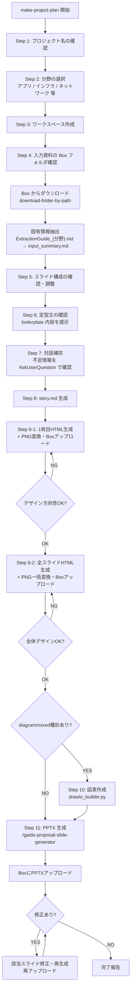

# Make Project Plan

## 概要

提案書・提供資料をインプットに、定型文（免責・法務系＋技術前提）とプロジェクト固有内容を組み合わせたプロジェクト計画書をPowerPoint形式で自動生成するスキル。

`/gaido-proposal-init` の完了後に連続実行することを想定しており、提案書の Box フォルダ情報を引き継いで動作する。単独実行も可能。

## 使用場面

- `/gaido-proposal-init` 完了後、続けてプロジェクト計画書を作成したい
- 既存の提案書・提供資料からプロジェクト計画書を作成したい
- 定型文（免責・法務系・技術前提）を含む標準フォーマットの計画書をPPTX形式で出力したい

## フロー



## ワークスペース構成

```
ai_generated/project_plans/{プロジェクト名}/
├── story.md              # スライド構成（壁打ち成果物）
├── input_summary.md      # 入力資料からの抽出結果
├── design/
│   └── slide_*.html      # frontend-design が生成
│   └── slide_*.png       # Playwright スクリーンショット
├── assets/
│   └── (draw.io 図等)
└── output/
    └── project_plan_{プロジェクト名}.pptx
```

## 実行手順

### Step 1: プロジェクト名の確認

ユーザーにプロジェクト名を確認する。ディレクトリ名に使うため、短い英語またはローマ字表記にする。

`/gaido-proposal-init` から引き継いだ場合は案件名をデフォルト値として提示する。

例: `renewal_2025`, `crm_migration`, `abc_corp_dx`

```
AskUserQuestion(
  questions=[
    {
      "question": "プロジェクト計画書のディレクトリ名に使うプロジェクト名を教えてください（短い英語またはローマ字）。",
      "header": "プロジェクト名の確認",
      "multiSelect": false,
      "options": []
    }
  ]
)
```

### Step 2: 分野の選択

プロジェクトの分野を選択する。選択した分野によってテンプレート・抽出ガイドが切り替わる。
選択結果を変数 `{分野}` として以降のステップで使用する。

| 分野 | {分野} の値 | 対象案件 |
|------|-----------|---------|
| アプリケーション開発 | `app` | Webシステム・業務アプリ・スマートフォンアプリ等 |
| インフラ構築 | `infra` | サーバー構築・クラウド移行・仮想化等（将来対応） |
| ネットワーク構築 | `network` | ネットワーク設計・導入・更改等（将来対応） |

```
AskUserQuestion(
  questions=[
    {
      "question": "プロジェクト計画書のテンプレートに使う分野を選択してください。",
      "header": "分野の選択",
      "multiSelect": false,
      "options": [
        {"label": "アプリケーション開発", "description": "Webシステム・業務アプリ・スマートフォンアプリ等"},
        {"label": "インフラ構築", "description": "サーバー構築・クラウド移行・仮想化等（将来対応）"},
        {"label": "ネットワーク構築", "description": "ネットワーク設計・導入・更改等（将来対応）"}
      ]
    }
  ]
)
```

現時点でテンプレートが存在するのは「アプリケーション開発」のみ。それ以外が選択された場合は「このスキルはまだ対応していません」と伝え、アプリケーション開発で代替するか確認する。

### Step 3: ワークスペース作成

以下のディレクトリを作成する。story.md の配置はStep 5後に行う。

```bash
mkdir -p ai_generated/project_plans/{プロジェクト名}/design
mkdir -p ai_generated/project_plans/{プロジェクト名}/assets
mkdir -p ai_generated/project_plans/{プロジェクト名}/output
```

### Step 4: 入力資料の Box フォルダ確認

#### Box フォルダの確認

`/gaido-proposal-init` から引き継いだ Box フォルダパス（`GAiDo/{案件名}/proposal`）を提示し、使用するフォルダを確認する。

```
AskUserQuestion(
  questions=[
    {
      "question": "提案書は Box の「GAiDo/{案件名}/proposal」に保存されています。このフォルダの資料をプロジェクト計画書の入力として使用しますか？",
      "header": "入力資料の Box フォルダ確認",
      "multiSelect": false,
      "options": [
        {"label": "そのまま使用する", "description": "GAiDo/{案件名}/proposal フォルダの資料を使用します"},
        {"label": "別のフォルダを指定する", "description": "使用する Box フォルダのパスを入力します"}
      ]
    }
  ]
)
```

「別のフォルダを指定する」場合は、AskUserQuestion で Box フォルダパスの入力を求める（フォルダIDではなくパス形式）。

単独実行の場合（`/gaido-proposal-init` からの引き継ぎなし）: AskUserQuestion で Box フォルダパスを直接入力させる。

#### Box からダウンロード

確認したフォルダパスを使ってダウンロードする。

```bash
python3 tools/box_client.py download-folder-by-path "{フォルダパス}" \
  --output-dir ai_generated/input/
# ダウンロード完了後、誤編集・誤削除を防ぐため read-only にする
chmod -R a-w ai_generated/input/
```

**エラー時の対処**:
- 「Box未連携です」→「Box連携が設定されていません。GAiDoアプリのStep 4でBox連携を有効にしてください。それまでの間、入力資料はローカル（`ai_generated/input/`）に保存されます」と伝え、ローカルフォルダパスを案内する
- 「接続認証の有効期限が切れています」→「GAiDoアプリのStep 4でBox連携を再設定してください」と伝えスキップ
- 「IDが存在しません」(404) →「入力したBoxフォルダパスが見つかりません。パスをご確認ください」と伝え再入力を求める
- 「アクセス権限がありません」(403) →「指定したBoxフォルダへのアクセス権限がありません。Box上の共有設定をご確認ください」と伝える
- 「接続できません」→「Boxのサーバーに接続できません。インターネット接続をご確認ください」と伝えスキップ
- その他のエラー → エラーメッセージをそのままユーザーに伝えスキップ

#### 固有情報の抽出

**Readツールで `references/ExtractionGuide_{分野}.md` を読み込み**、カテゴリ1〜11に従って `ai_generated/input/` 内の資料から固有情報を抽出する。

- PDF: `pdfinfo` でページ数確認後、`pages` パラメータで分割して読む
- PPTX/DOCX: `libreoffice --headless --convert-to pdf` で PDF 変換してから読む

抽出結果を `ai_generated/project_plans/{プロジェクト名}/input_summary.md` に ExtractionGuide_{分野}.md のフォーマットで保存する。

### Step 5: スライド構成の確認・調整

**Readツールで `templates/{分野}/structure.md` を読み込み**、全スライドの構成をチャットテキストとして出力する（AskUserQuestion には含めない）。

出力形式の例:
```
プロジェクト計画書は以下の構成で作成します。

| No. | スライドタイトル |
|-----|----------------|
| 1   | 表紙 |
| 2   | 目次 |
...（structure.md の内容を列挙）
```

その後、AskUserQuestion で確認する。

```
AskUserQuestion(
  questions=[
    {
      "question": "この構成で進めますか？",
      "header": "スライド構成の確認",
      "multiSelect": false,
      "options": [
        {"label": "この構成で進める", "description": "全スライドを作成します"},
        {"label": "スライドを調整する", "description": "不要なスライドの削除・追加を対話で決めます"}
      ]
    }
  ]
)
```

「スライドを調整する」場合は、削除・追加・変更したいスライドをユーザーと対話で確認し、最終的なスライド構成を決定する。

**Readツールで `references/StoryTemplate_{分野}.md` を読み込み**、決定したスライド構成（調整した場合は該当セクションを除外・追加した上で）`ai_generated/project_plans/{プロジェクト名}/story.md` に配置する。

### Step 6: 定型文の確認

**Readツールで `boilerplate/legal.md` と `boilerplate/technical.md` を読み込み**、前提条件・免責事項スライドに挿入する定型文の内容をユーザーに提示する。

```
AskUserQuestion(
  questions=[
    {
      "question": "前提条件・免責事項スライドに挿入する定型文の内容を確認してください。変更が必要ですか？",
      "header": "定型文の確認",
      "multiSelect": false,
      "options": [
        {"label": "このまま使用する", "description": "標準の定型文をそのまま使用します"},
        {"label": "一部を変更・追加する", "description": "変更・追加したい内容を対話で教えてください"}
      ]
    }
  ]
)
```

変更がある場合は内容を確認し、story.md 生成時に反映する。

### Step 7: 対話補完

`input_summary.md` の「不足情報」セクションを確認し、不足している情報を AskUserQuestion で補完する。

不足情報の例:
- 体制（担当者氏名・部署が「TBD」）
- スケジュール（具体的な日付が不明）
- 成果物一覧（資料に記載がない場合）

不足情報がない場合はこのステップをスキップする。

### Step 8: story.md 生成

収集した情報をもとに `ai_generated/project_plans/{プロジェクト名}/story.md` を完成させる。

1. 選択したStoryTemplateの各スライドの `{プレースホルダ}` を実際の値で埋める
2. 前提条件・免責事項スライド（スライド13）の内容欄に `boilerplate/legal.md` と `boilerplate/technical.md` の内容を展開する
3. デザイン方針を決定する（`DesignGuidelines.md` を参照）

デザイン方針の確認:

| 項目 | デフォルト | 確認内容 |
|---|---|---|
| トーン | ビジネス・フォーマル | 変更希望があるか |
| フォント | Noto Sans JP | 変更希望があるか |
| ベースカラー | ダークネイビー系 | 企業カラー等の指定があるか |
| アクセントカラー | ブルー系 | 強調色の好みがあるか |

決定したデザイン方針を story.md の「デザイン方針」セクションに記入する。

### Step 9: HTML デザインモック生成

story.md のデザイン方針に基づき、Skillツールで `/frontend-design` を実行してHTMLモックを生成する。

> **言語ルール**: `/frontend-design` を呼び出す際は**「日本語で回答すること」を必ず指示の冒頭に明記すること**。

**手順:**

1. まず **1枚目のスライド**（表紙）のHTMLモックを生成する
   - story.md のデザイン方針（配色・フォント・トーン）を指示として渡す
   - 「日本語で回答すること」を冒頭に明記する
   - **すべてのテキストは日本語で出力すること。英語のサンプルテキスト・プレースホルダは使用禁止**と明示する
   - スライドの内容は story.md に記載された実際の内容を使うこと（ダミーテキスト禁止）
   - 以下の品質要件を指示に含めること:
     - **CSS/JS はすべて `<style>`/`<script>` タグにインライン埋め込みで記述し、外部ファイルを参照しない**
     - **幅1280px・高さ720px（16:9）の単一スライドとして、body にスクロールバーが出ない構成にする**
     - プレースホルダ（XX、○○、TBD、[会社名]等）を一切残さない
     - 箇条書きは `・`（中黒）で統一
     - 表のカラム幅は内容量に合わせ、単語途中での折り返しを禁止
     - **全スライドで同一テーマ（ダーク or ライト）を統一すること**

2. **AIが自動で** Playwright を実行して PNG に変換する（ユーザーに依頼してはならない）

   ```bash
   python3 - <<'PYEOF'
   from playwright.sync_api import sync_playwright
   import os

   html_path = "ai_generated/project_plans/{プロジェクト名}/design/slide_1.html"
   png_path  = "ai_generated/project_plans/{プロジェクト名}/design/slide_1.png"
   os.makedirs(os.path.dirname(png_path), exist_ok=True)

   with sync_playwright() as p:
       browser = p.chromium.launch()
       page = browser.new_page(viewport={"width": 1280, "height": 720})
       page.goto(f"file://{os.path.abspath(html_path)}")
       page.wait_for_load_state("networkidle")
       page.screenshot(path=png_path, full_page=False)
       browser.close()

   print(f"スクリーンショット生成: {png_path}")
   PYEOF
   ```

3. PNG を Box にアップロードする

   ```bash
   python3 tools/box_client.py upload \
     ai_generated/project_plans/{プロジェクト名}/design/slide_1.png \
     --folder-path "GAiDo/{案件名}/project_plan/design"
   ```

   アップロード後、「BoxのGAiDo/{案件名}/project_plan/design フォルダにスクリーンショットを保存しました。Box上でスライドの見た目を確認できます」とユーザーに伝える。

   **アップロード失敗時（Box未連携など）**: デザイン確認用スクリーンショットはローカルで確認できる。「Box未連携のため、デザイン確認用スクリーンショットはローカル（`ai_generated/project_plans/{プロジェクト名}/design/slide_*.png`）で確認してください。Box連携を有効にするとBox上でも確認できます（GAiDoアプリの Step 4 で設定できます）」とユーザーに伝える。

4. **AskUserQuestion** でデザイン方向性を確認する（必須・スキップ禁止）

   ```
   AskUserQuestion(
     questions=[
       {
         "question": "1枚目スライド（表紙）のデザインを確認してください。配色・フォント・レイアウトの方向性はOKですか？",
         "header": "デザイン方向性確認",
         "multiSelect": false,
         "options": [
           {"label": "OKです、残りのスライドも生成してください", "description": "この方向性でデザインを確定し、全スライドのHTMLモックを生成します"},
           {"label": "修正したい", "description": "修正内容をテキストで入力してください（Otherで入力）"}
         ]
       }
     ]
   )
   ```

   修正がある場合は HTML を修正 → Playwright で PNG 再生成 → Boxアップロード → 再確認。OKが出たら次へ進む。

5. 方向性が決まったら、残りのスライドのHTMLモックを一括生成する。スライド 1 と同じ品質要件・デザイン方針を渡すこと

6. **AIが自動で** 全スライドのスクリーンショットを一括生成する（ユーザーに依頼してはならない）

   ```bash
   python3 - <<'PYEOF'
   from playwright.sync_api import sync_playwright
   import os, glob

   design_dir = "ai_generated/project_plans/{プロジェクト名}/design"
   html_files = sorted(glob.glob(f"{design_dir}/slide_*.html"))

   with sync_playwright() as p:
       browser = p.chromium.launch()
       for html_file in html_files:
           png_file = html_file.replace(".html", ".png")
           page = browser.new_page(viewport={"width": 1280, "height": 720})
           page.goto(f"file://{os.path.abspath(html_file)}")
           page.wait_for_load_state("networkidle")
           page.screenshot(path=png_file, full_page=False)
           page.close()
           print(f"生成: {png_file}")
       browser.close()
   PYEOF
   ```

7. 全スライドの PNG を Box にアップロードし、**AskUserQuestion** で全体デザインの確認を依頼する。OKが出るまで Step 10 に進んではならない

   ```bash
   # 全スライド PNG を一括アップロード
   for f in ai_generated/project_plans/{プロジェクト名}/design/slide_*.png; do
     python3 tools/box_client.py upload "$f" \
       --folder-path "GAiDo/{案件名}/project_plan/design"
   done
   ```

   ```
   AskUserQuestion(
     questions=[
       {
         "question": "全スライドのデザインを確認してください。全体的なデザインはOKですか？",
         "header": "全スライドデザイン確認",
         "multiSelect": false,
         "options": [
           {"label": "OKです、PPTXを生成してください", "description": "デザインを確定し、PPTX生成へ進みます"},
           {"label": "修正したい", "description": "修正が必要なスライド番号と修正内容を入力してください（Otherで入力）"}
         ]
       }
     ]
   )
   ```

生成先: `ai_generated/project_plans/{プロジェクト名}/design/slide_{番号}.html` および `slide_{番号}.png`

### Step 10: 図表作成

story.md で `diagram` または `mixed` 種別のスライドに図表定義がある場合、`tools/drawio_builder.py` で図を作成する。
作成した `.drawio` と PNG は `ai_generated/project_plans/{プロジェクト名}/assets/` に保存する。

#### スライド 3: コンテキスト図（context_diagram.drawio）

現状システム（課題）と新システム（解決後）を左右に対比する。

```python
import sys
sys.path.insert(0, "tools")
from drawio_builder import DrawioBuilder, OrgChartBuilder
from drawio_builder import STYLE_GROUP_DASHED_RED, STYLE_GROUP_GREEN, STYLE_EXTERNAL, STYLE_LABEL_SMALL

b = DrawioBuilder(name="コンテキスト図")

# 左: 現状（課題）
left = b.add_group(40, 80, 320, 200, "現状", style=STYLE_GROUP_DASHED_RED)
b.add_node(60, 40, 160, 50, "{現行システム名}", parent=left, style=STYLE_EXTERNAL)
b.add_node(40, 110, 240, 30, "課題: {課題1}", parent=left, style=STYLE_LABEL_SMALL)
b.add_node(40, 150, 240, 30, "課題: {課題2}", parent=left, style=STYLE_LABEL_SMALL)

# 右: 新システム（解決後）
right = b.add_group(520, 80, 320, 200, "新システム", style=STYLE_GROUP_GREEN)
b.add_node(60, 40, 160, 50, "{新システム名}", parent=right)
b.add_node(40, 110, 240, 30, "効果: {期待効果1}", parent=right, style=STYLE_LABEL_SMALL)
b.add_node(40, 150, 240, 30, "効果: {期待効果2}", parent=right, style=STYLE_LABEL_SMALL)

# 中央エッジ（グループ間）
b.add_edge(left, right, label="プロジェクト実施")

b.save("ai_generated/project_plans/{プロジェクト名}/assets/context_diagram.drawio")
```

#### スライド 4: スコープ境界図（scope_diagram.drawio）

対象スコープ（点線赤枠）と対象外エリア、外部連携先を配置する。

```python
from drawio_builder import STYLE_GROUP_DASHED_RED, STYLE_GROUP_GRAY, STYLE_EXTERNAL, STYLE_SCOPE_MARKER

b = DrawioBuilder(name="スコープ境界図")

# 対象スコープ枠
scope = b.add_group(40, 40, 500, 300, "対象スコープ", style=STYLE_GROUP_DASHED_RED)
b.add_node(20, 30, 200, 25, "★ 構築対象スコープ", parent=scope, style=STYLE_SCOPE_MARKER)
b.add_node(20, 70, 140, 40, "{機能1}", parent=scope)
b.add_node(180, 70, 140, 40, "{機能2}", parent=scope)
b.add_node(20, 130, 140, 40, "{API・連携機能}", parent=scope)
# 追加機能があれば b.add_node で追加

# 対象外
out_of_scope = b.add_group(580, 40, 220, 180, "対象外", style=STYLE_GROUP_GRAY)
b.add_node(20, 40, 180, 35, "{対象外1（例: インフラ設定）}", parent=out_of_scope)
b.add_node(20, 90, 180, 35, "{対象外2（例: ユーザー研修）}", parent=out_of_scope)

# 外部連携先
ext = b.add_node(580, 280, 160, 50, "{外部システム名}", style=STYLE_EXTERNAL)
# スコープ内の連携機能ノードIDと外部システムを接続
# b.add_edge(連携機能ノードID, ext, label="連携")

b.save("ai_generated/project_plans/{プロジェクト名}/assets/scope_diagram.drawio")
```

#### スライド 6: 体制図（team_chart.drawio）

```python
from drawio_builder import DrawioBuilder, OrgChartBuilder, STYLE_ORG_TOP, STYLE_ORG_MEMBER, STYLE_ORG_VENDOR

b = DrawioBuilder(name="体制図")
org = OrgChartBuilder(b)
org.add_role("pm",   title="PM",             name="{PM氏名}",   org="{ベンダー名}", style=STYLE_ORG_TOP)
org.add_role("tl",   title="テクニカルリード", name="{TL氏名}",   org="{ベンダー名}", parent="pm")
org.add_role("dev1", title="開発担当",         name="{担当者名}", org="{ベンダー名}", parent="tl")
org.add_role("test", title="テスト担当",        name="{担当者名}", org="{ベンダー名}", parent="tl")
# 顧客側
org.add_role("cust_pm",   title="顧客窓口",   name="{窓口氏名}", org="{顧客名}",   style=STYLE_ORG_VENDOR, parent="pm")
org.add_role("cust_appr", title="顧客承認者", name="{承認者名}", org="{顧客名}",   style=STYLE_ORG_VENDOR, parent="pm")
org.layout(start_x=100, start_y=50)
b.save("ai_generated/project_plans/{プロジェクト名}/assets/team_chart.drawio")
```

#### スライド 12: 変更管理フロー図（change_flow.drawio）

6ステップを横一列に矩形ノード＋エッジで表現する。

```python
b = DrawioBuilder(name="変更管理フロー")

steps = [
    "変更要求\n発生",
    "PM記録・\n判定",
    "影響範囲\n調査",
    "顧客\n確認",
    "承認",
    "変更\n反映",
]
node_w, node_h, gap = 120, 60, 30
ids = []
for i, label in enumerate(steps):
    nid = b.add_node(40 + i * (node_w + gap), 80, node_w, node_h, label)
    ids.append(nid)
    if i > 0:
        b.add_edge(ids[i - 1], nid)

b.save("ai_generated/project_plans/{プロジェクト名}/assets/change_flow.drawio")
```

#### PNG へのエクスポート

draw.io MCP の `export_diagram` コマンドで `.drawio` → PNG に変換する。MCP が利用できない場合は `.drawio` ファイルのみ保存し、ユーザーに手動エクスポートを依頼する。

### Step 11: PPTX 生成

Skillツールで `/gaido-proposal-slide-generator` を以下のargsを渡して実行する。

- 入力: `ai_generated/project_plans/{プロジェクト名}/story.md`
- HTML デザイン: `ai_generated/project_plans/{プロジェクト名}/design/slide_*.html`
- 出力: `ai_generated/project_plans/{プロジェクト名}/output/project_plan_{プロジェクト名}.pptx`
- **`claude_in_pptx_prompt.md` 保存先**: `ai_generated/project_plans/{案件名}/claude_in_pptx_prompt.md`
- **Box アップロード先**: `GAiDo/{案件名}/project_plan`

PPTX 生成後、Box にアップロードする。

```bash
python3 tools/box_client.py upload \
  ai_generated/project_plans/{プロジェクト名}/output/project_plan_{プロジェクト名}.pptx \
  --folder-path "GAiDo/{案件名}/project_plan"
```

**アップロード成功時**: Box フォルダ URL を取得してからユーザーに確認を依頼する。

**アップロード失敗時（Box未連携など）**: ローカル保存のままで、「Box未連携のためローカルに保存しました。Box連携を有効にすると、この成果物が自動でBoxに保存されます（GAiDoアプリの Step 4 で設定できます）。保存先: `ai_generated/project_plans/{プロジェクト名}/output/project_plan_{プロジェクト名}.pptx`」とユーザーに伝える。その場合でも、AskUserQuestion での確認（修正有無確認）は進める。

```python
from tools.box_client import BoxClient
client = BoxClient()
folder_id = client.resolve_folder_path("GAiDo/{案件名}/project_plan")
box_url = f"https://app.box.com/folder/{folder_id}"
print(box_url)
```

> **記録**: AskUserQuestion を呼ぶ前に `/record-progress "提案書確認フェーズ" "waiting_approval" --flow-type proposal --message "PPTXを確認してください"` を実行すること。

```
AskUserQuestion(
  questions=[
    {
      "question": "BoxのGAiDo/{案件名}/project_plan フォルダにプロジェクト計画書（PPTX）を保存しました。ご確認ください。修正はありますか？",
      "header": "PPTX確認",
      "multiSelect": false,
      "options": [
        {"label": "OKです", "description": "このまま完了します"},
        {"label": "修正したい", "description": "修正が必要なスライド番号と修正内容を入力してください（Otherで入力）"}
      ]
    }
  ]
)
```

修正がある場合は該当スライドの HTML を修正 → `/gaido-proposal-slide-generator` で再生成 → Box に再アップロード → 再確認。OKが出たら完了報告へ。

**⚠️ 省略禁止**: キャラクター口調への書き換えは許可するが、`### 次のステップ` セクション（Claude in PowerPoint推奨・draw.io編集案内・URL含む）は**構造・内容を保持したまま出力すること**。

取得した `box_url` を使い、以下のフォーマットでユーザーに完了報告すること:

---

## プロジェクト計画書が完成しました

### 成果物一覧（Box: 取得した folder_id を `https://app.box.com/folder/{folder_id}` 形式のリンクとして出力すること）

| ファイル | 内容 |
|---------|------|
| `project_plan_{プロジェクト名}.pptx` | プロジェクト計画書（完成版） |
| `claude_in_pptx_prompt.md` | Claude in PowerPoint 仕上げ用プロンプト |
| `story.md` | スライド構成・内容定義 |
| `input_summary.md` | 入力資料からの抽出サマリ |
| `assets/` | draw.io 図ファイル（編集可能） |

### 次のステップ

#### 1. Claude in PowerPoint で仕上げる

PPTXをダウンロードしてPowerPointで開き、Claude in PowerPoint アドインで仕上げを行うことをお勧めします。

**アドインのインストール手順（未インストールの場合）:**
1. [Microsoft Marketplace の Claude for PowerPoint ページ](https://marketplace.microsoft.com/en-us/product/office/WA200010001?tab=Overview) にアクセスして「Get it now」をクリック
2. PowerPoint を開いてアドインを有効化 → Claude アカウントでサインイン

参考: https://support.claude.com/en/articles/13521390-use-claude-for-powerpoint

**仕上げ用プロンプト:** Box の `claude_in_pptx_prompt.md` を開き、内容をClaude in PowerPointに貼り付けて実行してください。

#### 2. draw.io 図を編集する（必要に応じて）

Box の `assets/` フォルダに draw.io ファイルがあります。[draw.io](https://app.diagrams.net/) でファイルを開いて編集し、PowerPoint に貼り直すことができます。

---

## 注意事項

- 定型文（boilerplate）の内容は事前に確認・カスタマイズしてから story.md に展開すること
- 前提条件・免責事項スライド（スライド13）に固有の前提条件がある場合は定型文の後に追記すること
- story.md は後工程（frontend-design・slide-generator）の入力になる重要なファイルであることを意識すること
- ユーザーの承認が必要なのは Step 9（1枚目デザイン確認）・Step 9（全スライドデザイン確認）の 2 箇所。それ以外は自動実行される
- 分野選択（Step 2）で「アプリケーション開発」以外が選ばれた場合は未対応である旨を伝え、アプリケーション開発での代替を提案すること
