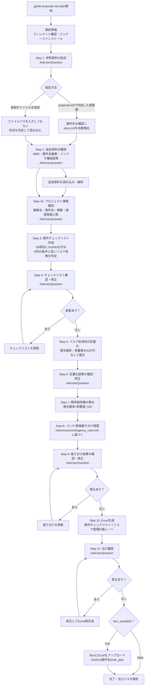

# リスク計画書生成スキル

## 概要

受注後プロジェクトのリスク計画書作成を自動化するスキル。
各種プロジェクト資料を AI が読み込み、案件チェックリストへの回答を通じてリスク項目を特定し、
定量化・コンテ/原価振り分けを行い、社内 Excel テンプレートに出力する。

welcome-message の「営業支援」→「プロジェクト計画書/リスク計画書を作成する」→「リスク計画書を作成する」で呼び出す独立スキル。
`/gaido-proposal-init` 完了後のネクストアクションとしても実行できる。

**入力として利用できる資料（複数可）:**

| 資料種別 | 主な記載内容 |
|---------|------------|
| 提案書（story.md 等） | 案件概要・技術スタック・スケジュール・体制 |
| プロジェクト憲章・スコープ定義書 | プロジェクト目的・スコープ内外・制約条件 |
| WBS | 作業分解・タスク一覧・依存関係 |
| システム要件定義書・アーキテクチャ設計書 | 機能/非機能要件・システム構成・外部連携 |
| インフラ構成図 | サーバー/クラウド構成・ネットワーク・セキュリティ境界 |

**出力対象シート（同一 Excel ファイル内）:**

1. **案件チェックリスト** — 26 項目への Yes/No 回答とリスク有無の判定結果
2. **リスク管理計画シート** — チェックリストで「リスク有」と判定した項目を定量化した計画書

### 本スキルが担うフェーズ・ステップ

社内リスク管理手順書に定義されたフェーズ・ステップとの対応を以下に示す。
本スキルが出力するのは「見積・計画フェーズ」の範囲であり、プロジェクト開始後の監視・対応は PM が担当する。

| フェーズ | ステップ | 担当 | 本スキルの対応 |
|---------|---------|------|-------------|
| フェーズ1（見積時） | ステップ1: リスク評価・チェックリスト | PM | ✅ Step 3〜4（案件チェックリスト自動回答） |
| フェーズ2（計画時） | ステップ2: リスクの特定と分析 | PM | ✅ Step 5（リスクイベント・確率・影響度の定量化） |
| フェーズ2（計画時） | ステップ3: リスク対応方針と優先順位の決定 | PM | ✅ Step 8〜9（コンテ/原価・対応方針の振り分け） |
| フェーズ2（計画時） | ステップ4: リスク対応計画の検討（対応責任者・実施期限） | PM | ❌ プロジェクト開始後に PM が記入 |
| フェーズ2（計画時） | ステップ5: コンティンジェンシー計画の策定 | PM | ✅ Step 8〜9（コンテ/原価振り分けと合計算出） |
| フェーズ2（計画時） | ステップ6〜7: リスク監視計画・見直しタイミングの設定 | PM | ❌ プロジェクト開始後に PM が記入 |
| フェーズ3（作業実施時） | ステップ8〜10: 監視・変更・顕在化対応 | PM | ❌ プロジェクト開始後に PM が記入 |

## 行動指針

- **選択式中心**: 自由記述は最小限にし、AskUserQuestion の選択式で素早く回答できるようにする
- **各ステップで確認**: データ抽出・AI 提案後は必ずユーザーに確認を取る
- **日本語**: ユーザーに見える出力はすべて日本語にする
- **戻り操作**: ユーザーが「戻りたい」「やり直したい」と言った場合は、直前のステップの AskUserQuestion を再度提示する

## フロー



## 事前準備

1. `ai_generated/proposals/` ディレクトリの存在を確認し、なければ作成
2. Python パッケージのインストール:

```bash
mkdir -p ai_generated/proposals
pip install --break-system-packages openpyxl 2>/dev/null || true
```

3. Box 接続の確認（`.box/credentials.json` の存在確認）:
   - 存在する → `box_available = true`
   - 存在しない → `box_available = false`（完了時の Box アップロードをスキップ）

4. テンプレートファイルの存在確認:
   - `SKILL_DIR/assets/risk_templete.xlsx` が存在するか確認
   - 存在しない場合は、ユーザーに「テンプレートを `assets/risk_templete.xlsx` に配置してください」と案内して処理を中断する

> **注意**: `SKILL_DIR` はこの SKILL.md が置かれているディレクトリの絶対パス。
> Bash で `find .claude/skills -name "gaido-proposal-risk-plan" -type d` で特定する。

## リファレンス構成

各リファレンスは該当ステップに入ったタイミングで読み込むこと。

| リファレンス | パス（相対） | 役割 | 読み込みタイミング |
|------------|-------------|------|----------------|
| checklist_writer | `references/checklist_writer.md` | 案件チェックリスト書き込み手順・全 26 項目一覧 | Step 3 前 |
| contingency_rules | `references/contingency_rules.md` | コンテ/原価の振り分けルール・判定フロー・例 | Step 8 前 |
| excel_writer | `references/excel_writer.md` | リスク管理計画シート書き込み手順 | Step 10 前 |

パスはこの SKILL.md ファイルと同じディレクトリからの相対パス。

---

## Step 1: 参照資料の指定

AskUserQuestion で主となる資料の指定方法を確認する。

```
メェナビ「リスク計画書を作成するなのです！まずメインの資料を指定してほしいなのです」
  ○ GAiDo で作成した提案書を使う（案件フォルダから自動検出します）
  ○ 自前のファイルを指定する（ファイルパスを入力してください）
```

### 「GAiDo で作成した提案書を使う」の場合

AskUserQuestion で案件名を確認する（`ai_generated/proposals/` 直下のディレクトリ一覧を提示）:

```bash
ls ai_generated/proposals/
```

```
メェナビ「案件名を選んでほしいなのです」
  ○ {案件名1}
  ○ {案件名2}
  ○ （自由入力）
```

案件名が確定したら `ai_generated/proposals/{案件名}/story.md` を Read で読み込む。

### 「自前のファイルを指定する」の場合

AskUserQuestion で自由入力を受け付ける:

```
メェナビ「ファイルのパスを入力してほしいなのです（例: /home/user/proposal.pdf）」
```

ファイル形式に応じて読み込む:

| 形式 | 読み込み方法 |
|------|------------|
| `.md` / `.txt` | Read ツールで直接読み込み |
| `.pdf` | Read ツール（PDF 対応）で読み込み。ページ数を先に pdfinfo で確認し `pages` パラメータを使用 |
| `.xlsx` | openpyxl で全シートのテキストを抽出 |
| `.pptx` | python-pptx でスライドテキストを抽出 |
| `.docx` | python-docx で本文テキストを抽出 |
| 画像（`.png` / `.jpg` / `.svg`） | Read ツール（画像対応）でビジュアルを直接解析 |

---

## Step 2: 追加資料の確認・読み込み

メイン資料を読み込んだ後、追加資料の有無を確認する。

AskUserQuestion で複数選択を受け付ける:

```
メェナビ「他にも参照できる資料があれば教えてほしいなのです！あるだけリスクを正確に把握できるなのです」
  ☐ プロジェクト憲章・スコープ定義書（スコープ内外・制約条件）
  ☐ WBS（作業分解・タスク一覧・依存関係）
  ☐ システム要件定義書・アーキテクチャ設計書（機能/非機能要件・システム構成）
  ☐ インフラ構成図（サーバー/クラウド構成・ネットワーク・セキュリティ境界）
  ☐ その他（ファイルパスを入力してください）
  ○ 追加資料なし（メイン資料のみで進める）
```

選択された資料について、それぞれファイルパスを確認して上記の形式対応表に従い読み込む。

### 各資料から把握すべき情報

読み込んだすべての資料を合わせて、以下の情報を把握する:

| 情報 | 主な参照資料 |
|------|------------|
| 案件の概要（何を作るか・規模・業種） | 提案書・プロジェクト憲章 |
| スコープ内外・制約条件 | プロジェクト憲章・スコープ定義書 |
| 技術スタック・アーキテクチャ | 提案書・要件定義書・アーキテクチャ設計書 |
| インフラ・クラウド構成・セキュリティ境界 | インフラ構成図・アーキテクチャ設計書 |
| 外部連携・依存システム | 要件定義書・アーキテクチャ設計書 |
| 作業構成・タスクの依存関係 | WBS |
| スケジュール・主要マイルストーン | 提案書・WBS |
| 体制・役割分担 | 提案書・プロジェクト憲章 |
| 顧客の特記事項・優先事項 | 提案書・プロジェクト憲章 |

---

## Step 1b: プロジェクト情報の確認

AskUserQuestion で以下の情報を確認する。提案書から読み取れる場合は候補を提示し、正しければそのまま使う。

| 項目 | 確認内容 | チェックリストへの影響 |
|------|---------|-------------------|
| 顧客名 | 例: 〇〇株式会社 | ヘッダー B2 に記入 |
| プロジェクト名 | 例: 受発注システム刷新プロジェクト | ヘッダー B3 に記入 |
| 案件規模 | 3000万円以上 / 3000万円未満 | 「3000万円以上」の項目（No.1,2,4,5,18,23,24,25）の適用可否を決定 |
| 契約違反時の損害賠償の上限 | 例: 契約金額の1倍 / 上限なし / 未確認 | ヘッダー B5 に記入 |

---

## Step 3: 案件チェックリストの作成

**`references/checklist_writer.md` を読み込む。**

`references/checklist_writer.md` の「全チェック項目一覧」26 項目について、提案書の内容から各項目への回答を決定する。

### 回答ルール

1. **案件規模フィルタ**: B 列が「3000万円以上」の項目は、案件規模が 3000万円以上の場合のみ回答する。3000万円未満の案件では `is_applicable = false` とし E 列・H 列とも空欄にする
2. **提案書・参照資料に明確な根拠がある場合**: 資料の記述を根拠に Yes/No を判定し、`confidence = 確信` として根拠を記録する
3. **資料に情報がない、または解釈が分かれる場合**: 資料から読み取れる範囲でベストの Yes/No を判定し、`confidence = 要確認` として根拠欄に理由（「資料に記載なし」「記述が曖昧」「資料間で矛盾」等）を記録する
   - `confidence = 要確認` かつ **リスク無** → Excel の当該行に「要確認」楕円バッジを描画する（見落とすと危険なため）
   - `confidence = 要確認` かつ **リスク有** → 特別なマーキングなし（リスク有で既に目に入るため）
4. **H 列のリスク判定**: `checklist_writer.md` の `determine_risk()` ロジックに従う

> **AI システム特記事項**: チェック項目 No.15「AIシステム固有のリスクを把握・対策しているか」が **リスク有**（＝「No」回答）と判定された場合は、ステップ 5 のリスクイベント記述時に以下を明示すること:
> - AI システム固有のリスク（精度劣化・バイアス・説明責任・データ品質等）を具体的に列挙する
> - 対応策に「CTC グループ AI 倫理原則に基づく追加チェック実施」を含める

### 出力形式（内部保持用）

```markdown
# チェックリスト回答

| 行 | No | リスク観点 | チェック項目（要約） | 回答 | リスク有無 | 確信度 | 根拠 |
|----|-----|---------|----------------|-----|---------|------|-----|
| 9 | 1 | 顧客 | 顧客はプロジェクトの主体性をもっているか | Yes | リスク無 | 確信 | 提案書に顧客主導の要件定義が明記されているため |
| 10 | 2 | 顧客・体制 | 顧客体制の大きな変更が予想されるか | No | リスク無 | 要確認 | 資料に記載なし、保守的に判定 |
...
```

`ai_generated/proposals/{案件名}/risk_plan/checklist_answers.md` に保存する。

---

## Step 4: チェックリスト確認・修正

抽出したチェックリスト回答をユーザーに提示し、過不足を確認する。

```
メェナビ「{案件名}の案件チェックリストを入力したなのです！回答を確認してほしいなのです」

━━━━━━━━━━━━━━━━━━━━━━━━━━━━━━
⚠️ 要確認（根拠不足・保守的判定）— {K}件
  資料に根拠がなかったため保守的に判定した項目です。PM が内容を確認して修正してください。

  No.2  顧客体制の変更リスク  → No  → リスク無  ※ 資料に記載なし、保守的に判定
  No.7  ...（要確認の項目を全件列挙）
━━━━━━━━━━━━━━━━━━━━━━━━━━━━━━

✅ 判定済み（根拠あり）

【1.スコープ定義】
  No.1  顧客の主体性         → Yes → リスク無（根拠: 提案書に顧客主導の要件定義が明記）
  ...（省略せず全件表示すること）

【2.要件洗い出し】
  ...

リスク有: {N}件 / 要確認: {K}件 / 対象外: {M}件（3000万円未満のため）
```

AskUserQuestion で確認:

```
  ○ このまま進める
  ○ 回答を修正する（修正したい No・変更後の回答を教えてください）
```

修正がある場合は回答を更新して `checklist_answers.md` を更新し、リスク有無も再判定して再度このステップに戻る。

---

## Step 5: リスク有項目の定量化

チェックリストで「リスク有」と判定された項目について、発生確率・影響度を付与する。

各リスクについて以下の情報を付与して表形式で提示する:

| No | リスク観点（D列） | リスクイベント（C列） | 発生確率(%) | 影響度(¥M) | 影響度の根拠・説明 |
|----|----------------|-----------------|-----------|----------|----------------|

- **リスクイベント（C列）**: チェック項目の問いかけをそのまま使わず、「〇〇が不明確なため△△が発生するリスク」の形式で具体的に記述する
- **リスク観点（D列）**: `checklist_writer.md` の「全チェック項目一覧」列「リスク管理計画D列対応値」を使用する
- **発生確率**: `references/excel_writer.md` の確率目安（高:30%以上 / 中:10〜30% / 低:10%未満）を参考に整数で設定する
- **影響度(¥M)**: 百万円単位。「追加工数×単価」または「直接費用」で算出

---

## Step 6: 定量化結果の確認・修正

Step 5 の結果を提示してユーザーに確認を取る。

```
メェナビ「発生確率と影響度はこのように見積もったなのです。修正があれば教えてほしいなのです」

{Step 5 の表をそのまま表示}
```

AskUserQuestion で確認:

```
  ○ このまま進める
  ○ 数値を修正する（修正したいNo・項目・値を教えてください）
```

修正がある場合は値を更新して再度提示し確認する。

---

## Step 7: 期待損失額の算出

```
期待損失額（¥M） = 発生確率（%） × 影響度（¥M） / 100
```

各リスクの期待損失額を計算し、合計を算出する。
また予測値の降順で Top20 順位を付与する。
（この計算は自動で行い、ユーザーへの確認は不要）

---

## Step 8: コンテ/原価振り分けの提案

**`references/contingency_rules.md` を読み込む。**

振り分けルールに基づき、各リスクについてコンテ/原価の判定を行い理由とともに提示する。

```
メェナビ「各リスクのコンテ/原価を振り分けたなのです！確認してほしいなのです」

| No | リスク項目 | 期待損失(¥M) | コンテ/原価 | 対応方針 | 理由 |
|----|---------|-----------|----------|--------|------|
...

コンテンジェンシー合計: {X} ¥M
原価合計: {Y} ¥M
```

- **コンテ/原価**: `references/contingency_rules.md` のルールに基づく判定
- **対応方針**: テンプレートの J 列に書く値。「回避」「転嫁」「軽減」「受容」から選択
  - コンテ → 「転嫁」または「受容」が多い
  - 原価 → 「回避」または「軽減」が多い

---

## Step 9: 振り分け結果の確認・修正

AskUserQuestion で確認:

```
  ○ このまま進める
  ○ 振り分けを修正する（修正したいNo・変更後の区分を教えてください）
```

修正がある場合は振り分けを更新して再度 Step 8 の結果を提示し確認する。

---

## Step 10: Excel ファイルの生成

**`references/checklist_writer.md` と `references/excel_writer.md` を読み込む。**

以下の手順で Excel ファイルを生成する:

1. テンプレートパスを特定する:
   ```bash
   find .claude/skills -name "gaido-proposal-risk-plan" -type d
   ```
   → `SKILL_DIR/assets/risk_templete.xlsx` を使用する

2. **openpyxl の `load_workbook` / `save` は使用禁止**。代わりに以下の順序で ZIP レベル操作を行う（`checklist_writer.md` の「両シートを書き込む場合」コード例を参照）:
   - `shutil.copy2(template, output)` でテンプレートをコピー（1回のみ）
   - `_write_cells_to_sheet()` で sheet2（案件チェックリスト）を書き込む
   - `_write_cells_to_sheet()` で sheet4（リスク管理計画シート）を書き込む
   - `add_yoKakunin_badges()` でバッジを追加する

3. **案件チェックリストシートへの書き込み**（`checklist_writer.md` 参照）:
   - B2〜B5 ヘッダー情報
   - 各データ行の E 列（回答）と H 列（リスク有無）

4. **リスク管理計画シートへの書き込み**（`excel_writer.md` 参照）:
   - C3, G3, R3, T3 ヘッダー情報
   - 14 行目からリスクデータを書き込む

5. 出力先に保存する:
   ```
   ai_generated/proposals/{案件名}/risk_plan/risk_plan.xlsx
   ```

6. 中間ファイルも同じディレクトリに保存する:
   ```
   ai_generated/proposals/{案件名}/risk_plan/checklist_answers.md
   ```

7. **box_available = true の場合**: Box にアップロードする:

   ```bash
   python3 tools/box_client.py upload \
     "ai_generated/proposals/{案件名}/risk_plan/risk_plan.xlsx" \
     --folder-path "GAiDo/{案件名}/risk_plan"
   ```

   アップロード成功後、Box URL をユーザーに表示する。

   **Boxアップロードが失敗した場合**: エラー内容をユーザーに伝え、ローカルファイルパスを案内して続行する。

---

## Step 11: 出力確認

完了報告をユーザーに行う。

---

## リスク計画書が完成しました

### 成果物

| ファイル | 内容 |
|---------|------|
| `ai_generated/proposals/{案件名}/risk_plan/risk_plan.xlsx` | リスク計画書 Excel（案件チェックリスト＋リスク管理計画シート、ローカル） |
| `ai_generated/proposals/{案件名}/risk_plan/checklist_answers.md` | チェックリスト回答（中間ファイル） |
| Box: `GAiDo/{案件名}/risk_plan/risk_plan.xlsx` | リスク計画書 Excel（Box、box_available=true のみ） |

### サマリー

| 指標 | 値 |
|------|-----|
| チェック項目数 | 26 件（うち対象外: {M} 件） |
| リスク有項目数 | {N} 件 |
| 期待損失額合計 | {X} ¥M |
| コンテンジェンシー合計 | {Y} ¥M |
| 原価合計 | {Z} ¥M |

---

AskUserQuestion で最終確認:

```
  ○ 完了（このまま終わる）
  ○ 一部を修正して Excel を再生成する（修正内容を教えてください）
```

修正がある場合は該当ステップに戻り修正を行い、Excel を再生成する。

---

## 注意事項

- `risk_templete.xlsx` が `assets/` に存在しない場合は処理を中断し、ユーザーにテンプレート配置を依頼すること
- **「リスク管理計画立案手順ガイド」シートは手順ガイドのため編集禁止**。書き込み対象は「案件チェックリスト」と「リスク管理計画シート」の 2 シートのみ
- **openpyxl の `save` は絶対に使用しない**: openpyxl は `load_workbook` → `save` の際に `xl/drawings/` を全削除・`_rels` / `[Content_Types].xml` も破壊することが実証済み。代わりに `shutil.copy2` + `_write_cells_to_sheet()` による ZIP 操作を使うこと（`checklist_writer.md` 参照）
- テンプレートの列構成が不明な場合は必ず openpyxl で確認してから書き込むこと（仮定で書き込まない）
- リスクイベントはチェック項目の文言をそのまま使わず、提案書固有の文脈を踏まえて具体的に記述すること
- 期待損失額の計算は `発生確率(%) × 影響度(¥M) / 100` の式を厳守すること（単位は百万円）
