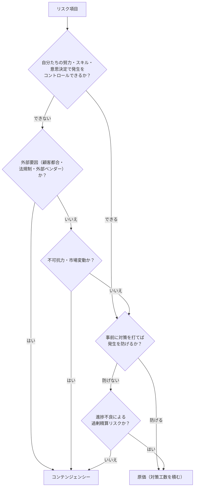

# コンテ/原価 振り分けルール

## 定義

| 区分 | 正式名称 | 意味 |
|------|---------|------|
| コンテ | コンテンジェンシー | 発生するかどうかが自分たちでコントロールできないリスクに備える予備費 |
| 原価 | 原価計上 | 発生が予見できるリスクを見越して、最初から見積もり原価に積み込む費用 |

---

## 振り分け判定フローチャート

---

## 振り分け基準

### コンテンジェンシーにすべきもの

「自分たちではコントロールできない」リスク:

- 顧客都合による仕様の大幅変更・追加要望
- 顧客側の意思決定遅延・承認遅延による工期延伸
- 法規制・業界規制の変更による仕様変更
- 外部ベンダー（パートナー・調達先）の遅延・品質問題
- 外部 API・SaaS の仕様変更・廃止
- 自然災害・パンデミック等の不可抗力
- 為替変動・市場価格の変動

### 原価に積むべきもの

「事前対策で防げる、または自分たちの責任範囲にある」リスク:

- 技術調査不足・PoC 未実施による手戻り
- 自社チームのスキルギャップ・学習コスト
- テスト工数の見積もり不足（類似案件の実績から補正可能）
- 設計ドキュメント作成コストの見落とし
- 性能試験・セキュリティ診断コストの見落とし
- 移行リハーサル・本番切り替え作業の見落とし
- 進捗不良による残業・追加要員コスト（工程管理で防げるもの）

---

## パターン別判定例

### コンテンジェンシー判定例

| No. | リスク項目 | 理由 |
|----|-----------|------|
| 1 | 顧客担当者交代による要件再確認・仕様変更 | 顧客組織の事情で発生する。自社でコントロール不可 |
| 2 | 行政申請・審査の遅延によるシステム稼働延伸 | 行政手続きは外部要因で期間が確定できない |
| 3 | 外部 API（決済・認証等）の仕様変更対応 | サービス提供元の都合で発生する |
| 4 | 顧客社内の IT 環境制約（セキュリティポリシー変更）による設計変更 | 顧客社内ルールの変更は予測困難 |
| 5 | パートナー企業の担当者離脱・品質問題による工数増加 | パートナーの内部問題は自社でコントロール不可 |
| 6 | 調達ハードウェアの納期遅延 | ベンダーの製造・物流事情に依存 |
| 7 | 法改正（個人情報保護法・電子帳簿保存法等）への緊急対応 | 立法府の判断に依存 |
| 8 | 顧客都合によるプロジェクト一時凍結・再開 | 顧客の経営判断に依存 |

### 原価判定例

| No. | リスク項目 | 理由 |
|----|-----------|------|
| 1 | 初めて利用するフレームワークの習得コスト | 事前に技術研修・PoC で対策可能。自社責任範囲 |
| 2 | DB 移行・データクレンジングの工数超過 | 事前のデータ調査で精度を高められる。見積もり精度の問題 |
| 3 | テスト工数の見積もり不足（単体・結合・E2E） | 類似案件の実績から補正可能。見積もりスキルの問題 |
| 4 | 性能要件を満たすための最適化作業 | 設計段階で性能要件を考慮すれば大半は回避可能 |
| 5 | 進捗遅延による残業・追加要員コスト | WBS 精度向上・進捗管理強化で低減可能 |
| 6 | レビュー指摘による手戻り工数 | コードレビュー文化・チェックリスト整備で低減可能 |
| 7 | 本番環境と開発環境の差異による追加対応 | Infrastructure as Code・早期本番相当環境構築で回避可能 |

---

## 境界ケースの考え方

### 「顧客追加要望」のケース

| 状況 | 判定 | 理由 |
|------|------|------|
| 要件定義前の追加要望 | 原価 | スコープ定義の精度の問題。変更管理プロセスで対応可能 |
| 要件定義完了後の仕様変更 | コンテ | 変更管理で追加費用請求が前提。自社でコントロール不可 |
| 顧客との合意なき追加実装（サービス残業） | 原価 | スコープ管理の問題。見積もりと変更管理強化で回避可能 |

### 「技術リスク」のケース

| 状況 | 判定 | 理由 |
|------|------|------|
| 新技術採用の習得コスト | 原価 | 事前 PoC で解消可能。自社の意思決定の結果 |
| 採用した OSS のバグによる対応 | コンテ | OSS メンテナーの判断に依存。自社でコントロール不可 |
| インフラ設計ミスによる再構築 | 原価 | 設計レビュー強化で防止可能 |
| クラウドサービス障害による稼働停止 | コンテ | サービスプロバイダーの問題。自社でコントロール不可 |

### 金額が不明な場合

コンテ/原価の振り分けに迷った場合は以下の問いに答える:

1. **「このリスクを防ぐために今すぐ手を打てるか？」** → YES なら原価（対策工数を積む）
2. **「もし発生したら、追加費用を顧客に請求できるか？」** → YES ならコンテ（顧客の責任範囲）
3. **「発生した場合に自社が全額負担するか？」** → YES ならコンテ（自社リスク予備費）

---

## コンテ合計と見積もりへの組み込み

- **コンテンジェンシー合計** = 全コンテ項目の期待損失額（万円）の合計
- **原価合計** = 全原価項目の期待損失額（万円）の合計

見積もり策定時の参考値:
- コンテは見積もりとは別枠（予備費）として提示することが多い
- 原価は通常の原価に上乗せして提示する
- コンテ率の目安: プロジェクト規模の 5〜15%（リスク度合いにより調整）

> **最終決定は総合判断**: コンテンジェンシー予備費の最終額は、本スキルで算出した期待損失額合計をベースとしつつ、**プロジェクト全体規模・複雑度・顧客との関係性**を総合的に勘案して PM が決定する。算出値はあくまで根拠となる出発点であり、そのまま確定額にはならない。

---

## 対応方針の定義

リスク管理計画シートの J 列「対応方針」に記入する 4 種の定義。

| 対応方針 | 意味 | 典型的な適用場面 |
|---------|------|--------------|
| **受容** | リスクをそのまま受け入れる（特段の対策を講じない） | 発生確率・影響度ともに低く、対策コストがリスクより高い場合 |
| **回避** | リスクの原因そのものを排除する | スコープから除外・技術変更・顧客条件の交渉で根本解消できる場合 |
| **軽減** | 発生確率または影響度を下げる対策を実施する | PoC 実施・レビュー強化・体制補強など事前対策が有効な場合 |
| **転嫁** | 保険・契約・SLA により第三者にリスクを移す | 外部ベンダー・顧客との責任分界を契約で明確化できる場合 |

コンテ/原価との関係の目安:
- **コンテ** → 「転嫁」または「受容」が多い（自社でコントロール不可なリスク）
- **原価** → 「回避」または「軽減」が多い（事前対策で抑制できるリスク）
