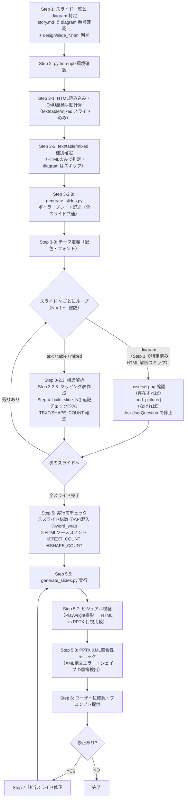

# Slide Generator

## 概要

壁打ちで作成した `story.md` をもとに、`python-pptx` を使ってPowerPointファイルを生成するスキル。

> **重要**: `design/slide_*.html` と `design/slide_*.png` は用途が全く異なる。混同厳禁。
>
> **`design/slide_*.html`** — text/table/mixed スライドの**唯一の設計ソース**。Readツールで1枚ずつ読み込み、CSSのposition・top・left・width・height・font-size・colorをEMUに変換してネイティブシェイプ・テキストで再現する。テキスト内容・座標・配色・フォントはすべてこのHTMLから読み取る。
>
> **`design/slide_*.png`** — HTMLをブラウザで表示した確認用スクリーンショット。**PPTXには一切使用しない。** `add_picture()` での貼り付けは絶対禁止。`add_picture()` が許可されるのは `assets/` 内の draw.io PNG（diagram種別）のみ。

**内部スキル**: `/gaido-proposal-init` から自動実行される。ユーザーが直接呼び出すのではなく、gaido-proposal-initのパイプライン（Step 11）の一部として動作する。

**ワークフロー上の位置:**
```
/gaido-proposal-init（単一入口）
    ├─ Step 0-8: ストーリー壁打ち → story.md
    ├─ Step 9:   /frontend-design → design/*.html
    ├─ Step 10:  drawio_builder.py + HTML再現 + element.screenshot() → assets/*.png
    └─ Step 11:  /gaido-proposal-slide-generator（本スキル） → output/proposal.pptx
```

## このスキルを呼び出すエージェントへ（必読）

このスキルをSkillツールまたはAgentツールで呼び出す際は、**プロンプトにスライドのテキスト内容・テーマ情報・スライド構成を記述してはならない**。そのような情報を渡すと、このエージェントがHTMLファイルを読まずにプロンプト内の情報だけでスライドを構成し、レイアウト・CSS座標・装飾要素がPPTXに反映されない。

### 呼び出しプロンプトに必ず含める文言

以下の文言をプロンプトの冒頭に必ず含めること:

```
まず story.md を読み、diagram 種別のスライド番号を特定する（種別特定のみ。テキスト内容は使用禁止）。
次に design/slide_*.html の一覧を確認する。diagram スライドは HTML が存在しない。

各HTMLファイル（design/slide_*.html）をReadツールで一枚ずつ読み込み、
CSSのposition・top・left・width・height・font-size・color・backgroundをパースして、
python-pptxの座標（EMU単位）・色（RGBColor）・フォントサイズ（Pt）に変換すること。
プロンプト内のテキスト内容・テーマ情報からスライドを構成することは禁止。
text/table/mixedスライドはHTMLのCSSが座標・デザインの正解。
diagramスライドはHTMLを持たない。assets/ のPNGをadd_picture()で埋め込む。
design/slide_*.pngはHTMLの確認用スクリーンショットであり、PPTXへのadd_picture()は絶対禁止。
「CSSが複雑でEMU変換が困難」「作業量が多い」は理由にならない。困難なレイアウトはStep 3-1の手動座標計算で対応する。
実装方法が分からないスライドがあっても、禁止された方法（add_picture()でのPNG貼り付け）を選んではならない。
その場合はAskUserQuestionで「スライドN: CSSレイアウト（○○）の変換方法が不明。実装方針を確認したい」と報告すること。
OrgChartBuilder等でノード・エッジ構造が必要な場合のみ story.md の図表欄を参照する。
```

### 呼び出し時に渡してよい情報

- 案件名（`{案件名}`）のみ（ワークスペースのパス特定に使用）

### 呼び出し時に渡してはいけない情報

- スライドのテキスト内容（各スライドの文言）→ HTMLから読み取る
- テーマ情報（配色・フォント）→ HTMLから読み取る
- スライド構成（スライド数・種別）→ story.md（diagram番号特定）とHTMLから読み取る

## 使用場面

- `/gaido-proposal-init` のStep 11から自動実行される
- `story.md` が確定し、HTMLデザインの方向性も決まった状態で呼び出される

## 前提条件

- `ai_generated/proposals/{案件名}/story.md` が作成済みであること
- HTMLデザインで配色・フォント・レイアウトの方針が決まっていること
- `assets/*.png` が `/gaido-proposal-init` Step 10 で生成済みであること（diagram種別のスライドで使用）

## フロー



## 実行手順

### Step 1: スライド一覧と diagram スライドの特定

まず `story.md` を読み込み、全スライドのうち **`diagram` 種別のスライド番号** を特定する。

```bash
# story.md を確認（diagram スライドの番号を特定するためのみ）
cat ai_generated/proposals/{案件名}/story.md | grep -A2 "^## スライド\|^## Slide\|type:"
```

> **story.md を読む目的はスライド番号と `type: diagram` の有無の特定のみ。**
> テキスト内容・箇条書き・説明文は絶対に参照しない。PPTX の文言は HTML からのみ取得する。

次に `design/slide_*.html` の一覧を確認する。

```bash
ls design/slide_*.html | sort
```

**diagram スライドは HTML が存在しない**（`/gaido-proposal-init` Step 9 で除外済み）。
HTML が存在しないスライド番号は、story.md で `type: diagram` と確認されたスライドとして処理する。

| 確認結果 | 処理方針 |
|---------|---------|
| HTML あり | Step 3 の HTML 解析で種別・レイアウトを確定する |
| HTML なし（diagram） | Step 4 diagram セクションへ直行（HTML 解析なし） |

**スライドの内容・レイアウト・配色はすべて Step 3 の HTML 解析で取得する（text/table/mixed スライドのみ）。**

> **diagram スライドを HTML で再現しようとしてはならない。** draw.io PNG を `add_picture()` で埋め込む唯一の正しい処理ルートは Step 4 diagram セクションのみ。

### Step 2: python-pptx環境確認

```bash
python3 -c "import pptx; print(pptx.__version__)" 2>/dev/null || pip install --user --break-system-packages python-pptx
```

### Step 3: HTMLデザイン解析とテーマ設定

**このStep内の実行順序:**

```
Step 3-1   → HTML一覧確認・座標変換手法の把握（text/table/mixed スライドのみ対象）
Step 3-2   → text/table/mixed スライドの種別確定（一括）
             ※ diagram スライドは Step 1 で story.md から特定済み → ここでは対象外
Step 3-2.8 → generate_slides.py にボイラープレート記述
Step 3-3   → テーマ定義（配色・フォント）

↓ 以下をスライドNごとに繰り返す（N = 1〜総数）──────────────────────
  【diagram スライド（Step 1 で特定済み）】
    → HTML 解析・構造解析・マッピング表 を一切スキップ
    → Step 4 diagram セクションへ直行（assets/ PNG 確認 → add_picture()）

  【text / table / mixed スライド】
    HTML再読み込み（slide_N.html をReadツールで再取得）
    Step 3-2.3 → スライドNの構造解析（要素 → 視覚的役割 → PPTX表現）
    Step 3-2.5 → スライドNのマッピング表作成（EMU座標確定）
    Step 4     → build_slide_N() をgenerate_slides.pyに追記
    チェック⑤⑥ → build_slide_N()内のTEXT_COUNT/SHAPE_COUNT確認 → NGなら修正してから次へ
───────────────────────────────────────────────────────────────────
全スライド完了後: Step 5（チェック①〜⑧）→ Step 5.5へ
```

> **禁止事項**: `design/slide_*.png`（スクリーンショット）を `add_picture()` でスライドに丸ごと貼り付けることは絶対禁止。テキスト・ボックス・テーブル等の要素はすべてネイティブシェイプ・テキストボックスで再現する。
> - `add_picture()` が許可されるのは diagram 種別の draw.io エクスポートPNGのみ
> - 絵文字・アイコンの扱いは Step 3-1 のボックスレイアウト検出テーブルおよび Step 3-2.5 を参照

#### Step 3-1: HTML一覧確認と座標変換手法の把握

**各HTMLファイルはReadツールで直接読み込む（1枚ずつ、ループ内でコード記述直前に再読み込みする）。Playwrightは使用しない。以下はEMU座標変換の手法を示す。**

##### スケール定数

```python
# 1px = 9525 EMU（96dpi基準、固定値）
PX = 9525

def px(n: float) -> int:
    """CSS px値をOOXML EMU（English Metric Units）に変換する。

    :param n: CSS px値（intまたはfloat）
    :return: EMU整数値
    """
    return int(n * PX)

SLIDE_W = px(1280)  # スライド幅 = 12,192,000 EMU
SLIDE_H = px(720)   # スライド高 = 6,858,000 EMU
```

##### よく使う変換値

| CSS値 | EMU | 用途 |
|---|---|---|
| 1280px | 12,192,000 | スライド幅 |
| 720px | 6,858,000 | スライド高 |
| 48px | 457,200 | 標準左右マージン |
| 80px | 762,000 | ヘッダー高さ |
| 16px | 152,400 | 標準ギャップ |
| 1px | 9,525 | 枠線最小幅 |

##### フローレイアウトの手動展開

CSSのflex/gridは以下のように絶対座標に変換する。これが「フロー→固定」変換の核心部分。
**変換が複雑に見えても省略・近道は禁止。計算量が多くても手動で展開すること。**

**3列均等グリッドの例:**

```css
/* HTMLから読み取ったCSS */
.three-col {
  display: grid;
  grid-template-columns: 1fr 1fr 1fr;
  gap: 16px;
  padding: 0 48px;
}
```

```python
margin = px(48)    # 左右パディング
gap    = px(16)    # 列間隔
col_w  = (SLIDE_W - margin * 2 - gap * 2) // 3
col1_x = margin
col2_x = margin + col_w + gap
col3_x = margin + col_w * 2 + gap * 2
```

**2列非対称（左40% + 右60%）の例:**

```python
gap     = px(24)
left_w  = int(SLIDE_W * 0.4)
right_w = SLIDE_W - left_w - gap
left_x  = px(48)
right_x = left_x + left_w + gap
```

**justify-content: space-between（均等間隔）の例:**

```python
n_items   = 4
margin    = px(48)
available = SLIDE_W - margin * 2
item_w    = available // n_items
gap       = (available - item_w * n_items) // (n_items - 1)
item_x    = [margin + i * (item_w + gap) for i in range(n_items)]
```

**カード内の子要素の絶対座標計算（入れ子レイアウト）:**

カードが `display: flex` / `display: grid` の子として配置され、さらにカード内に子要素がある場合、子要素の座標は「カード左上隅 + padding + 子要素の積み上げ高さ」で計算する。

```python
# 例: 2列グリッド × 4カード、各カードに icon(48px) + title + effect + desc + tags
content_x  = px(60)                          # .main-content left:40 + padding:20
content_w  = px(1160)                        # 1200px - padding 20*2
gap        = px(16)
col_w      = (content_w - gap) // 2
col1_x     = content_x
col2_x     = content_x + col_w + gap
content_y  = px(112)                         # .main-content top
card_pad_x = px(24)                          # .strength-card padding: 20px 24px
card_pad_y = px(20)

cards = [
    {"col": 0, "row": 0, "icon": "1", "title": "...", "effect": "...", "desc": "...", "tags": [...]},
    {"col": 1, "row": 0, ...},
    {"col": 0, "row": 1, ...},
    {"col": 1, "row": 1, ...},
]

card_h = px(160)  # HTMLのカード高さから計算

for c in cards:
    cx = col1_x if c["col"] == 0 else col2_x
    cy = content_y + c["row"] * (card_h + gap)

    # カード背景
    add_shape_xml(slide, x=cx, y=cy, w=col_w, h=card_h, prst="roundRect", ...)

    # アイコン（カード左上、padding分ずらす）
    icon_x = cx + card_pad_x
    icon_y = cy + card_pad_y
    add_shape_xml(slide, x=icon_x, y=icon_y, w=px(48), h=px(48), prst="roundRect", ...)
    add_textbox_xml(slide, x=icon_x, y=icon_y, w=px(48), h=px(48), text=c["icon"], ...)

    # body（アイコン右、gap 16px）
    body_x = icon_x + px(48) + px(16)
    body_w = col_w - card_pad_x * 2 - px(48) - px(16)

    # タイトル
    add_textbox_xml(slide, x=body_x, y=icon_y, w=body_w, h=px(24), text=c["title"], ...)

    # effect行（→ XX）
    effect_y = icon_y + px(24)
    add_textbox_xml(slide, x=body_x, y=effect_y, w=body_w, h=px(20), text=c["effect"], ...)

    # 説明文
    desc_y = effect_y + px(20) + px(8)
    add_textbox_xml(slide, x=body_x, y=desc_y, w=body_w, h=px(54), text=c["desc"], word_wrap=True, ...)

    # タグ（display:flex、各タグ幅を推定して横に並べる）
    tags_y = desc_y + px(54) + px(8)
    tag_x_cursor = body_x
    for tag_text in c["tags"]:
        tag_w = px(len(tag_text) * 11 + 16)   # 文字幅を概算（10px/文字 + padding 8px×2）
        add_shape_xml(slide, x=tag_x_cursor, y=tags_y, w=tag_w, h=px(20), prst="rect", fill_color="EBF4FF", ...)
        add_textbox_xml(slide, x=tag_x_cursor, y=tags_y, w=tag_w, h=px(20), text=tag_text, word_wrap=False, ...)
        tag_x_cursor += tag_w + px(6)   # gap: 6px
```

**子要素省略禁止**: カード内の入れ子要素（アイコン、effectテキスト、タグ等）はマッピング表に個別に列挙し、コードで個別に実装すること。「カードが複雑なので title+desc だけにする」「タグは省略する」は禁止。

##### テキスト内容の読み取り

**テキストはHTMLをReadして直接抽出すること。記憶・story.mdからの補完は絶対禁止。**

各テキスト変数にはHTMLの行番号をコメントで記載し、後から検証できるようにすること。

```python
# NG: 記憶から補完（HTMLを見ずにAIが書く）
header_text = "〇〇機能の役割"

# OK: HTMLをReadして読み取った内容をそのまま記述（コメントでHTML行番号を記載）
header_text = "【HTMLから読み取ったテキスト】"  # slide_N.html LXX: <h2 class="card-title">
body_text   = "【HTMLから読み取ったテキスト】"  # slide_N.html LXX: <p class="card-body">
```

##### ボックスレイアウトの検出

HTMLをReadして各要素を確認し、python-pptxの実装を決定する。**テキストのみに簡略化してはならない。**

| HTMLの特徴 | 判定されるパターン | OOXML実装 |
|---|---|---|
| `background-color` が不透明 + `border-radius: 0` | 矩形背景ボックス | `add_shape_xml(prst="rect")` |
| `background-color` が不透明 + `border-radius: 8px` 以上 | カード（角丸ボックス） | `add_shape_xml(prst="roundRect")` |
| `border: solid` + `background` が透明 | 枠線のみのボックス | `add_shape_xml(prst="rect")` 塗り無し・枠線あり |
| `border-top: 3px+` + 他のborderは0 | カード上部カラーボーダー | カード上端に細い `add_shape_xml(prst="rect")` を重ねて配置 |
| `border-radius: 50%` + 幅≒高さの小要素 | 丸バッジ（番号等） | `add_shape_xml(prst="ellipse")` + `add_textbox_xml()` の重ね合わせ |
| テキストが `→` / `▶` / `⇒` のみ | 矢印コネクタ | `add_shape_xml(prst="rightArrow")` または `add_textbox_xml()` |
| テキストに絵文字（📁💰🔒等）+ `font-size` が大きい | 絵文字アイコン | `add_textbox_xml()` でUnicode絵文字をそのまま配置。**省略禁止** |
| `<svg>` または `` タグ | SVG・画像アイコン | 意味的に近いUnicode絵文字で代替。代替不可ならテキストラベルで代用 |
| `<table>` または `<tr>` / `<td>` を持つ | テーブル | `add_table()` |
| 複数要素が横に並ぶ（CSSで `top` がほぼ同じ） | グリッド/フレックス並列 | 各要素の座標を手動計算して個別に `add_shape_xml()` |
| 縦横コネクタで繋がれた階層ボックス | 体制図・組織図 | `diagram` タイプ → `OrgChartBuilder` 使用 |
| 左列カード群 + 中央矢印 + 右列カード群 | 左右対比レイアウト | 左列・矢印・右列をそれぞれ個別に `add_shape_xml()` 。**左列を省略してはならない** |
| `background: linear-gradient(...)` | グラデーション背景 | `add_gradient_bg()` + `css_angle_to_ooxml()` |
| `writing-mode: vertical-rl` | 縦書きテキスト | `add_textbox_xml()` 配置後 `xfrm.set('rot', '5400000')` で回転 |
| CSSで同一 `top` 値の要素が複数 | flexbox横並び配置 | **縦積みしてはならない**。`left` の昇順に横並びで配置する |
| `width: 0; height: 0` + `border-left/right/top/bottom: solid` | CSSボーダートリック三角形 | `add_shape_xml(prst="triangle")` 等で代替配置 |
| カードが複数の子要素を持つ（アイコン+タイトル+サブテキスト+タグ等） | **入れ子カードレイアウト** | カード背景シェイプ＋各子要素を個別の `add_shape_xml()` / `add_textbox_xml()` で配置。**子要素を1つのテキストボックスにまとめてはならない（重要）** |
| `display: flex` のコンテナ内に複数の `<span class="tag">` | flexタグリスト | 各 `<span>` の幅を文字数から推定し、`gap` を足した累積 `left` で横並びに個別配置 |

##### 擬似要素・CSSトリックのチェック

HTMLをReadした際に以下のパターンを検索し、座標を手動解釈してStep 3-2.5の全要素マッピング表に追加する。

| 検索対象 | 検索キーワード | 対応 |
|---|---|---|
| `::before` / `::after` 擬似要素 | `::before` / `::after` | 装飾ライン・ドット等。親要素のCSSから座標を推定してマッピング表に追加 |
| CSSボーダートリック三角形 | `width: 0` + `border-left/right/top/bottom` に `solid` | `add_shape_xml(prst="triangle")` 等で代替配置 |
| 縦書きテキスト | `writing-mode` | `xfrm.set('rot', '5400000')` で対応 |

**HTMLに存在しない装飾要素は絶対に追加しない**（縦帯・横帯・ロゴ等、HTMLにないものを独自に加えてはならない）。

#### Step 3-2: スライド種別の確定（text / table / mixed のみ対象）

> **diagram スライドはこのセクションの対象外。** Step 1 で story.md から特定済みのため、HTML 解析・種別判定を行わない。diagram スライドが紛れ込んでいる場合でも、このステップで mixed 等に再分類してはならない。

**text / table / mixed スライドの種別はHTMLの実際のレイアウトのみで判定する。**
**story.md のテキスト内容・種別記述は絶対に参照しない。HTML に書かれた文言のみを PPTX に使用する。**

**【Step 1 特定漏れ検知スキャン】**

> このスキャンは「Step 1 で diagram と特定できなかったスライドが紛れ込んでいないか」を検知するための安全網。
> 正常フローでは diagram スライドに HTML は存在しないため、何も出力されないのが正常。

```bash
# ① <svg>タグを含むHTMLファイルを列挙する（体制図・組織図の候補）
grep -l "<svg" design/slide_*.html

# ② アーキテクチャ・システム構成図を示すクラス名を含むHTMLファイルを列挙する
grep -l -iE 'class="[^"]*\b(server|database|db|cloud|network|infra|architecture|system|component|node|layer)\b' design/slide_*.html
```

出力されたファイルがある場合 → **Step 1 での特定漏れ**を意味する。
そのスライドを diagram として扱い、draw.io で作成する（ネイティブ PPTX シェイプで再現しない）。

出力なし（正常）→ そのまま次に進む。

各 `design/slide_*.html` を読み、Step 3-1 で生成した `_elements.json` の要素構成から種別を決定する。

| HTMLの実際のレイアウト | 確定する種別 |
|---|---|
| プレーンテキスト・箇条書きのみ | text |
| 複数のボックス・カードが並ぶ | **mixed** |
| ボックス＋矢印コネクタがある | **mixed** |
| 区切り線・アクセント帯・強調ボックス等の装飾要素がある | **mixed** |
| テーブルが主体（セル内がテキストのみ） | table |
| テーブルのセル内に背景色付きインラインバッジ（`<span class="badge">` 等）がある | **table**（`add_table()` でテーブル構造を生成し、バッジ部分のみ `add_shape(ROUNDED_RECTANGLE)` を該当セル上に重ねて配置。詳細は Step 4 table セクション参照） |
| draw.io図が主体 | **⚠ 本来 HTML は存在しないはず（Step 1 特定漏れ）** → diagram として扱い draw.io で作成する |
| **縦横コネクタで繋がれた階層ボックス（組織図・体制図）** | **⚠ 本来 HTML は存在しないはず（Step 1 特定漏れ）** → diagram として扱い `OrgChartBuilder` を使用 |
| **サーバ・DB・クラウド等のコンポーネントを示すボックスが複数あり、矢印・線で繋がれたシステム構成図・アーキテクチャ図** | **⚠ 本来 HTML は存在しないはず（Step 1 特定漏れ）** → diagram として扱い `DrawioBuilder` を使用 |
| **組織図＋テーブルが同一スライドに共存** | **mixed**（diagram部分はdraw.io `OrgChartBuilder` で生成、テーブル部分は `add_table()` で生成） |

> **⚠ 印の行について**: diagram スライドは `/gaido-proposal-init` Step 9 で HTML が除外されるため、正常フローでは HTML が存在しない。
> ここで HTML がある状態で diagram 的レイアウトが検出された場合は、**Step 1 での特定漏れ**を意味する。
> その場合も必ず draw.io で作成する。ネイティブ PPTX シェイプで代替してはならない。

**種別確定後、各 text/table/mixed スライドについて以下を `generate_slides.py` の生成前にコメントとして記録すること。diagram スライドは Step 1 で特定済みのため、ここでの記録対象外。**

```python
# slide_3: mixed（HTMLにボックス3列グリッド＋コネクタ矢印あり → add_shape()で再現）
# slide_5: text（HTMLもプレーンテキストのみ）
# slide_7: diagram（Step 1 で story.md から特定済み → assets/ PNG → add_picture()）
```

この記録がないままコーディングしてはならない。

**`diagram` 種別スライドの処理フロー（Step 4 diagram セクションで実施）:**

- story.md は Step 1 で読み込み済みのため、再読み込みは不要
- `OrgChartBuilder` や `DrawioBuilder` を使う際にノード・エッジ構造が必要な場合のみ、story.md の該当スライド部分（図表欄）を参照する
- **story.md のテキスト内容（見出し・本文・箇条書き）は PPTX の文言として絶対に使用しない**
- text / table / mixed のスライドについては story.md を一切参照しない

#### Step 3-2.3: スライドNの構造解析（ループ内・1枚ずつ）

> **ループ1サイクルの入口**: Readツールで `design/slide_N.html` を再読み込みしてから開始する。全スライドを一括で解析してはならない。

**マッピング表（Step 3-2.5）を作成する前に、スライドNのHTMLを読んで「要素 → 視覚的役割 → PPTX表現」を明示すること。この解析なしにコードを書いてはならない。**

CSSのフローレイアウト（flex/grid）を固定座標の絶対配置に「翻訳」する判断を行う。

スライドNについて以下の形式で記録する：

```
## slide_5: 構造解析

| HTML要素 | CSSクラス | 視覚的役割 | PPTX表現 |
|---|---|---|---|
| `<div class="header">` | header | 全幅ネイビー帯 | `add_shape_xml(prst="rect", fill_color="1A365D")` |
| `<span class="point-num">1</span>` | point-num | 番号付き青丸 | `add_shape_xml(prst="ellipse")` + `add_textbox_xml()` |
| `<div class="before-after">` | before-after | 3列グリッド全体 | 左・中・右を個別にシェイプ配置（flexは手動展開） |
| `<div class="col before">` | col before | 左列「Before」赤背景カード | `add_shape_xml(prst="roundRect", fill_color="赤")` |
| `border-left: 3px solid blue` | — | 左側カラーライン | 細矩形（幅3px相当）を重ねて配置 |
| `<table>` | — | データテーブル | `add_table()` |
```

**汎用関数（build_content等）で全スライドをまとめて処理してはならない。**
各スライドは個別の `build_slide_N(slide, els)` 関数として実装し、HTMLの構造解析結果をそのままコードに反映すること。

```python
# NG: 汎用関数（全スライドを同じ処理で流す → 重なり・欠落の原因）
def build_content(slide, els): ...  # 禁止

# OK: スライドごとの個別関数
def build_slide_5(slide, els): ...
def build_slide_6(slide, els): ...
```

**構造解析 → コード変換のend-to-end例（slide_3.html を読んだ場合）:**

HTMLを読んだ結果:
```html
<!-- slide_3.html L18 -->
<div class="header" style="position:absolute;top:20px;left:48px;width:1184px;height:60px;background:#1A365D;">
  <span style="font-size:28px;color:#FFFFFF;font-weight:bold;">スライドタイトルテキスト</span>
</div>
<!-- slide_3.html L22 -->
<div class="card" style="position:absolute;top:100px;left:48px;width:560px;height:180px;background:#EBF4FF;border-radius:8px;">
  <p class="card-title" style="font-size:18px;color:#1A365D;padding:16px 20px 0;">カードタイトルテキスト</p>
  <p class="card-body" style="font-size:14px;color:#2D3748;padding:4px 20px;">カード本文テキスト</p>
</div>
```

構造解析表:
```
## slide_3: 構造解析

| HTML要素 | CSSクラス | 視覚的役割 | PPTX表現 |
|---|---|---|---|
| `<div class="header">` | header | 全幅ネイビー帯 | `add_shape_xml(prst="rect", fill_color="1A365D")` |
| `<span>スライドタイトルテキスト</span>` | — | ヘッダーテキスト | `add_textbox_xml(bold=True, color="FFFFFF")` |
| `<div class="card">` | card | 角丸カード（水色背景） | `add_shape_xml(prst="roundRect", fill_color="EBF4FF")` |
| `<p class="card-title">` | card-title | カードタイトル | `add_textbox_xml(font_size=18, color="1A365D")` |
| `<p class="card-body">` | card-body | カード本文 | `add_textbox_xml(font_size=14, color="2D3748")` |
```

変換後のコード（generate_slides.py に追記）:
```python
def build_slide_3(prs):
    # TEXT_COUNT: 3   ← add_textbox_xml の行数
    # SHAPE_COUNT: 2  ← add_shape_xml の行数
    slide = prs.slides.add_slide(prs.slide_layouts[6])
    _init_shape_id(slide)

    # ── ヘッダー帯 ─────────────────────────────────────────
    # slide_3.html L18: <div class="header" style="top:20px;left:48px;width:1184px;height:60px;background:#1A365D">
    add_shape_xml(slide, prst="rect",
        x=px(48), y=px(20), w=px(1184), h=px(60),
        fill_color="1A365D", shape_id=next_id(), name="header_bg")
    # slide_3.html L19: <span style="font-size:28px;color:#FFFFFF">スライドタイトルテキスト</span>
    add_textbox_xml(slide, text="スライドタイトルテキスト",  # slide_3.html L19
        x=px(48), y=px(20), w=px(1184), h=px(60),
        font_size=28, bold=True, color="FFFFFF",
        shape_id=next_id(), name="header_text")

    # ── カード ─────────────────────────────────────────────
    # slide_3.html L22: <div class="card" style="top:100px;left:48px;width:560px;height:180px;background:#EBF4FF;border-radius:8px">
    add_shape_xml(slide, prst="roundRect",
        x=px(48), y=px(100), w=px(560), h=px(180),
        fill_color="EBF4FF", shape_id=next_id(), name="card_bg",
        adj="val 16667")   # border-radius:8px → h=180px → 8/180≈4.4% → adj≈16667
    # slide_3.html L23: <p class="card-title" style="font-size:18px;color:#1A365D;padding:16px 20px 0">
    add_textbox_xml(slide, text="カードタイトルテキスト",  # slide_3.html L23
        x=px(68), y=px(116), w=px(520), h=px(40),
        font_size=18, bold=False, color="1A365D",
        shape_id=next_id(), name="card_title")
    # slide_3.html L24: <p class="card-body" style="font-size:14px;color:#2D3748;padding:4px 20px">
    add_textbox_xml(slide, text="カード本文テキスト",  # slide_3.html L24
        x=px(68), y=px(160), w=px(520), h=px(30),
        font_size=14, bold=False, color="2D3748",
        shape_id=next_id(), name="card_body")
```

#### Step 3-2.5: スライドNの全要素マッピング表作成（ループ内・1枚ずつ）

**コーディングを始める前に、スライドNの全HTML要素をリストアップし、対応するOOXMLコールと座標をStep 3-1の手動計算で確定させること。この表が完成するまでコードを書いてはならない。全スライドを一括でマッピングしてからコードを書くことは禁止。1枚のマッピング表完成 → build_slide_N() 記述 → チェック⑤⑥ → 次のスライドへ進む。**

**座標列（emu.x / emu.y / emu.w / emu.h）は必ずStep 3-1でHTMLを読んで計算した値を記載すること。目視推定・空欄は禁止。**

**【必須】スケルトン確認 → マッピング表の2ステップで作成すること:**

**ステップA: 主要ブロックのスケルトン確認（マッピング表の前に必ず実施）**

HTMLの `.body`（またはコンテンツエリア直下）の子要素をすべて列挙する。  
列挙後、「このスライドには N 個の主要ブロックがある」と宣言してから次のステップBへ進む。  
スケルトン確認を省略・省略・後回しにしてはならない。

```
スケルトン確認（例: 品質向上施策スライドの場合）:
1. .section-label （テキスト: QUALITY ASSURANCE）
2. .cards （子要素3つ: 単体テスト・結合テスト・E2Eテスト）
3. .two-col （子要素2つ: CI/CDパイプライン・脆弱性管理）
→ このスライドには 3 個の主要ブロックがある
```

**ステップB: スケルトンの各ブロックをすべてマッピング表に展開する**

ステップAで列挙した各ブロックを順番に展開し、ブロックごとにセクション見出し行を挿入する。  
ステップAのブロック数と、マッピング表のセクション見出し数が一致しない場合はコーディングを開始してはならない。

各スライドについて以下の形式で記録する:

```
スケルトン確認（slide_4 の場合）:
1. グラデーションバナー（1要素）
2. .two-col-left（左列ラベル + カード3枚）
3. 中央矢印（1要素）
4. .two-col-right（右列ラベル + カード3枚）
→ このスライドには 4 個の主要ブロックがある

## slide_4: mixed（左右非対称の対比レイアウト）

| # | HTML要素 | テキスト内容 | emu.x | emu.y | emu.w | emu.h | python-pptxの実装 |
|---|---------|------------|------:|------:|------:|------:|-----------------|
| - | **【グラデーションバナー】** | | | | | | |
| 1 | グラデーションバナー | 「バナーテキスト…」 | 0 | px(20) | px(1280) | px(60) | add_shape_xml(rect) グラデーション + add_textbox_xml() |
| - | **【.two-col-left — 左列】** | | | | | | |
| 2 | 左列ラベル | 「左列ラベルテキスト」 | px(48) | px(84) | left_w | px(40) | add_shape_xml(rect) 赤背景 + add_textbox_xml() |
| 3 | 左列カード①（赤枠） | 「課題①テキスト」＋アイコン | px(48) | px(132) | left_w | px(63) | add_shape_xml(roundRect) 赤枠 + add_textbox_xml() |
| 4 | 左列カード②（赤枠） | 「課題②テキスト」＋アイコン | px(48) | px(200) | left_w | px(63) | add_shape_xml(roundRect) 赤枠 + add_textbox_xml() |
| 5 | 左列カード③（赤枠） | 「課題③テキスト」＋アイコン | px(48) | px(268) | left_w | px(63) | add_shape_xml(roundRect) 赤枠 + add_textbox_xml() |
| - | **【中央矢印】** | | | | | | |
| 6 | 中央矢印 | → | px(598) | px(190) | px(63) | px(63) | add_shape_xml(rightArrow) |
| - | **【.two-col-right — 右列】** | | | | | | |
| 7 | 右列ラベル | 「右列ラベルテキスト」 | 計算値 | 計算値 | right_w | px(40) | add_shape_xml(rect) 青背景 + add_textbox_xml() |
| 8〜10 | 右列カード①②③ | ... | 計算値 | 計算値 | 計算値 | 計算値 | add_shape_xml(roundRect) + add_textbox_xml() |
```

**セクション見出し行（`| - | **【...】** |`）の数がスケルトン確認のブロック数と一致しない場合はコーディングを開始してはならない。**
**表に要素が列挙されていないものはPPTXにも存在しない。漏れなく列挙すること。**
**emu列に計算済みの実数値が入っていない行があれば、その行のコードを書いてはならない。**

**カード内子要素の個別展開（重要）:**

カードが複数の子要素（アイコン、タイトル、サブテキスト、タグ等）を含む場合、マッピング表にはカード背景＋各子要素を**個別の行**として展開すること。子要素をまとめて1行にしたり省略したりしてはならない。

```
例: .strength-card × 4枚（各カードにアイコン+タイトル+effectテキスト+本文+タグ3個）の場合
1枚のカードあたり: カード背景1 + アイコン背景1 + アイコン番号テキスト1 + タイトル1 + effectテキスト1 + 本文1 + タグ背景×3 + タグテキスト×3 = 13行
4枚合計: 13 × 4 = 52行がマッピング表に必要
```

**build_slide_N() 直前の HTML 再読み込み（後半スライド欠落対策）:**

後半スライドになるほど、以前に読んだ HTML の内容を記憶から補完してテキストを書く傾向がある。これを防ぐため、各 `build_slide_N()` を書き始める直前に、その HTML ファイルを**必ず再読み込み**すること。

```python
# build_slide_17() を書く前に: Readツールで design/slide_17.html を再読み込みする
# → テキスト変数はすべて再読み込みした HTML の行番号コメント付きで記述する
def build_slide_17(slide):
    # slide_17.html を直前に再読み込みして読み取った内容
    card1_title  = "【HTMLから読み取ったカードタイトル】"  # slide_N.html LXX: <div class="strength-title">
    card1_effect = "→ 【HTMLから読み取った効果テキスト】"  # slide_N.html LXX: <div class="strength-effect">
    ...
```

story.md のキーワードやスライドタイトルでテキストを補完することは**絶対禁止**。テキストが story.md と異なっていても HTML を優先すること。

**マッピング表完成後、以下の2つの合計数を数え、`generate_slides.py` の各 `build_slide_N()` 先頭に `# TEXT_COUNT: N` と `# SHAPE_COUNT: N` コメントとして記録すること。Step 5-⑤⑥で自動検証される。**

- `TEXT_COUNT`: `add_textbox_xml()` または `add_multirun_textbox()` で実装される行の数
- `SHAPE_COUNT`: `add_shape_xml()` で実装される行の数（背景ボックス・枠線・矢印・アクセントバー等すべて含む）

```python
def build_slide_3(slide):
    # TEXT_COUNT: 12  ← マッピング表のadd_textbox_xml/add_multirun_textbox行数（Step 5-⑤で検証）
    # SHAPE_COUNT: 8  ← マッピング表のadd_shape_xml行数（Step 5-⑥で検証）
    ...
```

**アイコン・絵文字の扱い（省略禁止）:**

| HTML上の要素 | マッピング表への記載方法 |
|---|---|
| 絵文字（📁💰🔒👤等）を含む `div`/`span` | `add_textbox_xml()` で絵文字をそのまま配置。フォントサイズ・位置はStep 3-1の計算値を使用 |
| SVGアイコン / CSSアイコン | 意味的に近いUnicode絵文字で代替。例: フォルダ→📁、警告→⚠️、チェック→✅ |

アイコン・絵文字要素を「再現困難」「テキストだけなので省略」として省略することは**絶対禁止**。

#### Step 3-2.8: generate_slides.py のボイラープレート（必須）

**`generate_slides.py` の冒頭に必ず以下のコードを記述すること。このコードなしにスライド生成コードを書いてはならない。**

```python
import os
from lxml import etree
from pptx import Presentation
from pptx.util import Pt, Emu
from pptx.dml.color import RGBColor

# ── パス定数 ─────────────────────────────────────────────
# スクリプト自身の場所を基準にパスを解決する。
# ワークスペースルートから実行しても、スクリプトと同階層の
# assets/ や output/ を正しく参照できる。
BASE_DIR   = os.path.dirname(os.path.abspath(__file__))
ASSETS_DIR = os.path.join(BASE_DIR, "assets")   # draw.io PNGの置き場
OUTPUT_DIR = os.path.join(BASE_DIR, "output")   # PPTX出力先
os.makedirs(OUTPUT_DIR, exist_ok=True)

# ── 座標変換定数 ─────────────────────────────────────────
# HTML座標系（1280×720px）をOOXML EMUに変換する。1px = 9525 EMU（96dpi基準）
PX = 9525

def px(n: float) -> int:
    """CSS px値をOOXML EMU（English Metric Units）に変換する。

    :param n: CSS px値（intまたはfloat）
    :return: EMU整数値
    """
    return int(n * PX)

SLIDE_W = px(1280)  # スライド幅 = 12,192,000 EMU（16:9）
SLIDE_H = px(720)   # スライド高 = 6,858,000 EMU（16:9）

# ── Presentationオブジェクト初期化 ───────────────────────
# Presentation()のデフォルトは4:3（9,144,000×6,858,000 EMU）のため、
# 必ず作成直後にスライドサイズを16:9に明示設定すること。
# これを省略すると、要素配置の座標系（16:9）とスライド実サイズ（4:3）が
# 不一致になり、コンテンツが左上に偏る・右端が切れる不具合が発生する。
#
#   prs = Presentation()
#   prs.slide_width  = Emu(SLIDE_W)   # ← 必須: 12,192,000 EMU に設定
#   prs.slide_height = Emu(SLIDE_H)   # ← 必須: 6,858,000 EMU に設定（通常デフォルトと同値だが明示する）

# ── OOXMLシェイプ追加ヘルパー ────────────────────────────
def add_shape_xml(slide, x: int, y: int, w: int, h: int,
                  prst: str = "rect",
                  fill_color: str | None = None,
                  border_color: str | None = None,
                  border_w_emu: int = 0,
                  adj: str | None = None,
                  shape_id: int = 1,
                  name: str = "shape") -> etree._Element:
    """
    OOXML <p:sp> をスライドのspTreeに直接追加する。
    python-pptx高レベルAPIでは再現困難な角丸・グラデーション・左ボーダーに対応。

    :param prst: プリセット形状。"rect"=矩形, "roundRect"=角丸矩形, "triangle"=三角形 等
    :param fill_color: 塗り色（"RRGGBB"形式）。Noneで塗りなし
    :param border_color: 枠線色（"RRGGBB"形式）。Noneで枠線なし
    :param border_w_emu: 枠線幅（EMU単位）。0で枠線なし
    :param adj: roundRectの角丸調整値。例: "val 33333"（33%角丸）
    :param shape_id: シェイプID（スライド内で一意）。必ず next_id() で取得すること
    :param name: シェイプ名（デバッグ用）
    :return: 追加した <p:sp> lxml要素
    """
    a = 'http://schemas.openxmlformats.org/drawingml/2006/main'
    p_ns = 'http://schemas.openxmlformats.org/presentationml/2006/main'
    # name属性はXML属性値として埋め込むためエスケープする
    safe_name = name.replace("&", "&amp;").replace('"', "&quot;").replace("<", "&lt;")

    sp_xml = f'''<p:sp xmlns:p="{p_ns}" xmlns:a="{a}">
  <p:nvSpPr>
    <p:cNvPr id="{shape_id}" name="{safe_name}"/>
    <p:cNvSpPr><a:spLocks noGrp="1"/></p:cNvSpPr>
    <p:nvPr/>
  </p:nvSpPr>
  <p:spPr>
    <a:xfrm><a:off x="{x}" y="{y}"/><a:ext cx="{w}" cy="{h}"/></a:xfrm>
    <a:prstGeom prst="{prst}">
      <a:avLst>{f'<a:gd name="adj" fmla="{adj}"/>' if adj else ''}</a:avLst>
    </a:prstGeom>
    {f'<a:solidFill><a:srgbClr val="{fill_color}"/></a:solidFill>' if fill_color else '<a:noFill/>'}
    {f'<a:ln w="{border_w_emu}"><a:solidFill><a:srgbClr val="{border_color}"/></a:solidFill></a:ln>' if border_color and border_w_emu > 0 else '<a:ln><a:noFill/></a:ln>'}
  </p:spPr>
  <p:txBody><a:bodyPr/><a:lstStyle/><a:p/></p:txBody>
</p:sp>'''
    # NOTE: 旧実装にあった「SubElement→clear→fromstring→remove」パターンは禁止。
    # SubElement後にfromstringが例外を投げると空の<p:sp/>がspTreeに残留してPPTXが破損する。
    new_sp = etree.fromstring(sp_xml)
    slide.shapes._spTree.append(new_sp)
    return new_sp


def add_textbox_xml(slide, x: int, y: int, w: int, h: int,
                    text: str,
                    font_size_pt: float = 12,
                    bold: bool = False,
                    color: str = "000000",
                    align: str = "l",
                    word_wrap: bool = True,
                    shape_id: int = 1,
                    name: str = "text") -> etree._Element:
    """
    OOXML <p:sp> テキストボックスをスライドのspTreeに直接追加する。

    :param text: テキスト内容（必ずStep 3-1でHTMLから読み取った変数を使用。リテラル直書き禁止）
    :param font_size_pt: フォントサイズ（pt）
    :param bold: 太字
    :param color: 文字色（"RRGGBB"形式）
    :param align: テキスト配置。"l"=左, "ctr"=中央, "r"=右
    :param word_wrap: True=折り返し有効（本文）, False=折り返し無効（タイトル・ラベル）
    :return: 追加した <p:sp> lxml要素
    """
    a = 'http://schemas.openxmlformats.org/drawingml/2006/main'
    p_ns = 'http://schemas.openxmlformats.org/presentationml/2006/main'
    sz = int(font_size_pt * 100)  # pt → hundredths of a point
    wrap_attr = 'none' if not word_wrap else 'sq'
    bold_attr = '1' if bold else '0'

    sp_xml = f'''<p:sp xmlns:p="{p_ns}" xmlns:a="{a}">
  <p:nvSpPr>
    <p:cNvPr id="{shape_id}" name="{name}"/>
    <p:cNvSpPr txBox="1"><a:spLocks noGrp="1"/></p:cNvSpPr>
    <p:nvPr/>
  </p:nvSpPr>
  <p:spPr>
    <a:xfrm><a:off x="{x}" y="{y}"/><a:ext cx="{w}" cy="{h}"/></a:xfrm>
    <a:prstGeom prst="rect"><a:avLst/></a:prstGeom>
    <a:noFill/>
  </p:spPr>
  <p:txBody>
    <a:bodyPr wrap="{wrap_attr}" rtlCol="0"/>
    <a:lstStyle/>
    <a:p>
      <a:pPr algn="{align}"/>
      <a:r>
        <a:rPr lang="ja-JP" sz="{sz}" b="{bold_attr}" dirty="0">
          <a:solidFill><a:srgbClr val="{color}"/></a:solidFill>
        </a:rPr>
        <a:t>{text.replace("&", "&amp;").replace("<", "&lt;").replace(">", "&gt;")}</a:t>
      </a:r>
    </a:p>
  </p:txBody>
</p:sp>'''
    new_sp = etree.fromstring(sp_xml)
    slide.shapes._spTree.append(new_sp)
    return new_sp


def add_gradient_bg(slide, color_stops: list[tuple[int, str]]) -> None:
    """
    スライド背景にグラデーションを設定する。
    python-pptxのSlide.background APIは単色のみ対応のため、OOXML直接操作で設定。

    :param color_stops: [(pos_pct, "RRGGBB"), ...] 例: [(0, "FFFFFF"), (60, "F0F2F5"), (100, "E8ECF1")]
    """
    a = 'http://schemas.openxmlformats.org/drawingml/2006/main'
    p_ns = 'http://schemas.openxmlformats.org/presentationml/2006/main'

    gs_list = ''.join(
        f'<a:gs pos="{pos * 1000}"><a:srgbClr val="{color}"/></a:gs>'
        for pos, color in color_stops
    )
    bg_xml = f'''<p:bg xmlns:p="{p_ns}" xmlns:a="{a}">
  <p:bgPr>
    <a:gradFill><a:gsLst>{gs_list}</a:gsLst>
      <a:lin ang="5400000" scaled="0"/>
    </a:gradFill>
    <a:effectLst/>
  </p:bgPr>
</p:bg>'''
    bg_el = etree.fromstring(bg_xml)
    sp_tree = slide.shapes._spTree
    cSld = sp_tree.getparent()
    # 既存のbgを除去して新しいbgを先頭に挿入
    for old in cSld.findall(f'{{{p_ns}}}bg'):
        cSld.remove(old)
    cSld.insert(0, bg_el)
```

**使用例（混在パターン）:**

```python
# slide_3.html をReadして読み取った座標（1px = 9525 EMU）
# CSS: .issue-card { left: 60px; top: 120px; width: 560px; height: 200px; border-radius: 8px }
card_x, card_y, card_w, card_h = px(60), px(120), px(560), px(200)

# CSS: .issue-label { left: 64px; top: 124px; width: 200px; height: 24px }
label_x, label_y, label_w, label_h = px(64), px(124), px(200), px(24)
label_text = "ラベルテキスト"  # slide_N.html LXX: <span class="issue-label">

# CSS: .arrow-down { left: 290px; top: 340px; width: 24px; height: 16px }
arrow_x, arrow_y, arrow_w, arrow_h = px(290), px(340), px(24), px(16)

# 背景グラデーション
add_gradient_bg(slide, [(0, "FFFFFF"), (60, "F0F2F5"), (100, "E8ECF1")])

# カード（角丸・白背景・薄い枠）→ roundRect + 枠線
add_shape_xml(slide,
    x=card_x, y=card_y, w=card_w, h=card_h,
    prst="roundRect", adj="val 33333",
    fill_color="FFFFFF", border_color="D0D5DD", border_w_emu=9525,
    shape_id=10, name="IssueCard1"
)

# カード左端アクセントバー（border-left: 4px solid #c53030 の再現）→ 細い矩形を重ねる
add_shape_xml(slide,
    x=card_x, y=card_y, w=px(4), h=card_h,
    prst="rect", fill_color="C53030",
    shape_id=11, name="AccentBar1"
)

# テキスト（テキスト内容はHTMLから読み取った変数を使用）
add_textbox_xml(slide,
    x=label_x, y=label_y, w=label_w, h=label_h,
    text=label_text,  # ← HTMLから読み取った変数。リテラル直書き禁止
    font_size_pt=10, bold=True, color="C53030",
    word_wrap=False, shape_id=12, name="IssueLabel1"
)

# ▼ 矢印（triangle を180°回転）
add_shape_xml(slide,
    x=arrow_x, y=arrow_y, w=arrow_w, h=arrow_h,
    prst="triangle", fill_color="2B6CB0",
    shape_id=20, name="ArrowDown1"
)
# 回転はxfrm要素に rot 属性で設定（180° = 10800000）
sp = slide.shapes._spTree[-1]
xfrm = sp.find('.//{http://schemas.openxmlformats.org/drawingml/2006/main}xfrm')
xfrm.set('rot', '10800000')
```

def add_multirun_textbox(slide, x: int, y: int, w: int, h: int,
                         runs: list[dict],
                         align: str = "l",
                         word_wrap: bool = True,
                         shape_id: int = 1,
                         name: str = "text") -> etree._Element:
    """
    <strong>text</strong>と通常テキストが混在するインラインテキストを複数ランで配置する。
    OOXMLでは親要素からスタイルを継承しないため、各ランに個別にフォント属性を指定する。

    :param runs: [{"text": str, "bold": bool, "sz": float, "color": "RRGGBB"}, ...]
        - text: テキスト内容（必ずStep 3-1でHTMLから読み取った変数を使用。リテラル直書き禁止）
        - bold: 太字
        - sz: フォントサイズ（pt）
        - color: 文字色（"RRGGBB"形式）
    :param align: "l"=左, "ctr"=中央, "r"=右
    :param word_wrap: True=折り返し有効, False=折り返し無効

    使用例（<strong>見出し：</strong>本文テキスト の再現）:
        label_text = "【HTMLから読み取った太字ラベル】："  # slide_N.html LXX: <strong>
        body_text  = "【HTMLから読み取った本文テキスト】"  # slide_N.html LXX: テキストノード
        add_multirun_textbox(slide, x, y, w, h, runs=[
            {"text": label_text, "bold": True,  "sz": 9, "color": "2D3748"},
            {"text": body_text,  "bold": False, "sz": 9, "color": "2D3748"},
        ])
    """
    a = 'http://schemas.openxmlformats.org/drawingml/2006/main'
    p_ns = 'http://schemas.openxmlformats.org/presentationml/2006/main'
    wrap_attr = 'none' if not word_wrap else 'sq'

    run_xmls = ""
    for r in runs:
        sz100 = int(r.get("sz", 11) * 100)
        bold_attr = "1" if r.get("bold", False) else "0"
        color = r.get("color", "1A202C")
        text = r["text"].replace("&","&amp;").replace("<","&lt;").replace(">","&gt;")
        run_xmls += f'''<a:r>
        <a:rPr lang="ja-JP" sz="{sz100}" b="{bold_attr}" dirty="0">
          <a:solidFill><a:srgbClr val="{color}"/></a:solidFill>
          <a:latin typeface="Meiryo"/><a:ea typeface="Meiryo"/>
        </a:rPr>
        <a:t>{text}</a:t>
      </a:r>'''

    sp_xml = f'''<p:sp xmlns:p="{p_ns}" xmlns:a="{a}">
  <p:nvSpPr>
    <p:cNvPr id="{shape_id}" name="{name}"/>
    <p:cNvSpPr txBox="1"><a:spLocks noGrp="1"/></p:cNvSpPr>
    <p:nvPr/>
  </p:nvSpPr>
  <p:spPr>
    <a:xfrm><a:off x="{x}" y="{y}"/><a:ext cx="{w}" cy="{h}"/></a:xfrm>
    <a:prstGeom prst="rect"><a:avLst/></a:prstGeom><a:noFill/>
  </p:spPr>
  <p:txBody>
    <a:bodyPr wrap="{wrap_attr}" rtlCol="0"/>
    <a:lstStyle/>
    <a:p><a:pPr algn="{align}"/>{run_xmls}</a:p>
  </p:txBody>
</p:sp>'''
    new_sp = etree.fromstring(sp_xml)
    slide.shapes._spTree.append(new_sp)
    return new_sp


# ── CSSプロパティ変換ユーティリティ ─────────────────────────
import re as _re

def parse_rgb(css_color: str) -> str | None:
    """
    CSSのrgb()/rgba()または#hex表記をOOXML用6桁hex（#なし）に変換する。

    :param css_color: "rgb(26,54,93)" / "rgba(255,255,255,0.6)" / "#1A365D"
    :return: "1A365D" 形式。変換不可の場合None
    """
    if not css_color:
        return None
    m = _re.match(r'rgba?\((\d+),\s*(\d+),\s*(\d+)', css_color)
    if m:
        return f"{int(m.group(1)):02X}{int(m.group(2)):02X}{int(m.group(3)):02X}"
    m = _re.match(r'#([0-9A-Fa-f]{6})', css_color)
    if m:
        return m.group(1).upper()
    return None


def parse_alpha(css_color: str) -> int | None:
    """
    rgba()のアルファ値をOOXML alpha値（0-100000）に変換する。

    :param css_color: "rgba(255,255,255,0.6)"
    :return: 60000（0.6 → 60000）。不透明またはrgb()の場合None
    """
    m = _re.match(r'rgba\(\d+,\s*\d+,\s*\d+,\s*([0-9.]+)\)', css_color)
    if m:
        alpha = float(m.group(1))
        if alpha < 1.0:
            return int(alpha * 100000)
    return None


def css_angle_to_ooxml(css_deg: int) -> int:
    """
    CSSグラデーション角度をOOXML ang値（60000分の1度）に変換する。
    CSSとOOXMLでは角度の基準軸が異なる点に注意。

    CSS:   0deg=下→上, 90deg=左→右, 180deg=上→下
    OOXML: ang=0=左→右, ang=5400000=上→下, ang=10800000=右→左, ang=16200000=下→上

    :param css_deg: CSSのlinear-gradientの角度（deg）
    :return: OOXMLのang属性値
    """
    # CSS 90deg（左→右）→ OOXML ang=0
    # CSS 0deg（下→上）→ OOXML ang=16200000
    # CSS 180deg（上→下）→ OOXML ang=5400000
    # 変換式: OOXML_deg = (css_deg - 90) % 360  ← 符号に注意（逆にすると全方向でずれる）
    ooxml_deg = (css_deg - 90) % 360
    return int(ooxml_deg * 60000)


def border_radius_to_adj(border_radius_px: float, shape_h_px: float) -> str:
    """
    CSSのborder-radius(px)をOOXMLのroundRect adj値に変換する。
    adj = border_radius / (短辺/2) の割合（50000 = 50%で半円）。

    :param border_radius_px: CSSのborder-radius値（px）
    :param shape_h_px: シェイプの高さ（px）。短辺の計算に使用
    :return: "val NNNNN" 形式の文字列
    """
    half_short = shape_h_px / 2
    if half_short <= 0:
        return "val 0"
    ratio = min(border_radius_px / half_short, 1.0)
    return f"val {int(ratio * 50000)}"
```

#### z-order（描画順）の原則

`<p:spTree>` に追加した順が描画順を決定する。**先に追加 = 下層（背景側）、後に追加 = 上層（前面側）**。
各 `build_slide_N()` 内では必ず以下の順でシェイプを追加すること。

| 順序 | 要素の種類 | 例 |
|---|---|---|
| 1 | 背景装飾 | グラデーション背景、装飾ライン、斜線パターン |
| 2 | カード背景 | 矩形、角丸矩形（中身のテキストより先） |
| 3 | テーブル | `add_table()` |
| 4 | テキスト | `add_textbox_xml()` / `add_multirun_textbox()` |
| 5 | アイコン・絵文字 | `add_textbox_xml()` で絵文字配置 |
| 6 | 前面装飾 | カード上部カラーボーダー、強調枠線オーバーレイ |

**禁止パターン（これを書いたらやり直し）:**

```python
# NG: python-pptx高レベルAPI でシェイプ配置（角丸・グラデーション・左ボーダーが再現できない）
shape = slide.shapes.add_shape(MSO_AUTO_SHAPE_TYPE.ROUNDED_RECTANGLE, left, top, w, h)

# NG: テキストのハードコード
add_textbox_xml(..., text="課題 1")

# NG: 汎用build_content()関数（全スライドを同じ処理で流す）
def build_content(slide, els): ...

# OK: OOXML直接操作 + HTMLから読み取った変数 + スライドごとの個別関数
add_shape_xml(slide, x=px(60), y=px(120), w=px(560), h=px(200), prst="roundRect")
card_text = "カードタイトルテキスト"  # slide_N.html LXX: <div class="card-title">
add_textbox_xml(slide, ..., text=card_text)
def build_slide_5(slide): ...
```

> **python-pptx高レベルAPIが引き続き有効な箇所**:
> - `prs.slides.add_slide(layout)` — スライド追加
> - `slide.shapes.add_table(rows, cols, ...)` — テーブル（table種別のみ）
> - `slide.shapes.add_picture(img, ...)` — 画像埋め込み（diagram種別のみ）

#### Step 3-3: テーマ定義

**Readツールで `references/SlideTheme.md` を読み込み**、テーマ設定の手順に従う。

Step 3-1で抽出した実際のCSS値でデフォルト値を上書きしてTHEMEを定義する。
レイアウト構造もシェイプ生成関数として `generate_slides.py` に実装する。

### Step 4: スライド種別ごとの生成

> **全種別共通ルール（再掲禁止のため以下1箇所にのみ記載）**
> - HTMLに存在する装飾要素（ボックス・アクセント帯・区切り線・矢印等）は必ず `add_shape()` でネイティブ再現すること
> - HTMLに存在しない要素を独自に追加してはならない
> - Step 3-2.5 の要素マッピング表に挙げられていない要素はPPTXに含めない
> - **テキスト内容のハードコード禁止（最重要）**: `add_textbox_xml()` の `text=` 引数に日本語・英語テキストをリテラルで直接書いてはならない。すべてのテキスト内容はStep 3-1でHTMLをReadして読み取った変数から設定すること。ハードコードするとHTMLの内容を無視してAIが記憶・story.mdから誤った内容を書く直接原因になる
>   ```python
>   # NG: ハードコード（AIがstory.mdや記憶から「補完」した内容が入る）
>   add_textbox_xml(slide, ..., text="〇〇の役割: 記憶で補完したテキスト（禁止）")
>   # OK: HTMLをReadして読み取った変数を使用（HTMLに書かれた実際の内容が入る）
>   header_text = "【HTMLから読み取ったテキスト】"  # slide_N.html LXX: <div class="slide-header">
>   add_textbox_xml(slide, ..., text=header_text)
>   ```
> - **`word_wrap` の設定基準**:
>   - `False`（折り返し無効）: タイトル・見出し・ラベル・数値・バッジテキストなど **1行で収まることが期待される要素**。デフォルト有効のまま幅が足りないと1文字ずつ縦に並んだりタイトルが欠落したりする
>   - `True`（折り返し有効、デフォルト）: 本文・説明テキスト・テーブルセルなど **複数行になりうる要素**
>   - `slide-title` / `slide-header` 等タイトル系要素は必ず `word_wrap=False` を設定すること
> - **テキスト変数がNoneや空の場合はスライドタイトルを省略しない**: 変数が空の場合は `ValueError` でスクリプトを停止させること。`if text:` でスキップしてはならない。空になる場合はHTMLを再確認してクラス名・行番号を修正する
> - **flexbox横並び要素の配置**: HTMLのCSSで複数要素の `top` 値がほぼ同じ場合は横並び配置。`left` の昇順に左から並べること。縦積みしてはならない
> - **縦書きテキスト（writing-mode）**: HTMLのCSSに `writing-mode: vertical-rl` がある場合は `xfrm.set('rot', '5400000')` で回転させること。通常の横書きテキストボックスとして配置してはならない

#### text（テキストスライド）

- タイトル + 箇条書きの標準レイアウト
- スライド追加は `prs.slides.add_slide(layout)` を使用
- タイトル・本文はすべて `add_textbox_xml()` で配置（テキスト内容はStep 3-1でHTMLから読み取った変数を使用）
- フォントサイズ・色はテーマ設定に従う

#### table（テーブルスライド）

**テーブル種別の判定（必須）:**

| HTMLの `<td>` の内容 | 実装方法 |
|---|---|
| テキストのみ（`<br>` を含む場合も） | `add_table()` で生成。`<br>` は `cell.text_frame.add_paragraph()` で段落追加 |
| `<span class="badge">` 等の背景色付きインラインバッジを含む | `add_table()` でテーブル構造を生成し、バッジセルの上に `add_shape(ROUNDED_RECTANGLE)` を重ねて配置 |

**`<br>` を含むセルの実装（重要）:**

`<br>` はセル内の改行であり、独立したテキストボックスとして配置してはならない。必ず同一セル内に収める。

```python
# NG: <br> の後を別テキストボックスで配置する
cell.text_frame.text = "KPIダッシュボード"
# ... 別途 add_textbox() で「経営レポート閲覧」を配置 ← 禁止

# OK: cell.text_frame に段落を追加する
tf = cell.text_frame
tf.text = "KPIダッシュボード"      # 1段落目（最初の text 代入で自動生成）
p2 = tf.add_paragraph()           # 2段落目を追加
p2.text = "経営レポート閲覧"
p2.font.size = Pt(11)             # HTMLのfont-sizeをpt換算で指定
```

**背景色付きインラインバッジの再現手順:**

`add_table()` でテーブルを生成したあと、バッジセルの位置に `add_shape(ROUNDED_RECTANGLE)` を重ねて配置する。テーブル全体を `add_shape` で再構築してはならない（フォントサイズ崩れの原因になる）。

```python
# 1. add_table() でテーブル全体を生成（バッジセルはテキストを空にする）
tbl = slide.shapes.add_table(rows, cols, left, top, width, height).table

# 2. バッジセルのセル座標を計算（行高さの累積からy座標を求める）
badge_row = 1  # 0-indexed
cell_left  = left + col_offsets[badge_col]   # 列オフセットを累計で計算
cell_top   = top  + sum(row_heights[:badge_row]) + (row_heights[badge_row] - badge_h) // 2
badge_w    = px(60)   # HTMLの badge width から計算
badge_h    = px(20)   # HTMLの badge height から計算

# 3. バッジシェイプを重ねて配置
badge = slide.shapes.add_shape(
    MSO_AUTO_SHAPE_TYPE.ROUNDED_RECTANGLE, cell_left + px(8), cell_top, badge_w, badge_h
)
badge.fill.solid()
badge.fill.fore_color.rgb = RGBColor(0x2B, 0x6C, 0xB0)  # HTMLのbackground-colorから
badge.line.fill.background()
tf = badge.text_frame
tf.word_wrap = False
p = tf.paragraphs[0]
p.alignment = PP_ALIGN.CENTER
run = p.add_run()
run.text = "Viewer (無償)"
run.font.size = Pt(10)       # ← HTMLの font-size: 10px を pt換算（10 * 0.75 = 7.5pt、最低8pt）
run.font.bold = True
run.font.color.rgb = RGBColor(0xFF, 0xFF, 0xFF)
```

**フォントサイズ変換の原則（テーブル・バッジ共通）:**

すべての `run.font.size` はHTMLの `font-size` CSS値から計算すること。スライドのデフォルトフォントサイズを使ってはならない。

```
HTMLの font-size → pt換算の目安
  9px → Pt(7)     10px → Pt(8)    11px → Pt(9)
 12px → Pt(9)    13px → Pt(10)   14px → Pt(11)
```

テーブルセルの `font-size` が `11px` 等の小サイズであっても、そのまま変換した値を使うこと。ClaudeInPowerPointPromptのフォント最小値ルールはテーブルセルには適用しない（テーブル全体の比率が崩れるため）。

**テーブル下の要素（注釈・ライセンスノート等）の配置:**

HTMLでテーブルの下に `<div>` 等の要素がある場合、その縦位置はテーブルの bottom から計算すること。

```python
table_bottom = table_top + sum(row_heights)   # 全行高さの合計
note_top = table_bottom + px(10)              # HTMLのmargin-topをpxで変換
# add_textbox() で note_top を使って配置
```

**add_table() の共通ルール:**

- セルの結合、背景色、フォント設定を適用
- **スケジュール表**: 列＝月/週、行＝タスク、色付きセルで期間表現
- **機器一覧**: ヘッダー行 + データ行のシンプルなテーブル
- テーブルはPPTX上で編集可能な状態にすること

#### diagram（図の埋め込み）

`/gaido-proposal-init` Step 10 で生成した `assets/*.png`（ダイアグラム専用HTMLのPlaywright要素スクリーンショット）をPPTXに埋め込む。

**PNG は `assets/` に `/gaido-proposal-init` Step 10 で生成済みであることが前提。** フォールバック（PNG欠落時）はStep 4参照。

**手順:**

1. `assets/` ディレクトリに存在するPNGファイルをGlobツールで確認する
   ```bash
   ls ai_generated/proposals/{案件名}/assets/*.png 2>/dev/null
   ```
   > **重要**: `design/slide_*.png` は絶対に使用しない。`assets/` 内のPNGのみが対象。
   > **注意**: `assets/` に対応する `.drawio` ファイルが存在しない `.png` は不正なファイル（HTMLの全画面スクリーンショット混入の可能性）。必ず `.drawio` と `.png` のペアになっているPNGのみを使用すること。
2. story.mdの図表欄の説明と照合して、このdiagramスライドに対応するPNGを特定する（ファイル名がstory.mdに明示されていない場合は、内容の説明から最も近いものを選ぶ）
3. **`assets/` に対応する `.drawio` と `.png` の両方が存在する場合**（`/gaido-proposal-init` Step 10 で作成済み）: そのまま手順5へ進む
4. **`.png` が存在しない場合**: AskUserQuestionで「スライドN: assets/に対応するPNGが見つかりません。/gaido-proposal-init Step 10 でダイアグラム専用HTMLからPlaywright要素スクリーンショットを生成してください」と報告し、作業を一時停止する（slide-generator側でPNGを生成しない）
5. スライドタイトルを `add_textbox_xml()` でネイティブPPTXテキストとして追加する（編集可能）

   タイトルテキストは `design/slide_N.html` の `.slide-title` / `.slide-header` 等のクラスから読み取ること。HTMLに該当クラスがない場合は `story.md` のスライドタイトル欄を参照する。

   ```python
   # diagramスライドのタイトル（ネイティブテキスト、編集可能）
   title_text = "全体アーキテクチャ"  # design/slide_5.html L12: <h2 class="slide-title">
   add_textbox_xml(
       slide,
       x=px(60), y=px(40), w=px(1140), h=px(60),
       text=title_text,
       font_size=32, bold=True, color="FFFFFF",  # HTMLのCSSから読み取る
       word_wrap=False,
       shape_id=next_id(), name="slide_title"
   )
   ```

   > タイトルの座標・フォントサイズ・色は `design/slide_N.html` のCSSから読み取ること。HTMLが存在しない場合はテーマ設定（Step 3-3）に従う。

6. python-pptxの `add_picture()` でPNGを埋め込み。**パスは必ず `ASSETS_DIR` を使うこと**

   ```python
   # NG: 相対パス（実行ディレクトリによって壊れる）
   slide.shapes.add_picture("assets/team.png", ...)

   # OK: ASSETS_DIR を使う（どこから実行しても正しく解決される）
   img_path = os.path.join(ASSETS_DIR, "team.png")
   slide.shapes.add_picture(img_path, ...)
   ```

7. 画像サイズはスライドの80%幅を目安に自動調整。タイトル領域の下から配置すること
8. スライドのノート欄に diagrams.net 編集URLを追記する

   ユーザーがPPTXのノート欄を開くとブラウザで図を直接編集できる。
   以下のヘルパー関数を `generate_slides.py` に含め、図の埋め込み直後に呼び出すこと：

   ```python
   import subprocess

   def get_diagrams_edit_url(drawio_relative_path: str) -> str | None:
       """
       draw.ioファイルのdiagrams.net編集URLを生成する。

       :param drawio_relative_path: リポジトリルートからの相対パス
           （例: ai_generated/proposals/xxx/assets/arch.drawio）
       :return: diagrams.net編集URL、取得失敗時はNone
       """
       try:
           remote = subprocess.check_output(
               ["git", "remote", "get-url", "origin"], text=True
           ).strip()
           branch = subprocess.check_output(
               ["git", "branch", "--show-current"], text=True
           ).strip()
           if remote.startswith("git@github.com:"):
               remote = remote.replace("git@github.com:", "https://github.com/")
           remote = remote.removesuffix(".git")
           raw_base = remote.replace(
               "https://github.com/", "https://raw.githubusercontent.com/"
           )
           raw_url = f"{raw_base}/{branch}/{drawio_relative_path}"
           return f"https://app.diagrams.net/#H{raw_url}"
       except Exception:
           return None

   # PPTXに図を埋め込んだ直後に実行する例
   drawio_path = "ai_generated/proposals/{案件名}/assets/{図ファイル名}.drawio"
   edit_url = get_diagrams_edit_url(drawio_path)
   if edit_url:
       notes_tf = slide.notes_slide.notes_text_frame
       notes_tf.text = f"図を編集するには: {edit_url}"
   ```

   > `.drawio` ファイルはローカルに保存される。ユーザーはPPTXのノート欄のURLをブラウザで開くと図を直接編集できる（diagrams.net形式）。

**体制図（`OrgChartBuilder`）の使い方:**

```python
import sys
sys.path.insert(0, "tools")
from drawio_builder import DrawioBuilder, OrgChartBuilder, STYLE_ORG_TOP, STYLE_ORG_MEMBER, STYLE_ORG_VENDOR

b = DrawioBuilder(name="提案体制図")
org = OrgChartBuilder(b)
# add_role() は必ず親→子の順で呼び出す
org.add_role("pm",  title="PMリーダー",   name="山田 太郎", org="CTC", style=STYLE_ORG_TOP)
org.add_role("se1", title="システムSE",   name="鈴木 花子", org="CTC", parent="pm")
org.add_role("se2", title="インフラSE",   name="佐藤 次郎", org="CTC", parent="pm")
org.add_role("v1",  title="ベンダー担当", name="田中 三郎", org="ABC社", parent="se2", style=STYLE_ORG_VENDOR)
org.layout(start_x=50, start_y=50)  # 自動レイアウト
b.save("ai_generated/proposals/{案件名}/assets/team.drawio")
```

**`tools/drawio_builder.py` の使い方（システム構成図等）:**

案件固有の生成スクリプト（例: `assets/generate_diagrams.py`）から import して使用する。

```python
import sys
sys.path.insert(0, "tools")
from drawio_builder import DrawioBuilder, STYLE_SERVER, STYLE_STORAGE

b = DrawioBuilder(name="システム構成図")
b.add_group(0, 0, 400, 300, "リソースPod")
b.add_node(20, 40, 150, 60, "ESXi Server", style=STYLE_SERVER)
b.save("ai_generated/proposals/{案件名}/assets/system_config.drawio")
```

**注意:** `.drawio` の元ファイルも `assets/` に残すこと（後から編集可能にするため）

#### mixed（複合スライド）

**mixed の定義**: テキスト・ボックス・テーブル・図のうち複数種別の要素が同一スライドに存在するもの。Step 3-2 の判定テーブルで mixed と確定したスライドがすべて対象。

実装パターンは内容によって異なる：

| 内容 | 実装方針 |
|---|---|
| 複数ボックス・カード・矢印が並ぶ | 各要素を `emu.*` 座標で個別に `add_shape()` / `add_textbox()` |
| テーブル＋インラインバッジ | `add_table()` でテーブル構造を生成し、バッジ部分のみ `add_shape(ROUNDED_RECTANGLE)` をセル上に重ねて配置（Step 4 table セクション参照） |
| 組織図＋テーブル | 上部: draw.io OrgChartBuilder PNG、下部: `add_table()` |
| テキスト領域＋図 | 左右または上下分割。図は `/gaido-proposal-init` Step 10 で生成した `assets/*.png` を `add_picture()` で埋め込む |

**組織図＋テーブルの複合スライド（例: 体制・役割）:**

HTMLに組織図と役割テーブルが同一スライドに存在する場合、上下分割で配置する。

```
スライド上部（約55%の高さ）: draw.io OrgChartBuilder で生成した組織図PNG
スライド下部（約40%の高さ）: add_table() で生成したネイティブテーブル
```

手順:
1. `OrgChartBuilder` で組織図 `.drawio` を生成 → PNGにエクスポート → `add_picture()` でスライド上部に埋め込む
2. `add_table()` でスライド下部に役割テーブルを配置
3. 組織図画像のノートに diagrams.net 編集URLを追記する（editURL手順は diagram セクション参照）

**組織図のボックスデザイン:**
- HTMLでダーク塗りのボックス（技術統括責任者・PM等）は draw.io の `STYLE_ORG_TOP` に対応
- HTMLでアウトラインのみのボックス（配下メンバー等）は `STYLE_ORG_MEMBER` に対応
- 組織図のボックス色・線色・フォントも HTMLの色に合わせて `DrawioBuilder` のスタイル引数で設定すること

#### ボックスレイアウトの再現ルール（mixed/textで複数ボックスがある場合）

HTMLに複数ボックスが存在する場合は Step 3-1 で手動計算した EMU 座標を使い、**`add_shape_xml()` / `add_textbox_xml()` で配置する。**
**python-pptx高レベルAPI（`add_shape()`, `add_textbox()`）は使用しない。目視推定も禁止。**

```python
# slide_4.html をReadして読み取った座標
# CSS: .outer-box { left: 48px; top: 80px; width: 560px; height: 400px; border-radius: 12px }
outer_x, outer_y, outer_w, outer_h = px(48), px(80), px(560), px(400)
# OOXML直接操作で角丸矩形を配置
add_shape_xml(slide,
    x=outer_x, y=outer_y, w=outer_w, h=outer_h,
    prst="roundRect", adj="val 33333",
    fill_color="FFFFFF", border_color="1A365D", border_w_emu=14288,
    shape_id=next_id(), name="OuterBox"
)
```

**親ボックス + 子ボックス群のパターン（例: ヘッダー帯＋子ボックスリスト）:**
```python
# slide_4.html から読み取った座標と文字列
# CSS: .outer-box { left:48px; top:80px; width:560px; height:400px }
outer_x, outer_y, outer_w, outer_h = px(48), px(80), px(560), px(400)
# CSS: .box-header { left:48px; top:80px; width:560px; height:44px }
hdr_x, hdr_y, hdr_w, hdr_h = px(48), px(80), px(560), px(44)
hdr_text = "ボックスヘッダーテキスト"  # slide_N.html LXX: <div class="box-header">

# CSS: .child-box { left:56px; height:56px; width:544px } 各子要素のtopはHTMLから読む
child_items = [
    {"y": px(136), "text": "子要素テキスト①"},  # slide_N.html LXX
    {"y": px(200), "text": "子要素テキスト②"},  # slide_N.html LXX
    {"y": px(264), "text": "子要素テキスト③"},  # slide_N.html LXX
]
child_x, child_w, child_h = px(56), px(544), px(56)

# 1. 外枠（角丸矩形）
add_shape_xml(slide, x=outer_x, y=outer_y, w=outer_w, h=outer_h,
    prst="roundRect", adj="val 20000",
    fill_color="EBF4FF", border_color="2B6CB0", border_w_emu=9525,
    shape_id=next_id(), name="OuterBox")

# 2. ヘッダー帯（外枠上部に重ねる）
add_shape_xml(slide, x=hdr_x, y=hdr_y, w=hdr_w, h=hdr_h,
    prst="rect", fill_color="2B6CB0",
    shape_id=next_id(), name="BoxHeader")
add_textbox_xml(slide, x=hdr_x, y=hdr_y, w=hdr_w, h=hdr_h,
    text=hdr_text,  # ← HTMLから読み取った変数
    font_size_pt=13, bold=True, color="FFFFFF",
    align="ctr", word_wrap=False, shape_id=next_id(), name="BoxHeaderText")

# 3. 子ボックスを縦に並べる（各座標はHTMLから読み取った値）
for i, item in enumerate(child_items):
    add_shape_xml(slide, x=child_x, y=item["y"], w=child_w, h=child_h,
        prst="rect", fill_color="FFFFFF", border_color="D0D5DD", border_w_emu=9525,
        shape_id=next_id(), name=f"ChildBox{i}")
    add_textbox_xml(slide, x=child_x, y=item["y"], w=child_w, h=child_h,
        text=item["text"],  # ← HTMLから読み取った変数
        font_size_pt=12, color="1A365D",
        shape_id=next_id(), name=f"ChildText{i}")
```

**コネクタ矢印のパターン:**
```python
# slide_4.html から読み取った座標
# CSS: .arrow-down { left: 290px; top: 340px; width: 24px; height: 16px }
arrow_down_x, arrow_down_y = px(290), px(340)
arrow_down_w, arrow_down_h = px(24), px(16)

# CSS: .arrow-right { left: 598px; top: 200px; width: 40px; height: 32px }
arrow_right_x, arrow_right_y = px(598), px(200)
arrow_right_w, arrow_right_h = px(40), px(32)

# ▼ 下向き矢印（triangle を180°回転で再現）
add_shape_xml(slide, x=arrow_down_x, y=arrow_down_y,
    w=arrow_down_w, h=arrow_down_h,
    prst="triangle", fill_color="2B6CB0",
    shape_id=next_id(), name="ArrowDown")
# 180°回転を xfrm に設定
last_sp = slide.shapes._spTree[-1]
xfrm = last_sp.find('.//{http://schemas.openxmlformats.org/drawingml/2006/main}xfrm')
xfrm.set('rot', '10800000')

# → 右向き矢印
add_shape_xml(slide, x=arrow_right_x, y=arrow_right_y,
    w=arrow_right_w, h=arrow_right_h,
    prst="rightArrow", fill_color="2B6CB0",
    shape_id=next_id(), name="ArrowRight")
```

### Step 4.5: CSSパターン→OOXMLマッピング早見表

HTMLのCSSプロパティをOOXMLで再現する際の対応表。**python-pptx高レベルAPIは使用しない。**

| CSSパターン | OOXML再現方法 | ヘルパー/引数 |
|---|---|---|
| `background-color: #RRGGBB` | `<a:solidFill>` | `fill_color="RRGGBB"` |
| `background-color: rgb(R,G,B)` | `parse_rgb()` で変換してから使用 | `fill_color=parse_rgb(el["style"]["bg"])` |
| `background: linear-gradient(90deg, ...)` | `add_gradient_bg()` + `css_angle_to_ooxml()` | `css_angle_to_ooxml(90)` → `ang=0` |
| `rgba(R,G,B,0.6)`（半透明） | `<a:alpha val="60000"/>` | `parse_alpha()` でアルファ値取得 |
| `border-radius: 8px` 以上 | `prst="roundRect"` + `adj` | `border_radius_to_adj(8, h_px)` で `adj` 計算 |
| `border: 1px solid #RRGGBB` | `<a:ln>` | `border_color="RRGGBB", border_w_emu=9525` |
| `border-left: 4px solid #RRGGBB` のみ | 細い矩形（w=4px相当）を重ねて配置 | 左端に別シェイプとして `add_shape_xml()` |
| 下向き `▼` 矢印 | `prst="triangle"` + `rot="10800000"` | `prst="triangle"` → xfrm.set('rot','10800000') |
| 右向き `→` 矢印 | `prst="rightArrow"` または `add_textbox_xml()` で `→` | — |
| `border-radius: 50%`（丸バッジ） | `prst="ellipse"` | `prst="ellipse"` |
| `line-height: 1.7`（行間） | `<a:lnSpc><a:spcPts val="1400"/>` | フォントサイズ×1.7をspcPtsに換算 |
| `letter-spacing: 0.05em`（字間） | `<a:rPr spc="50">` | spc値＝100分の1pt単位 |
| `<strong>テキスト</strong>` + 通常テキスト | 複数ラン（`<a:r>`）で表現 | `add_multirun_textbox()` を使用 |
| `display: flex / grid`（レイアウト） | 直接の対応なし | Step 3-1の手動計算で絶対座標に展開（`px()` で変換） |
| `box-shadow` | `<a:effectLst><a:outerShdw>` で近似 | 簡略化してよい |
| `overflow: hidden` | 対応なし（テキストはシェイプ境界を超えうる） | テキストボックスサイズを実測値に合わせる |

**テキスト色の原則:**

- 明るい背景（白・薄い色）→ テキストは暗色（例: `"1F1F1F"`）
- 暗い背景（濃い青・黒など）→ テキストは白（`"FFFFFF"`）
- **背景色と同系色のテキストは絶対に禁止**（見えなくなる）

**シェイプIDの管理:**

スライド内で `shape_id` が重複するとPPTXが破損し、PowerPointで「修復」ダイアログが表示される。
`prs.slides.add_slide(layout)` で生成したスライドには、レイアウトのプレースホルダー要素が既に存在し、低いID（1, 2等）を使用している場合がある。
`_shape_id = 1` から開始すると既存要素と衝突する危険があるため、**スライドを生成したあとに既存 ID の最大値を取得してからカウンターを初期化する**こと。

```python
def _init_shape_id(slide) -> None:
    """スライドの既存シェイプIDの最大値を取得し、_shape_idをその値で初期化する。
    これによりレイアウトのプレースホルダーIDとの衝突を防ぐ。

    :param slide: python-pptxのSlideオブジェクト
    """
    global _shape_id
    p_ns = 'http://schemas.openxmlformats.org/presentationml/2006/main'
    max_id = 0
    for el in slide.shapes._spTree.iter(f'{{{p_ns}}}cNvPr'):
        try:
            max_id = max(max_id, int(el.get('id', 0)))
        except (ValueError, TypeError):
            pass
    _shape_id = max(max_id, 1)

_shape_id = 1
def next_id() -> int:
    global _shape_id
    _shape_id += 1
    return _shape_id
```

使い方（各スライド生成の冒頭で必ず呼び出す）:

```python
def build_slide_3(prs):
    slide = prs.slides.add_slide(prs.slide_layouts[6])  # Blank
    _init_shape_id(slide)   # ← 必ずここで初期化してからシェイプを追加する
    add_shape_xml(slide, ..., shape_id=next_id(), ...)
    ...
```

### Step 4.9: ループ内チェック（build_slide_N() 記述直後・1枚ずつ）

**各スライドの `build_slide_N()` を記述したら、すぐに以下のチェックをその関数のみに絞って実行すること。全スライドを書き終えてから確認するのは禁止。**

```bash
SCRIPT="ai_generated/proposals/{案件名}/generate_slides.py"

# 【ループ内チェック⑤-N】このスライドのTEXT_COUNTと実際のadd_textbox_xml()呼出数が一致するか
python3 << 'PYEOF'
import re, sys
script = open("$SCRIPT").read()
# 対象のbuild_slide_N()ブロックのみ取得
target = "build_slide_{N}"  # ← Nを実際のスライド番号に置き換える
blocks = re.split(r'\ndef (build_slide_\d+)', script)
for i in range(1, len(blocks), 2):
    if blocks[i] == target:
        body = blocks[i+1].split('\ndef ')[0]
        m = re.search(r'#\s*TEXT_COUNT:\s*(\d+)', body)
        if not m:
            print(f"⑤-N NG: {target} に # TEXT_COUNTコメントなし"); sys.exit(1)
        expected = int(m.group(1))
        actual = len(re.findall(r'add_textbox_xml\(|add_multirun_textbox\(', body))
        if actual < expected:
            print(f"⑤-N NG: add_textbox_xml={actual} < TEXT_COUNT={expected}"); sys.exit(1)
        print(f"⑤-N OK: {target} TEXT_COUNT={expected} 一致"); sys.exit(0)
print(f"⑤-N SKIP: {target} 未定義"); sys.exit(0)
PYEOF

# 【ループ内チェック⑥-N】このスライドのSHAPE_COUNTと実際のadd_shape_xml()呼出数が一致するか
python3 << 'PYEOF'
import re, sys
script = open("$SCRIPT").read()
target = "build_slide_{N}"  # ← Nを実際のスライド番号に置き換える
blocks = re.split(r'\ndef (build_slide_\d+)', script)
for i in range(1, len(blocks), 2):
    if blocks[i] == target:
        body = blocks[i+1].split('\ndef ')[0]
        m = re.search(r'#\s*SHAPE_COUNT:\s*(\d+)', body)
        if not m:
            print(f"⑥-N NG: {target} に # SHAPE_COUNTコメントなし"); sys.exit(1)
        expected = int(m.group(1))
        actual = len(re.findall(r'add_shape_xml\(', body))
        if actual < expected:
            print(f"⑥-N NG: add_shape_xml={actual} < SHAPE_COUNT={expected}"); sys.exit(1)
        print(f"⑥-N OK: {target} SHAPE_COUNT={expected} 一致"); sys.exit(0)
print(f"⑥-N SKIP: {target} 未定義"); sys.exit(0)
PYEOF
```

| チェック結果 | 対応 |
|---|---|
| ⑤-Nまたは⑥-NがNGの場合 | マッピング表に戻り、不足している要素を `build_slide_N()` に追加して再チェック |
| ⑤-Nかつ⑥-NがOKの場合 | 次のスライド（N+1）のループへ進む |

**全スライドのループが完了したら、Step 5 のチェック①〜⑧を実行する（ループ内チェック⑤⑥はスライド単位の途中確認であり、Step 5 の一括チェックの代替ではない）。**

---

### Step 5: 実行前チェック（全スライド完了後）

**全スライドのループ（Step 3-2.3 〜 Step 4.9）が完了してから実行すること。Pythonスクリプトを実行する前に、以下を必ず確認すること。チェックが通らない場合はコードを修正してから実行する。**

```bash
SCRIPT="ai_generated/proposals/{案件名}/generate_slides.py"

# ① スライド総数と build_slide_N() 関数定義数が一致するか確認
# ※ diagram スライドは HTML を持たないため、HTML数 + diagram 数の合計を使う
HTML_COUNT=$(ls design/slide_*.html 2>/dev/null | wc -l)
# DIAGRAM_COUNT: Step 1 で story.md を読んで特定した diagram スライードの枚数を代入する
# diagram がない場合は 0、diagram が 2 枚なら 2 のように実際の値を入れること
DIAGRAM_COUNT=0  # ← Step 1 で確認した実際の枚数に置き換える
SLIDE_COUNT=$((HTML_COUNT + DIAGRAM_COUNT))
BUILD_COUNT=$(grep -cP "^def build_slide_\d+\(" "$SCRIPT" || echo 0)
echo "スライド総数（HTML:$HTML_COUNT + diagram:$DIAGRAM_COUNT = $SLIDE_COUNT）/ build_slide_N()定義数: $BUILD_COUNT"

# ② python-pptx高レベルAPIによるシェイプ配置の混入検出
# add_shape() / add_textbox() はOOXML直接操作に置き換えること
# 注意: add_picture() は assets/ PNGのみ許可。design/slide_*.png への使用は⑧で検出
grep -n "\.add_shape(\|\.add_textbox(" "$SCRIPT"
```

```bash
# ③ タイトルにword_wrap=Falseが設定されているか確認
grep -c "word_wrap=False" "$SCRIPT"
```

```bash
# ④ テキスト変数にHTMLソースコメントが付いているか確認
# 6文字以上の文字列リテラルにコメントがない行を検出（記憶からの補完を防ぐ）
grep -nP '=\s*["\'][^"'"'"']{6,}["\']' "$SCRIPT" | grep -v '#.*\.html'
```

```bash
# ⑤ 各build_slide_N()のTEXT_COUNTと実際のadd_textbox_xml()/add_multirun_textbox()呼出数が一致するか確認
python3 << 'PYEOF'
import re, sys
script = open("$SCRIPT").read()
# 関数ごとにブロックを分割（defで始まる行で区切る）
blocks = re.split(r'\ndef (build_slide_\d+)', script)
errors = []
for i in range(1, len(blocks), 2):
    fname = blocks[i]
    body = blocks[i+1].split('\ndef ')[0]
    m = re.search(r'#\s*TEXT_COUNT:\s*(\d+)', body)
    if not m:
        errors.append(f"  {fname}: # TEXT_COUNTコメントなし → Step 3-2.5のマッピング表を確認")
        continue
    expected = int(m.group(1))
    actual = len(re.findall(r'add_textbox_xml\(|add_multirun_textbox\(', body))
    if actual < expected:
        errors.append(f"  {fname}: add_textbox_xml={actual} < TEXT_COUNT={expected} → {expected - actual}要素が未実装")
if errors:
    print("⑤ NG: 要素欠落あり")
    for e in errors:
        print(e)
    sys.exit(1)
else:
    print("⑤ OK: 全スライドのテキスト要素数がTEXT_COUNTを満たしています")
PYEOF
```

| チェック結果 | 対応 |
|---|---|
| ①の `build_slide_N()` 定義数 < スライド数 | 不足スライド分の個別関数が未実装。`build_slide_N()` を追加する |
| ②にマッチする行がある | `add_shape_xml()` / `add_textbox_xml()` に置き換える。ただし `add_table()` / `add_picture()`（`assets/` PNGのみ許可）/ `add_slide()` はOK |
| ③の `word_wrap=False` の件数がスライド数を大幅に下回る | タイトル要素に `word_wrap=False` が設定されていない。各スライドのタイトルに追加する |
| ④にマッチする行がある | 該当行のテキストリテラルにHTMLファイル名と行番号のコメントを追加する。**story.mdや記憶から補完した内容でないかHTMLを再確認すること** |
```bash
# ⑥ 各build_slide_N()のSHAPE_COUNTと実際のadd_shape_xml()呼出数が一致するか確認
python3 << 'PYEOF'
import re, sys
script = open("$SCRIPT").read()
blocks = re.split(r'\ndef (build_slide_\d+)', script)
errors = []
for i in range(1, len(blocks), 2):
    fname = blocks[i]
    body = blocks[i+1].split('\ndef ')[0]
    m = re.search(r'#\s*SHAPE_COUNT:\s*(\d+)', body)
    if not m:
        errors.append(f"  {fname}: # SHAPE_COUNTコメントなし → Step 3-2.5のマッピング表を確認")
        continue
    expected = int(m.group(1))
    actual = len(re.findall(r'add_shape_xml\(', body))
    if actual < expected:
        errors.append(f"  {fname}: add_shape_xml={actual} < SHAPE_COUNT={expected} → {expected - actual}シェイプが未実装")
if errors:
    print("⑥ NG: シェイプ欠落あり")
    for e in errors:
        print(e)
    sys.exit(1)
else:
    print("⑥ OK: 全スライドのシェイプ数がSHAPE_COUNTを満たしています")
PYEOF
```

```bash
# ⑦ Step 1 特定漏れによる diagram スライドの処理誤りを検出する
# 正常フローでは diagram スライドに HTML が存在しないため、以下は何も出力しないのが正常。
# SVGタグを含む HTML が存在する = Step 1 での diagram 特定漏れ、かつ OrgChartBuilder で処理されていない可能性がある。
python3 << 'PYEOF'
import subprocess, sys, glob, re

script_path = "$SCRIPT"
try:
    script = open(script_path).read()
except FileNotFoundError:
    print(f"⑦ SKIP: {script_path} が未生成のため確認できません")
    sys.exit(0)

ng_messages = []

# --- 体制図チェック: <svg>タグを含むHTMLが存在するのにOrgChartBuilderが使われていない ---
# diagram スライドに HTML は本来存在しない。HTML に <svg> があれば Step 1 特定漏れを示す。
html_files = glob.glob("design/slide_*.html")
svg_slides = [
    f for f in html_files
    if "<svg" in open(f, encoding="utf-8").read()
]
if svg_slides and "OrgChartBuilder" not in script:
    ng_messages.append("【Step 1 特定漏れ疑い】<svg>タグを含むHTMLが存在するがOrgChartBuilderが使われていません")
    for f in svg_slides:
        ng_messages.append(f"  対象: {f}")
    ng_messages.append("  → 該当スライドは diagram（体制図）として draw.io で作成し直すこと")

# --- システム構成図チェック: story.mdにアーキテクチャ系キーワードがありDrawioBuilderが未使用 ---
ARCH_KEYWORDS = re.compile(
    r'(システム構成図|アーキテクチャ図|構成図|ネットワーク図|インフラ図|system.?diagram|architecture.?diagram)',
    re.IGNORECASE
)
story_path = "story.md"
try:
    story = open(story_path, encoding="utf-8").read()
    if ARCH_KEYWORDS.search(story) and "DrawioBuilder" not in script:
        ng_messages.append("【Step 1 特定漏れ疑い】story.mdにアーキテクチャ系キーワードがあるがDrawioBuilderが使われていません")
        ng_messages.append("  → 該当スライドが diagram（システム構成図）として処理されているか確認すること")
except FileNotFoundError:
    pass  # story.mdが存在しない場合はスキップ

if ng_messages:
    print("⑦ NG: Step 1 で diagram と特定すべきスライドが漏れている可能性があります")
    for m in ng_messages:
        print(f"  {m}")
    sys.exit(1)
else:
    print("⑦ OK: diagram種別の処理に問題は検出されませんでした")
PYEOF
```

```bash
# ⑧ design/slide_*.png（スクリーンショット）の不正な add_picture() 使用を検出
# design/*.png はHTMLのスクリーンショットであり、PPTXに貼り付けるとユーザーが編集できない画像スライドになる
# add_picture() が許可されるのは assets/ 内のdraw.io PNGのみ
python3 << 'PYEOF'
import re, sys

try:
    script = open("$SCRIPT").read()
except FileNotFoundError:
    print("⑧ SKIP: スクリプトが未生成")
    sys.exit(0)

lines = script.splitlines()
ng = []

for i, line in enumerate(lines, 1):
    # コメント行は除外
    if line.lstrip().startswith('#'):
        continue
    # design/slide_*.png への文字列参照を検出（変数代入・関数引数どちらも対象）
    if re.search(r'design[\\/]slide_\d+\.png|slide_\d+\.png.*design', line):
        ng.append(f"  L{i}: {line.strip()}")

if ng:
    print("⑧ NG: design/slide_*.png（スクリーンショット）への参照が検出されました")
    print("  スクリーンショットをPPTXに貼り付けるとユーザーが編集できない画像スライドになるため禁止です")
    for l in ng:
        print(l)
    print("  → 該当スライドのHTMLをReadツールで読み直し、ネイティブシェイプ・テキストボックスで再現すること")
    sys.exit(1)
else:
    print("⑧ OK: design/slide_*.png の不正使用なし")
PYEOF
```

| チェック結果 | 対応 |
|---|---|
| ⑤でNGが出た場合 | 不足している `{fname}` の `build_slide_N()` に、マッピング表の未実装テキスト要素の `add_textbox_xml()` 呼び出しを追加する |
| ⑥でNGが出た場合 | 不足している `{fname}` の `build_slide_N()` に、マッピング表の未実装シェイプの `add_shape_xml()` 呼び出しを追加する |
| ⑦でNG（体制図）が出た場合 | Step 1 特定漏れ。`<svg>`タグを含む該当スライドは diagram（体制図）として `OrgChartBuilder` で draw.io 生成し直す。HTML をネイティブ PPTX で再現してはならない |
| ⑦でNG（システム構成図）が出た場合 | Step 1 特定漏れ。story.md の図表欄に記載されたスライドは diagram として `DrawioBuilder` で draw.io 生成し直す。HTML をネイティブ PPTX で再現してはならない |
| ⑧にマッチする行がある | `design/slide_*.png`（スクリーンショット）を `add_picture()` で貼り付けている。`add_picture()` が許可されるのは `assets/` 内の draw.io PNGのみ。該当スライドの HTML を Readツールで読み直し、ネイティブシェイプ・テキストボックスで再現すること |
| ①が一致 かつ ②が0件 かつ ③がスライド数以上 かつ ④が0件 かつ ⑤がOK かつ ⑥がOK かつ ⑦がOK かつ ⑧が0件 | チェック通過 → Step 5.5へ進む |

> **注意**: `add_table()` / `add_slide()` はpython-pptx高レベルAPIのまま使用する。`add_shape()` / `add_textbox()` はOOXML直接操作に置き換えること。`add_picture()` は `assets/` 内の draw.io PNGのみ許可。`design/slide_*.png`（スクリーンショット）への `add_picture()` は禁止（⑧で検出）。

**いずれかのチェックに失敗した場合**: コードを修正後、①〜⑧のコマンドをすべて再実行して全チェック通過を確認してから Step 5.5 へ進む。部分的な通過で先に進まないこと。

### Step 5.5: Pythonスクリプト実行

生成したPythonスクリプトを実行してPPTXファイルを出力する。

```bash
python3 ai_generated/proposals/{案件名}/generate_slides.py
```

出力先: `ai_generated/proposals/{案件名}/output/proposal.pptx`

**スクリプト内のPPTX保存パスも `OUTPUT_DIR` を使うこと:**

```python
# NG: 相対パス
prs.save("output/proposal.pptx")

# OK: OUTPUT_DIR を使う
prs.save(os.path.join(OUTPUT_DIR, "proposal.pptx"))
```

### Step 5.7: ビジュアル検証（必須）

**スクリプト実行直後、ユーザーへの報告前に必ず実施すること。構造チェック（Step 5）だけでは「数値的に正しいが見た目がおかしい」問題を検出できない。**

Playwrightで各HTMLをスクリーンショット撮影し、PPTXの各スライドと目視比較する。

```bash
# 各スライドのHTMLをスクリーンショット撮影（比較用）
for html in design/slide_*.html; do
  n=$(basename "$html" .html | grep -oP '\d+')
  npx playwright screenshot \
    --viewport-size="1280,720" \
    "file://$(pwd)/$html" \
    "ai_generated/proposals/{案件名}/verify/html_slide_${n}.png"
done
```

撮影後、各スライドについて以下を確認し、問題があれば `generate_slides.py` を修正して Step 5.5 からやり直す：

| 確認項目 | NGの例 |
|---|---|
| 要素の欠落 | HTMLにあるカード・テキスト・アイコンがPPTXにない |
| テキスト内容の相違 | story.mdや記憶から補完された別テキストになっている |
| 座標・サイズのずれ | 要素がスライド外にはみ出す、大幅に位置がずれる |
| z-orderの逆転 | テキストがカード背景の下に隠れている |
| グラデーション方向の逆転 | HTMLと逆方向のグラデーションになっている |

**構造検証（Step 5）で問題なし かつ ビジュアル検証（Step 5.7）で問題なし → Step 6へ進む。**

### Step 5.8: PPTX XML 整合性チェック（必須）

**Step 5.5 実行直後に必ず実施すること。PowerPointで「修復が必要です」ダイアログが出る問題の事前検知。**

```bash
python3 << 'PYEOF'
import zipfile, sys
from lxml import etree

pptx_path = "ai_generated/proposals/{案件名}/output/proposal.pptx"
errors = []

with zipfile.ZipFile(pptx_path) as z:
    slide_files = sorted([n for n in z.namelist() if n.startswith("ppt/slides/slide") and n.endswith(".xml")])
    for fname in slide_files:
        xml_bytes = z.read(fname)
        try:
            root = etree.fromstring(xml_bytes)
        except etree.XMLSyntaxError as e:
            errors.append(f"  {fname}: XML構文エラー → {e}")
            continue
        # シェイプIDの重複チェック
        ids = []
        for el in root.iter('{http://schemas.openxmlformats.org/presentationml/2006/main}cNvPr'):
            sid = el.get('id')
            if sid is not None:
                ids.append(int(sid))
        dupes = [x for x in ids if ids.count(x) > 1]
        if dupes:
            errors.append(f"  {fname}: シェイプID重複 → {sorted(set(dupes))}")

if errors:
    print("⑦ NG: PPTX XML 整合性エラー（PowerPointで「修復」ダイアログが出る原因）")
    for e in errors:
        print(e)
    print("\n対処: generate_slides.py の _init_shape_id() 呼び出し漏れ、または add_shape_xml の SubElement→clear→remove パターンが残存していないか確認")
    sys.exit(1)
else:
    print(f"⑦ OK: {len(slide_files)}スライドのXML整合性OK・シェイプID重複なし")
PYEOF
```

| チェック結果 | 対処 |
|---|---|
| XML構文エラー | `add_shape_xml` / `add_textbox_xml` の f-string に不正な文字（ `&`、`<`、`"` 等）が入っていないか確認。旧 `SubElement→clear→remove` パターンが残っていれば除去する |
| シェイプID重複 | `_init_shape_id(slide)` の呼び出し漏れ、または `next_id()` を使わずにハードコードしている箇所を修正する |

### Step 6: ユーザー確認

生成したPPTXの内容をユーザーに報告し、確認を依頼する。

**報告前に以下を必ず実施すること:**

1. `.claude/skills/gaido-proposal-slide-generator/references/ClaudeInPowerPointPrompt.md` をReadする
2. テンプレートの `{...}` プレースホルダーを実際のスライド情報（使用した色・フォント・スライド構成等）で埋める
3. 埋めた内容を以下のパスに保存する
   - argsで `claude_in_pptx_prompt.md` 保存先が指定されている場合: 指定されたパス
   - 指定がない場合: `ai_generated/proposals/{案件名}/claude_in_pptx_prompt.md`
4. `.box/credentials.json` が存在する場合、Boxにプロンプトファイルをアップロードする
   - argsでBox アップロード先が指定されている場合: 指定されたフォルダパス
   - 指定がない場合: `GAiDo/{案件名}/proposal`

   ```bash
   python3 tools/box_client.py upload \
     {claude_in_pptx_prompt.mdのパス} \
     --folder-path "{Boxアップロード先}"
   ```

**その上で、以下のフォーマットでチャット応答すること:**

---

## 生成完了

- 出力ファイル: `ai_generated/proposals/{案件名}/output/proposal.pptx`
- スライド数: {N}枚

### スライド一覧
| # | タイトル | 種別 | 備考 |
|---|---------|------|------|
| 1 | ... | text | |
| 2 | ... | table | 編集可能テーブル |
| 3 | ... | diagram | draw.io図埋め込み |

---

### 仕上げ: Claude in PowerPoint を使ってください

PPTXをPowerPointで開き、**Claude in PowerPoint** で仕上げを行うことをお勧めします。
使い方: https://support.claude.com/en/articles/13521390-use-claude-for-powerpoint

#### Claude in PowerPoint への推奨プロンプト

以下のプロンプトをClaude in PowerPointに貼り付けて実行してください。

**← ここに `claude_in_pptx_prompt.md` の内容をそのまま展開する（ファイルパスの案内のみは禁止）**

---

### Step 7: 修正対応

ユーザーから修正依頼があった場合：

1. 該当スライドのみを修正（Pythonスクリプトの該当部分を編集）
2. スクリプトを再実行してPPTXを再生成
3. 修正内容を報告

## スライド生成のガイドライン

### レイアウト

| 項目 | 値 |
|---|---|
| スライドサイズ | ワイドスクリーン（16:9） |
| 余白 | 上下左右 1インチ |
| タイトル位置 | 上部、左揃え |
| 本文開始位置 | タイトル下 0.5インチ |

### フォントサイズ目安

視認性を最優先とする。小さすぎるフォントは厳禁。

| 要素 | 推奨サイズ | 最小サイズ |
|---|---|---|
| スライドタイトル | 34-38pt | 30pt |
| セクション見出し | 26-30pt | 22pt |
| 本文 | 20-22pt | 18pt |
| テーブルセル | 16-18pt | 14pt |
| 注釈 | 12-14pt | 12pt |
| フッター（コピーライト） | 9pt | 9pt |

**制約:**

- **本文は18pt未満にしてはならない**
- **テーブルセルは14pt未満にしてはならない**
- フォントサイズを小さくする代わりに、1スライドに収める情報量を減らすこと
- テキストが収まらない場合はスライドを分割する

### フッター（コピーライト）

表紙（1枚目）を除くすべてのスライドのフッターに以下のコピーライトを挿入すること。

```
© ITOCHU Techno-Solutions Corporation
```

**実装方法:**

スライドごとにネイティブテキストボックスをフッター位置に追加する。スライドマスタのフッター機能ではなく、各スライドに直接追加すること（python-pptxのスライドマスタ操作は複雑なため）。

```python
from pptx.util import Inches, Pt
from pptx.dml.color import RGBColor
from pptx.enum.text import PP_ALIGN

def add_copyright_footer(slide, slide_width, slide_height):
    """
    スライドのフッターにコピーライトテキストボックスを追加する。

    :param slide: python-pptxのSlideオブジェクト
    :param slide_width: スライド幅（Emu）
    :param slide_height: スライド高さ（Emu）
    """
    footer_height = Inches(0.3)
    footer_top = slide_height - footer_height
    # ページ番号（右端）との重複を避けるため、幅を70%に抑えて左寄せ配置
    footer_width = int(slide_width * 0.7)
    txBox = slide.shapes.add_textbox(Inches(0.2), footer_top, footer_width, footer_height)
    tf = txBox.text_frame
    tf.word_wrap = False
    p = tf.paragraphs[0]
    p.alignment = PP_ALIGN.LEFT
    run = p.add_run()
    run.text = "© ITOCHU Techno-Solutions Corporation"
    run.font.size = Pt(9)
    run.font.color.rgb = RGBColor(0x80, 0x80, 0x80)  # グレー

# 使用例: 表紙（インデックス0）を除く全スライドに適用
prs = Presentation()
prs.slide_width  = Emu(SLIDE_W)   # 16:9 幅（12,192,000 EMU）に明示設定（省略禁止）
prs.slide_height = Emu(SLIDE_H)   # 16:9 高さ（6,858,000 EMU）に明示設定（省略禁止）
slide_width  = prs.slide_width
slide_height = prs.slide_height
# ... スライド生成処理 ...
for i, slide in enumerate(prs.slides):
    if i > 0:  # 表紙を除く
        add_copyright_footer(slide, slide_width, slide_height)
```

### スケジュールテーブルの作り方

スケジュール（ガントチャート風）はテーブルで表現し、PPTX上で編集可能にする。

```
| タスク | 1月 | 2月 | 3月 | 4月 | 5月 | 6月 |
|--------|-----|-----|-----|-----|-----|-----|
| 設計   | ███ | ███ |     |     |     |     |
| 構築   |     | ███ | ███ | ███ |     |     |
| 試験   |     |     |     | ███ | ███ |     |
| 移行   |     |     |     |     | ███ | ███ |
```

- 期間のセルにはテーマのアクセントカラーで背景色を設定
- 空白セルは白または薄いグレー
- 結果としてガントチャート風の見た目になる

## 注意事項

- python-pptxで生成したPPTXは、PowerPointで開いて編集可能であること
- テキスト・箇条書き・見出しはすべてネイティブテキストボックスで生成すること
- テーブルは必ずネイティブテーブル（`add_table()`）で生成すること（画像化しない）
- **`add_shape()` はHTMLに存在する装飾要素を再現するために使用すること**。HTMLにない要素を独自に追加してはならない
- シェイプにテキストを配置する場合は、背景色に対して十分なコントラストのテキスト色を指定すること（白背景に白文字は禁止）
- 図の埋め込みは画像として行うが、元ファイル（.drawio）もassets/に保存しておくこと
- フォントはシステムにインストールされているフォントを使うこと（Windowsで開くことを考慮し、メイリオ/游ゴシック等の日本語フォントを推奨）
