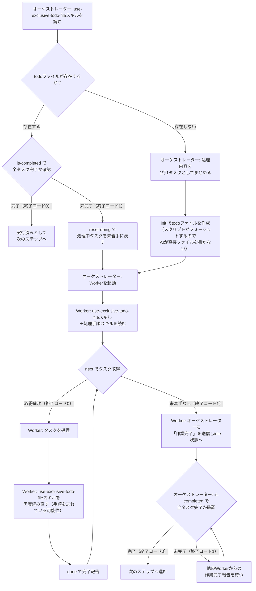

# 排他制御付きtodoファイル管理

マークダウンチェックリスト形式のtodoファイルに対して、flockによる排他制御付きでタスクの取得・完了を行うシェルスクリプトを提供する。

**重要: todoファイルの読み書きは、オーケストレーター・Workerを問わず、絶対に直接行ってはならない。すべての操作は以下のスクリプト経由で行うこと。** 直接ReadやEditでtodoファイルを操作すると、排他制御が効かずタスクの重複取得やステータス不整合が発生する。

スクリプトのパス: `.claude/skills/use-exclusive-todo-file/scripts/use-exclusive-todo-file.sh`

## 全体フロー



## todoファイルの構造

各行のステータス:

| プレフィックス | 意味 | `next`で取得 | `is-completed` |
|--------------|------|:---:|:---:|
| `- [ ] ` | 未着手 | YES | 未完了 |
| `- [>] ` | 処理中（Workerが取得済み） | NO | 未完了 |
| `- [x] ` | 完了 | NO | 完了 |
| `- [!] ` | 失敗（処理対象外） | NO | 完了扱い |

例:
```
- [ ] output_system/src/app.ts
- [>] output_system/src/utils.ts
- [x] output_system/src/index.ts
```

テキスト部分はファイルパスに限らず、並列実行可能なタスクを指すものなら何でもよい。ただの文字列として扱う。

## コマンド

### init — todoファイルの新規作成（オーケストレーター用）

```bash
echo "output_system/src/app.ts
output_system/src/main.ts
output_system/src/utils.ts" | .claude/skills/use-exclusive-todo-file/scripts/use-exclusive-todo-file.sh init <todoファイル絶対パス>
```

- 標準入力から1行1タスクを読み取り、各行に `- [ ] ` プレフィックスを付けてtodoファイルを新規作成する
- AIがtodoファイルを直接書くとフォーマットが崩れるリスクがあるため、必ずこのコマンド経由で作成すること
- ファイルが既に存在する場合は終了コード1でエラー

### is-completed — 完了確認（オーケストレーター用）

```bash
.claude/skills/use-exclusive-todo-file/scripts/use-exclusive-todo-file.sh is-completed <todoファイル絶対パス>
```

- 全タスクが完了しているか（`- [ ] ` と `- [>] ` が存在しないか）を確認する
- 終了コード0: 全タスク完了、終了コード1: 未完了タスクあり

### reset-doing — 中断からの復旧（オーケストレーター用）

```bash
.claude/skills/use-exclusive-todo-file/scripts/use-exclusive-todo-file.sh reset-doing <todoファイル絶対パス>
```

- すべての処理中タスク（`- [>] `）を未着手（`- [ ] `）に戻す
- **Workerが全停止している状態で実行すること。並列実行中に実行するとタスクが重複実行される**
- リセットした件数を標準エラーに出力する

### next — 次のタスクを取得（Worker用）

```bash
TASK=$(.claude/skills/use-exclusive-todo-file/scripts/use-exclusive-todo-file.sh next <todoファイル絶対パス>)
```

- 最初の未着手行を処理中に変更し、テキスト部分を返す
- 未着手行がなければ終了コード1（全タスク完了）

具体例: `/home/user/project/tasks.md` に以下の内容がある場合

```
- [x] output_system/src/index.ts
- [>] output_system/src/utils.ts
- [ ] output_system/src/app.ts
- [ ] output_system/src/main.ts
```

`use-exclusive-todo-file.sh next /home/user/project/tasks.md` を実行すると:
1. 3行目の `- [ ] output_system/src/app.ts` を `- [>] output_system/src/app.ts` に変更
2. 標準出力に `output_system/src/app.ts` を返す（`- [ ] ` プレフィックスは含まない）
3. 終了コード0

ファイルは以下の状態になる:
```
- [x] output_system/src/index.ts
- [>] output_system/src/utils.ts
- [>] output_system/src/app.ts
- [ ] output_system/src/main.ts
```

### done — タスクを完了にする（Worker用）

```bash
.claude/skills/use-exclusive-todo-file/scripts/use-exclusive-todo-file.sh done <todoファイル絶対パス> "$TASK"
```

- `next` で受け取った文字列をそのまま渡すこと（加工禁止）

具体例: 上記のnextの例で標準出力に `output_system/src/app.ts` が返ってきた場合、このタスクを完了したときに以下のように呼ぶこと

```bash
use-exclusive-todo-file.sh done /home/user/project/tasks.md "output_system/src/app.ts"
```

`- [>] output_system/src/app.ts` が `- [x] output_system/src/app.ts` に変更される

### fail — リトライ不可の失敗を記録（Worker/スクリプト用）

```bash
.claude/skills/use-exclusive-todo-file/scripts/use-exclusive-todo-file.sh fail <todoファイル絶対パス> "$TASK"
```

- 処理中タスク（`- [>] `）を失敗（`- [!] `）に変更する
- 以後`next`の取得対象から除外される。`is-completed`では完了扱い
- タイムアウト、max-turns超過、設定エラー等のリトライしても解決しない失敗に使用する

### release — リトライ可能な失敗でタスクを戻す（Worker/スクリプト用）

```bash
.claude/skills/use-exclusive-todo-file/scripts/use-exclusive-todo-file.sh release <todoファイル絶対パス> "$TASK"
```

- 処理中タスク（`- [>] `）を未着手（`- [ ] `）に戻す
- 他のワーカーまたは自分が再度`next`で取得できるようになる
- レートリミット、ネットワークエラー等のリトライで解決する可能性がある失敗に使用する

## Workerでの典型的な使い方

```bash
SCRIPT=".claude/skills/use-exclusive-todo-file/scripts/use-exclusive-todo-file.sh"
TODO="/absolute/path/to/source_file_tasks.md"

while TASK=$("$SCRIPT" next "$TODO"); do
  # $TASK に対して処理を実行
  # ...

  "$SCRIPT" done "$TODO" "$TASK"
done
# ループ終了 = 全タスク完了 → オーケストレーターに「作業完了」を送信
```

## 注意事項

- `next` が返した文字列は一切加工せずに `done` に渡すこと。todoファイル内の文字列との不一致によるエラーを防止するため
- Bashから `done` を呼ぶ際は変数を必ずダブルクォートで囲むこと（`"$TASK"`）。クォートなし（`$TASK`）だとタスク文字列に `*` 等が含まれる場合にシェルのglob展開が発生し、意図しない引数になる
- todoファイルの作成は必ず `init` コマンド経由で行うこと。AIが直接ファイルを書くとフォーマットが崩れるリスクがある
- ロックファイル（`<todoファイル絶対パス>.lock`）がtodoファイルと同じディレクトリに自動生成される。削除不要
- プロセスが異常終了した場合、カーネルが自動的にロックを解放する。デッドロックは発生しない
- 異常終了でステータスが `- [>] ` のまま残った場合は、Workerを全停止してから `reset-doing` コマンドで復旧する
